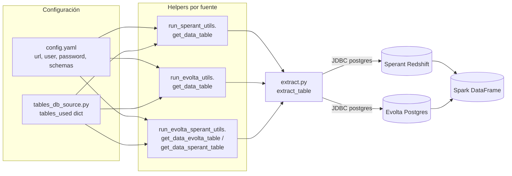

# Capa 1 — Extracción JDBC

## Propósito de negocio

Leer datos crudos desde los CRMs externos (**Sperant** y **Evolta**) hacia memoria de Spark, para que las capas posteriores los normalicen.

Esta capa **no aplica reglas de negocio**. Solo trae filas tal como están en la base origen, opcionalmente filtrando columnas (column pruning) y limitando filas (modo prueba).

---

## Archivos involucrados

| Archivo | Rol |
|---|---|
| `extract.py` | Wrapper genérico de lectura JDBC con Spark |
| `tables_db_source.py` | Catálogo central de tablas y queries por fuente |
| `run_evolta_utils.py` | Helpers de extracción para pipeline Evolta puro |
| `run_sperant_utils.py` | Helpers de extracción para pipeline Sperant puro |
| `run_evolta_sperant_utils.py` | Helpers para pipeline Joined (lee de ambas fuentes en una sola corrida) |

---

## Flujo de extracción



---

## `extract.py` — núcleo de lectura

Un único punto de entrada:

```python
extract_table(spark, jdbc_url, query, user, password) -> DataFrame
```

**Características:**
- Driver fijo: `org.postgresql.Driver` (sirve tanto para Postgres Azure como Redshift, ambos hablan protocolo Postgres).
- Lee con `spark.read.format("jdbc").option("query", query)`.
- Mide y reporta tiempo de lectura por consulta.
- Re-lanza la excepción si falla la lectura (no enmascara errores de conexión).

**Reglas de negocio:** ninguna. Es infraestructura pura.

---

## `tables_db_source.py` — catálogo de tablas

Define un único diccionario `tables_used` con dos llaves:

| Llave | Fuente | Helpers que la consumen |
|---|---|---|
| `read_query_1` | **Sperant** | `run_sperant_utils.get_data_table`, `run_evolta_sperant_utils.get_data_sperant_table` |
| `read_query_2` | **Evolta** | `run_evolta_utils.get_data_table`, `run_evolta_sperant_utils.get_data_evolta_table` |

> **Nota:** En el pipeline joined, `get_data_sperant_table` lee de la sección `read_query_2` (no de `read_query_1`). Es un detalle de implementación a tener en cuenta si se reorganiza el catálogo.

### Estructura de una entrada

Cada tabla en el catálogo tiene una de estas tres formas:

**1. Tabla física en la BD origen** (se construye query con SELECT):
```python
"bi_proyecto": {
    "name_table": "bi_proyecto",
    "fields_table": "codempresa, empresa, codproyecto, proyecto, activo",
    "active": True
}
```
- `name_table` — nombre real en la BD origen.
- `fields_table` — columnas a extraer (column pruning explícito; no se usa `SELECT *`).
- `active` — flag por si se quiere desactivar la lectura.

**2. Query estática inline** (datos hardcoded para tablas maestras de un solo registro):
```python
"bd_grupo_inmobiliario": {
    "name_table": "",
    "query_table": "SELECT 1 AS id_grupo_inmobiliario, 'Grupo_2_Sperant' AS nombre, ...",
    "active": True,
    "create_table_bigquery": True,
    "insert_table_bigquery": True
}
```
- `name_table` vacío indica que no hay tabla física; se ejecuta `query_table` directo.
- Usado para `bd_empresa`, `bd_grupo_inmobiliario`, `bd_team_performance` cuando la fuente no expone esa información (caso Sperant).

**3. Solo flags de carga** (la tabla no se lee, se construye en transformación):
```python
"bd_proyectos": {
    "create_table_bigquery": True,
    "insert_table_bigquery": True
}
```
- No tiene `name_table` ni `query_table`. Solo declara que esta tabla `bd_*` se va a crear/insertar más adelante en BigQuery (capa 4).

### Tablas físicas catalogadas por fuente

**Sperant (`read_query_1`):**

| Tabla origen | Propósito |
|---|---|
| `proyectos` | Maestro de proyectos inmobiliarios |
| `subdivision` | Subdivisiones / etapas / torres |
| `unidades` | Unidades inmobiliarias |
| `datos_extras` | Atributos extra de unidades |
| `clientes` | Clientes / prospectos |
| `interacciones` | Interacciones cliente-asesor |
| `abonos` | Pagos / abonos |
| `proforma_unidad` | Proformas vinculadas a unidad |
| `usuarios_asignados` | Asesores |
| `procesos` | Procesos comerciales (separación, venta) |

**Evolta (`read_query_2`):**

| Tabla origen | Propósito | Pruning aplicado |
|---|---|---|
| `bi_proyecto` | Proyectos | `codempresa, empresa, codproyecto, proyecto, activo` |
| `bi_etapa` | Etapas / subdivisiones | `codetapa, codproyecto, etapa, activo` |
| `bi_stock` | Inventario de unidades | precios, áreas, tipologías, estado |
| `bi_inmueble_oc` | Vínculo unidad-comercial | `codinmueble, codoc` |
| `bi_comercial` | Operaciones comerciales (cotización, venta, devolución) | extenso |
| `bi_cliente` | Datos personales cliente | `codcliente, apellidopaterno, ...` |
| `bi_prospecto` | Datos de prospecto + UTM | extenso |
| `bi_contacto` | Datos de contacto | `codcontacto, nombres, ...` |
| `bi_evento_contacto` | Eventos sobre un contacto | `fecha, accion, nivelinteres, ...` |
| `bi_evento_prospecto` | Eventos sobre un prospecto | `fecha, accion, nivelinteres, ...` |

> **Convención Evolta:** todas las tablas origen tienen prefijo `bi_` (BI = Business Intelligence). Los `bd_*` resultantes son nuestra normalización.

---

## Helpers por pipeline

### `run_sperant_utils.get_data_table(spark, esquema, tables_used, id_table, config)`
- Lee de `tables_used["read_query_1"][id_table]`.
- URL/credenciales: `config["source_1"]`.
- Esquema: el que esté iterando el loop de `run.py` (ej. `checor`).

### `run_evolta_utils.get_data_table(spark, esquema, tables_used, id_table, config)`
- Lee de `tables_used["read_query_2"][id_table]`.
- URL/credenciales: `config["source_2"]`.
- Esquema: ej. `sev_14`, `sev_21`, etc.

### `run_evolta_sperant_utils.get_data_evolta_table(...)` y `get_data_sperant_table(...)`
- Para el pipeline joined, donde una sola corrida lee de ambos CRMs.
- Toma URL/credenciales/esquema desde `config[actual_joined_esquema]["source_1"]` (Evolta) o `["source_2"]` (Sperant).
- `actual_joined_esquema` se setea en `run.py` antes de llamar a `run_evolta_sperant`. Indica cuál bloque `joined_sources_N` está activo.

> **Atención inversión semántica en joined:** dentro de `joined_sources_N` la convención cambia respecto al resto del config:
> - `joined_sources_N.source_1` apunta a **Evolta**.
> - `joined_sources_N.source_2` apunta a **Sperant**.
>
> En cambio, en el config raíz `source_1` es Sperant y `source_2` es Evolta. Confuso pero así está.

### Variantes "configurable"
`get_data_table_configurable(...)` (en cada helper) permite pasar `table_name` y `fields_table` directamente sin pasar por el catálogo. Usado para casos ad-hoc.

### Variantes BigQuery
- `get_data_table_from_bigquery(...)` — lee una tabla `bd_*` ya cargada.
- `get_data_table_from_bigquery_pruning_fields(...)` — versión con SELECT explícito.

Estas se usan en capa 2 cuando una transformación necesita una `bd_*` previa que ya está en BigQuery (caso típico: el pipeline joined leyendo `bd_*` de Evolta o Sperant ya generadas en corridas previas).

---

## Reglas de negocio aplicadas en esta capa

**Ninguna.** La capa de extracción no filtra ni transforma datos de negocio. Sin embargo:

1. **Column pruning obligatorio en Evolta.** Las tablas `bi_*` tienen muchas columnas; solo se traen las listadas en `fields_table`. Si se necesita una columna nueva, hay que añadirla al catálogo (`tables_db_source.py`) — no aparecerá automáticamente.
2. **Modo prueba con `limit_get_data`.** Si `config["limit_get_data"] > 0`, todas las queries añaden `LIMIT N`. Útil para desarrollo, **nunca** dejar activo en producción (datos truncados → KPIs incorrectos).
3. **Tablas maestras hardcoded.** `bd_empresa`, `bd_grupo_inmobiliario`, `bd_team_performance` para Sperant se generan inline porque la BD origen no las tiene. Cualquier cambio de nombre/empresa requiere editar `tables_db_source.py`.

---

## Notas y gotchas

- **Driver Postgres único.** Tanto Redshift (Sperant) como Postgres Azure (Evolta) se leen con el mismo driver `org.postgresql.Driver`. Funciona porque Redshift implementa el wire protocol de Postgres, pero algunas funciones SQL no son compatibles entre ambos motores.
- **Credenciales en `config.yaml`.** Hoy van en plano. Si se mueve a secret manager, los helpers solo necesitan que `config[...]["url"|"user"|"password"]` siga existiendo.
- **JAR JDBC requerido en local.** `infra/src/etl/jar/postgresql-42.7.2.jar`. En Dataproc viene preinstalado o se baja del bucket de Hadoop.
- **Una `SparkSession` por esquema.** `run.py` crea y destruye Spark por cada esquema procesado para evitar leaks de memoria entre lecturas. Esto significa que el coste fijo de levantar Spark se paga N veces (1 por esquema activo).
- **Sin reintentos a nivel de extract.** Si la BD origen falla, `extract_table` lanza la excepción y `run.py` la captura a nivel de esquema (lo registra como `failed_esquemas` y sigue con el siguiente).
- **`limpiar_tablas_temporales`.** Al final de cada pipeline borra tablas con prefijo `_bqc_` (artefactos del conector Spark-BigQuery). No es estrictamente capa de extracción pero vive en los mismos archivos `*_utils.py`.

---

## Consumidores downstream

Toda la capa 2 (`transformations2.py`, `transformation_sperant.py`) y la capa 3 (`run_*_transform.py`) llaman a estos helpers para obtener los DataFrames raw que normalizarán a `bd_*`.
