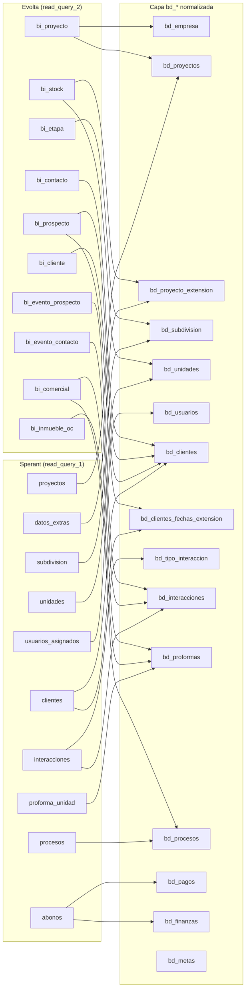

# Catálogo de tablas fuente

Referencia rápida de **qué tabla origen se usa para qué**, columnas extraídas, y la `bd_*` resultante.

Fuente única de verdad en código: `infra/src/etl/tables_db_source.py` (diccionario `tables_used`).

---

## Mapa fuente → bd_*



> El diagrama muestra **flujo de datos**, no mapeo 1:1. Una `bd_*` puede componerse de varias tablas raw vía joins.

---

## Sperant — `read_query_1`

Tablas físicas leídas (sin column pruning explícito en el catálogo; se trae el esquema completo de cada tabla):

| Tabla origen | bd_* resultante(s) | Notas de negocio |
|---|---|---|
| `proyectos` | `bd_proyectos` | Maestro de proyectos. Contiene `codigo` (no `id`), `fecha_estimacion`, `banco_promotor`. La empresa va hardcoded a "CHECOR". |
| `subdivision` | `bd_subdivision` | Etapas/torres por proyecto. Se une vía `proyecto_codigo` (no `proyecto_id`). |
| `unidades` | `bd_unidades` | Unidades. Usa `codigo_proyecto`, `nombre_tipologia`, `precio_base_proforma`, `estado_comercial`. |
| `datos_extras` | `bd_proyecto_extension` | Atributos adicionales de proyectos. |
| `clientes` | `bd_clientes`, `bd_clientes_fechas_extension` | Cliente en una sola tabla (apellidos juntos en `apellidos`, no separados). Usa `username` para vincular asesor (no `usuario_id`). |
| `interacciones` | `bd_interacciones`, `bd_tipo_interaccion` | Vinculadas vía `codigo_proyecto`/`codigo_unidad`. La fecha es `fecha_creacion`. |
| `abonos` | `bd_pagos`, `bd_finanzas` | Pagos asociados a unidades. No tiene `numero_cuota` ni `codigo_letra`. |
| `proforma_unidad` | `bd_proformas` | Proformas vinculadas a unidad. |
| `usuarios_asignados` | `bd_usuarios` | Asesores. **No tiene columna `id`** — se generan IDs secuenciales a partir de `username`. |
| `procesos` | `bd_procesos` | Procesos comerciales (separación, venta, desistimiento). Mantiene `nombre` original (no se renombra a `nombre_proceso`). |

**Tablas hardcoded para Sperant** (la BD no las expone, se inyectan vía SQL inline):
- `bd_empresa` — single-row "CHECOR".
- `bd_grupo_inmobiliario` — single-row "Grupo_2_Sperant".
- `bd_team_performance` — single-row "Team_1_Sperant".

> **Detalle crítico Sperant:** las fechas vienen como string formato `dd/MM/yyyy` (ej. `30/06/2027`). En transformación se debe convertir con `F.to_date(col, "dd/MM/yyyy")`, **no** con `.cast("date")`. Afecta a `proyectos`, `subdivision`, `clientes`.

---

## Evolta — `read_query_2`

Tablas con column pruning explícito (solo se traen los campos listados):

### `bi_proyecto` → `bd_proyectos`, `bd_empresa`
**Campos extraídos:** `codempresa, empresa, codproyecto, proyecto, activo`

Es la fuente de verdad de proyectos en Evolta. Único lugar donde aparece `empresa` real (en Sperant es hardcoded).

### `bi_etapa` → `bd_subdivision`
**Campos:** `codetapa, codproyecto, etapa, activo`

Mapea 1:1 con la tabla `subdivision` de Sperant.

### `bi_stock` → `bd_unidades`, `bd_proyecto_extension`
**Campos:** `codinmueble, codproyecto, codetapa, nroinmueble, tipoinmueble, nropiso, modelo, numdormitorio, numbanios, arealibre, areatechada, areaventa, areaconstruida, areajardin, areaterraza, areaterreno, vista, preciobase, preciolista, precioventa, descuento, estado, moneda, observaciones, preciometro2, anulado`

Inventario completo. La columna `anulado` se usa en filtros para excluir unidades canceladas.

### `bi_inmueble_oc` → `bd_proformas`
**Campos:** `codinmueble, codoc`

Tabla de vínculo entre unidad y operación comercial (`codoc`).

### `bi_comercial` → `bd_proformas`, `bd_procesos`
**Campos:** `codoc, codcontacto, tipocotizacion, tipofinanciamiento, codproyecto, estadoinmueble, codcliente, comoseentero, formacontacto, fechaproforma, nombrevendedorproforma, etapacomercial, moneda, tipocambio, entidadfinanciera, montototal, montodescuento, montoventa, nombreresponsable, promocion, fechaseparacion, fechaventa, motivodevolucion, ultimocomentario, fechadevolucion`

Operaciones comerciales: cotizaciones, separaciones, ventas, devoluciones. Es la tabla más rica del modelo Evolta (hito comercial de cada cliente).

### `bi_cliente` → `bd_clientes`
**Campos:** `codcliente, apellidopaterno, apellidomaterno, ocupacion, fechanacimiento, nacionalidad`

Datos personales del cliente. Apellidos separados (a diferencia de Sperant).

### `bi_prospecto` → `bd_clientes`, `bd_clientes_fechas_extension`
**Campos:** `nrodocumento, correo, estado, fecharegistro, comoseentero, formacontacto, nivelinteres, descripcionultimaaccion, responsablecita, responsable, fechacitado, rangoedad, codprospecto, cantacciones, celular, codproyecto, idresponsable, motivocerrado, leadunicoxmes, utmsource, utmmedium, utmcampaign, utmterm, utmcontent, fechaultimaaccion, nombres, apellidopaterno, apellidomaterno, fechatarea, direccion, tipodocumento, departamento, provincia, estadocivil, distrito, codcontacto, proyecto`

Información de prospecto + UTMs de marketing. Único lugar donde Evolta expone tracking de campañas digitales.

### `bi_contacto` → `bd_clientes`
**Campos:** `codcontacto, nombres, correo, celular, direccion, tipodocumento, nrodocumento, departamento, provincia, estadocivil, distrito, sexo, puesto, motivocerrado, estadocontacto, apellidopaterno`

Contacto general (puede ser cliente o prospecto). Se usa `codcontacto` para vincular con `bi_evento_contacto` y `bi_comercial`.

### `bi_evento_contacto` → `bd_interacciones`
**Campos:** `codeventocontacto, codcontacto, fecha, responsable, accion, nivelinteres, esefectivo, codproyecto`

Eventos sobre contacto (llamadas, citas, visitas). `esefectivo` indica si la interacción fue efectiva.

### `bi_evento_prospecto` → `bd_interacciones`
**Campos:** `codeventoprospecto, codprospecto, fecha, responsable, accion, nivelinteres, esefectivo`

Equivalente a `bi_evento_contacto` pero para prospectos. La transformación de `bd_interacciones` une ambas tablas con `unionByName`.

---

## Tablas hardcoded por pipeline

Inyectadas vía `query_table` SQL inline (sin tabla física):

| Pipeline | Tabla `bd_*` | Valores |
|---|---|---|
| Sperant | `bd_grupo_inmobiliario` | `id=1, nombre='Grupo_2_Sperant'` |
| Sperant | `bd_team_performance` | `id=1, nombre='Team_1_Sperant', id_grupo=1` |
| Sperant | `bd_empresa` | `id=1, empresa='CHECOR', id_team=1` |
| Evolta | `bd_grupo_inmobiliario` | `id=1, nombre='Grupo_2'` |
| Evolta | `bd_team_performance` | `id=1, nombre='Team_1_Evolta', id_grupo=1` |

> Si se agrega un nuevo grupo inmobiliario o se renombra una empresa, hay que editar manualmente `tables_db_source.py`.

---

## Tablas declaradas para BigQuery (sin lectura)

Estas entradas en `tables_used` **no se leen** desde una fuente. Solo declaran que se van a `create_table_bigquery: True` / `insert_table_bigquery: True` en capa 4 (load). El DataFrame correspondiente lo construye la capa 2 (transformación).

```python
"bd_proyectos": {"create_table_bigquery": True, "insert_table_bigquery": True}
```

Lista completa (ambas fuentes): `bd_empresa`, `bd_proyectos`, `bd_proyecto_extension`, `bd_subdivision`, `bd_usuarios`, `bd_unidades`, `bd_clientes`, `bd_tipo_interaccion`, `bd_interacciones`, `bd_proformas`, `bd_procesos`, `bd_clientes_fechas_extension`, `bd_metas`, `bd_pagos` (Sperant only), `bd_finanzas` (Sperant only).

---

## Cambios comunes en este catálogo

| Cambio de negocio | Qué editar |
|---|---|
| Agregar columna nueva de Evolta | Sumarla al `fields_table` de la entrada correspondiente en `read_query_2`. Sino, no llegará al DataFrame. |
| Agregar tabla nueva de Sperant | Agregar entrada en `read_query_1` con `name_table` y `active: True`. |
| Renombrar empresa en CHECOR (Sperant) | Editar el `query_table` de `bd_empresa` en `read_query_1`. |
| Desactivar lectura puntual | `active: False` en la entrada (la transformación que dependa fallará — usar con cuidado). |
| Nueva tabla `bd_*` derivada | Agregar entrada solo con `create_table_bigquery` y `insert_table_bigquery` (no necesita `name_table`). |

---

## Referencias cruzadas

- **Cómo se leen estas tablas:** `01_extract/jdbc_extraction.md`.
- **Qué transformaciones se aplican:** `02_transform_bd/{evolta,sperant,joined}/<bd_tabla>.md`.
- **Cómo se cargan a BigQuery:** `03_load_bd/spark_to_bigquery.md`.
