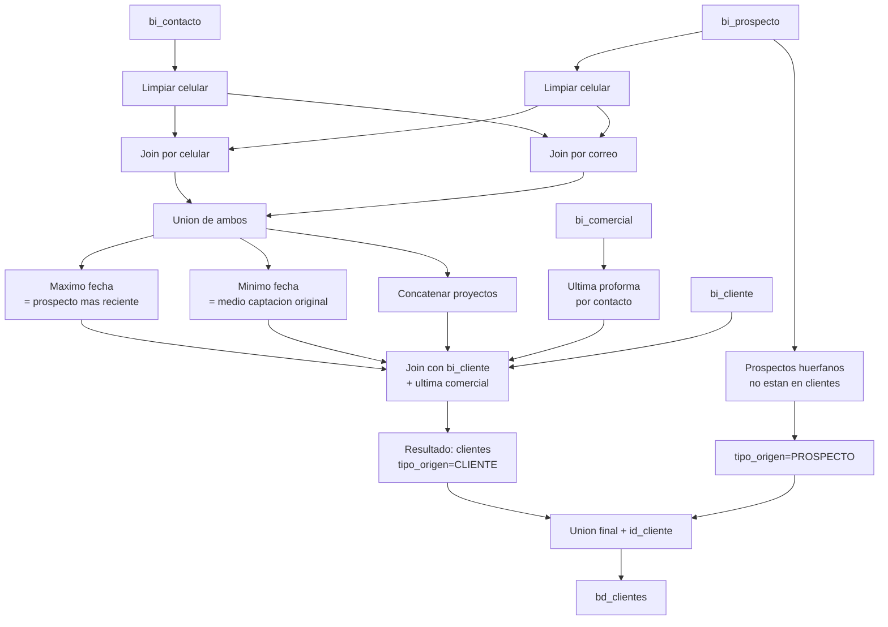

# `bd_clientes` — Evolta

## ¿Qué representa?

La tabla unificada de **clientes y prospectos** de Evolta.

En Evolta la información del cliente está repartida en cuatro tablas distintas según en qué etapa del embudo está la persona. Esta transformación las junta todas para tener una única vista del cliente.

---

## ¿De dónde vienen los datos?

| Tabla raw | ¿Qué aporta? |
|---|---|
| `bi_contacto` | Datos de contacto base: nombre, correo, celular, dirección, documento |
| `bi_prospecto` | Datos del prospecto: nivel de interés, UTM, fecha de registro, último responsable, motivo de cierre |
| `bi_cliente` | Datos personales: apellidos, ocupación, fecha de nacimiento, nacionalidad |
| `bi_comercial` | Datos comerciales: última proforma, tipo de cotización, financiamiento, vendedor, estado del inmueble |

La pregunta de fondo: **¿cómo unir las cuatro?**

- `bi_contacto` ↔ `bi_prospecto` se unen por **celular o correo** (no hay un ID común directo).
- `bi_contacto` ↔ `bi_comercial` se unen por `codcontacto`.
- `bi_comercial` ↔ `bi_cliente` se unen por `codcliente`.

---

## Lógica de armado

Esta es la transformación **más compleja** del ETL. Se hace en varias fases:

### Fase 1 — Limpieza de celulares

Tanto en `bi_contacto` como en `bi_prospecto` se crea una columna `celular_clean` que es el celular sin espacios:
```python
F.regexp_replace("celular", " ", "")
```
Razón: los celulares vienen con formatos inconsistentes (espacios, guiones), y eso rompe los joins.

### Fase 2 — Última operación comercial por contacto

Se busca, para cada `codcontacto`, la **última proforma** (la más reciente por `fechaproforma`). De ahí se sacan los datos comerciales más actuales.

### Fase 3 — Unir contacto con prospecto (por dos caminos)

Como no hay ID directo entre `bi_contacto` y `bi_prospecto`, se prueban dos joins:
1. **Por celular limpio** — match exacto.
2. **Por correo** — match exacto.

Después se hace `unionAll` de ambos resultados (un mismo contacto puede aparecer dos veces si coincide por celular Y por correo).

### Fase 4 — Quedarse con el prospecto MÁS RECIENTE

Como un contacto puede tener varios prospectos asociados (ej. visitó varios proyectos en distintas fechas), se calcula la **fecha máxima de registro de prospecto** por `codcontacto` y se conserva solo esa fila.

### Fase 5 — Quedarse con el medio de captación MÁS ANTIGUO

Por separado, se calcula la fecha **mínima** de registro y de ahí se extrae solo el campo `comoseentero` ("cómo se enteró"). La idea es: el medio de captación original es el del primer contacto, no el del último.

### Fase 6 — Concatenar todos los proyectos relacionados

Cada contacto puede haber visto varios proyectos. Se hace un `collect_set` de los `codproyecto` y se concatenan separados por coma:
```
"P001, P003, P007"
```
Esto se guarda en `proyectos_relacionados`.

### Fase 7 — Join final con cliente y comercial

A los contactos enriquecidos con prospecto se les agrega:
- Datos personales desde `bi_cliente` (apellidos, ocupación, nacimiento, nacionalidad).
- Datos de la última operación comercial desde la fase 2.

### Fase 8 — Procesar prospectos huérfanos

Algunos prospectos no tienen contacto asociado (no hay coincidencia ni por celular ni por correo). Se procesan aparte:
1. Se construye un DataFrame con todos los prospectos.
2. Se filtran los que **NO** están en el resultado anterior (left_anti join por celular y por correo).
3. Se unionByName al resultado final.

Estos casos se marcan con `tipo_origen = 'PROSPECTO'` (los demás llevan `tipo_origen = 'CLIENTE'`).

### Fase 9 — Asignar ID interno

Al final se agrega `id_cliente` con `monotonically_increasing_id()` para tener un identificador único por fila.

---

## Diagrama del flujo



---

## Reglas de negocio importantes

### Cómo se decide el medio de captación

Hay tres campos relacionados:
- `medio_captacion_prospectos` — el que dice el prospecto cuando se registra.
- `medio_captacion_comercial` — el que dice la última proforma.
- `medio_captacion` — **el final**, calculado así:
  ```
  COALESCE(medio_captacion_prospectos_mas_antiguo, medio_captacion_comercial)
  ```
  Es decir, prevalece el del **primer prospecto** del contacto. Si no hay, se usa el comercial.

`agrupacion_medio_captacion` es lo mismo que `medio_captacion_prospectos` original (sin coalesce). Sirve para agrupar reportes por canal aunque el `medio_captacion` final difiera.

### Cómo se decide si el cliente "ha desistido"

Lógica anidada:
1. Si **no hay correo de prospecto**:
   - Si `estadocontacto = 'ACTIVO'` → `ha_desistido = 'si'` (raro, parece bug semántico — verificar con negocio).
   - Si `estadocontacto = 'CERRADO'` → `ha_desistido = 'no'`.
   - Otro caso → `ha_desistido = 'no'`.
2. Si **sí hay correo de prospecto**:
   - Si `pros_estado = 'Activo'` → `ha_desistido = 'si'`.
   - Si `pros_estado = 'Cerrado'` → `ha_desistido = 'no'`.
   - Otro caso → `ha_desistido = 'no'`.

> **Nota**: la semántica parece invertida (un cliente "Activo" se marca como `ha_desistido='si'`). Hay que validar con negocio si es deseado o un bug histórico.

### Cómo se decide el "estado del proceso"

Mapeo desde `estadoinmueble` (de la última operación comercial):

| `estadoinmueble` | `estado_proceso` |
|---|---|
| `Minuta` | `Comprador` |
| `Entregado` | `Propietario` |
| Otro | `Interesado` |

### Razón de desistimiento

Coalesce entre `pros_motivocerrado` y `motivocerrado` del contacto. Lo primero que tenga valor.

---

## Resultado: columnas destacadas

(El esquema completo tiene ~50 columnas, aquí solo lo importante)

| Columna | Qué guarda |
|---|---|
| `id_cliente` | ID interno (monotonic) |
| `id_cliente_evolta` | ID original (codcontacto o codprospecto) |
| `id_proyecto`, `id_proyecto_evolta` | Proyecto principal |
| `id_usuario_evolta` | Asesor responsable |
| `tipo_origen` | `CLIENTE` o `PROSPECTO` |
| `nombres`, `apellido_paterno`, `apellido_materno` | Datos personales |
| `correo`, `celular`, `direccion` | Contacto |
| `tipo_documento`, `nrodocumento` | Documento de identidad |
| `genero`, `estado_civil`, `pais_residencia`, `rango_edad` | Demográficos |
| `fecha_nacimiento`, `fecha_registro` | Fechas clave |
| `medio_captacion`, `agrupacion_medio_captacion`, `canal_entrada` | Marketing |
| `nivel_interes`, `estado_cliente`, `estado_proceso` | Etapa del embudo |
| `ultimo_proyecto`, `proyectos_relacionados` | Histórico de proyectos |
| `total_interacciones`, `proxima_tarea` | Actividad |
| `ha_desistido`, `razon_desistimiento` | Estado de cierre |
| `tipo_financiamiento`, `origen` | Datos comerciales |

---

## Cosas a tener en cuenta

- **Es la transformación más cara del pipeline.** Hace múltiples joins y agregaciones; en esquemas grandes puede tardar minutos.
- **Si un mismo contacto coincide con dos prospectos por celular y otros dos por correo**, va a quedar la fila del prospecto más reciente (por `pros_fecharegistro`). Las otras se descartan.
- **Los prospectos huérfanos pueden duplicar gente.** Si una persona se registró con un email distinto a su contacto, aparecerá dos veces: una como `CLIENTE` y otra como `PROSPECTO`. Es comportamiento conocido — la dedup está incompleta.
- **Filtrado por `dropDuplicates(["id_cliente_evolta"])`.** Solo elimina duplicados exactos por ID original. No detecta duplicados por persona real.
- **`ha_desistido` tiene lógica con valores hardcoded.** Cualquier cambio en cómo Evolta nombra los estados (`Activo`/`Cerrado`/`ACTIVO`/`CERRADO`) rompe la regla.
- **Los uppercase en strings categóricos son obligatorios.** Si un dashboard filtra por `medio_captacion = 'facebook'` no va a matchear nada — siempre filtrar en mayúsculas.

---

## Referencia rápida al código

- Orquestador: `run_evolta_transform.py` → `run_bd_clientes(...)`.
- Lógica: `transformations2_operations.py` → `transform_bd_clientes(bi_comercial, bi_cliente, bi_prospecto, bi_contacto)`.
