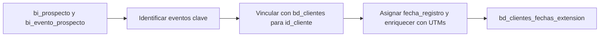

# `bd_clientes_fechas_extension` — Evolta

## ¿Qué representa?

Una tabla que registra **eventos clave en la línea de tiempo del cliente** (cuándo fue captado, por qué medio, en qué proyecto, qué responsable). Sirve para el cálculo del embudo comercial y los reportes de captación por canal.

A diferencia de `bd_clientes` (que tiene una fila por cliente), esta tabla puede tener **varias filas por cliente** — una por cada evento de captación o sub-estado.

## ¿De dónde vienen los datos?

| Fuente | Aporta |
|---|---|
| `bi_prospecto` | Datos del prospecto + UTMs + `subestado` |
| `bi_evento_prospecto` | Eventos sobre el prospecto |
| `bd_clientes` (ya transformada) | Para vincular el evento al cliente final |

## Reglas aplicadas

(Detalle en código — la lógica varía según el tipo de evento y la fuente que lo originó. Se construye en `run_bd_clientes_extension_transform`.)

Conceptualmente:
1. Se identifican los eventos relevantes para captación (registro de prospecto, primera interacción, sub-estados).
2. Se cruza con `bd_clientes` para resolver el `id_cliente` final.
3. Se calcula `fecha_registro` por cada evento.
4. Se enriquece con UTMs y categoría de medio de captación.

## Diagrama del flujo

## Resultado: columnas destacadas

| Columna | Qué guarda |
|---|---|
| `id_cliente`, `id_cliente_evolta` | Cliente al que pertenece el evento |
| `id_proyecto`, `id_proyecto_evolta` | Proyecto del evento |
| `fecha_registro` | Cuándo ocurrió el evento |
| `medio_captacion`, `medio_captacion_categoria` | Canal y categoría |
| `sub_estado` | Sub-estado dentro del embudo |
| `responsable_consolidado` | Asesor responsable |
| UTMs (`utm_source`, `utm_medium`, etc.) | Tracking de marketing |

## Cosas a tener en cuenta

- **Una fila por evento, no una por cliente.** Un cliente captado dos veces (por dos canales distintos) tendrá dos filas aquí.
- Esta tabla es consumida fuertemente por dashboards de embudo y de canal digital.

## Referencia al código

- `run_evolta_transform.py` → `run_bd_clientes_extension_transform(...)`.
- Orquestador: `run_evolta_transform.py` → `run_bd_clientes_fechas_extension(...)`.
