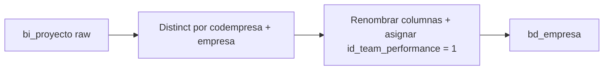

# `bd_empresa` — Evolta

## ¿Qué representa?

La empresa propietaria del CRM (la inmobiliaria). En cada esquema `sev_*` puede haber una o varias empresas según cómo se haya configurado Evolta.

## ¿De dónde vienen los datos?

| Tabla raw | Aporta |
|---|---|
| `bi_proyecto` | El nombre y código de cada empresa que tiene proyectos cargados |

Se infiere desde `bi_proyecto` porque en Evolta cada proyecto trae el `codempresa` y `empresa` directamente, sin tabla maestra de empresas separada.

## Reglas aplicadas

1. **Se hace `distinct`** sobre `codempresa` + `empresa` para no repetir empresas.
2. Se renombran las columnas:
   - `codempresa` → `id_empresa` (y se duplica como `id_empresa_evolta`).
   - `empresa` → `nombre`.
3. Se hardcodea `id_team_performance = 1` (todas las empresas de Evolta van al mismo team por defecto).
4. Auditoría con timestamps.

## Diagrama del flujo

## Resultado

| Columna | Qué guarda |
|---|---|
| `id_empresa` | ID de la empresa |
| `nombre` | Razón social |
| `id_team_performance` | Siempre 1 |
| `id_empresa_evolta` | Mismo ID original |
| `fecha_hora_creacion_aud`, `fecha_hora_modificacion_aud` | Auditoría |

## Cosas a tener en cuenta

- No tiene `id_empresa_sperant` (esta es la versión Evolta-pura).
- Puede haber varias empresas si Evolta tiene proyectos de varias inmobiliarias en el mismo esquema.

## Referencia al código

- `transformations2_operations.py` → `transform_bd_empresa(bi_proyecto)`.
- Orquestador: `run_evolta_transform.py` → `run_bd_empresa(...)`.
