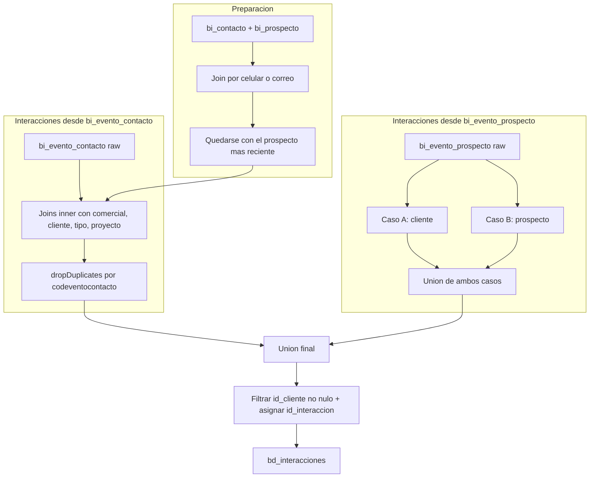

# `bd_interacciones` — Evolta

## ¿Qué representa?

Cada **acción registrada entre un asesor y un cliente o prospecto**: una llamada, una visita al proyecto, una cita agendada, un mail enviado. Alimenta los reportes de actividad comercial y de detalle (visitas, citas, llamadas).

Cada fila es un evento puntual con su tipo, fecha, responsable y a qué cliente/proyecto/unidad se refiere.

## ¿De dónde vienen los datos?

Es la transformación más compleja del lado Evolta — usa **diez** DataFrames:

| Fuente | Aporta |
|---|---|
| `bi_evento_contacto` (raw) | Eventos sobre un contacto |
| `bi_evento_prospecto` (raw) | Eventos sobre un prospecto |
| `bi_contacto` (raw) | Datos del contacto |
| `bi_prospecto` (raw) | Datos del prospecto + UTMs |
| `bi_comercial` (raw) | Operación comercial relacionada |
| `bi_inmueble_oc` (raw) | Vínculo unidad-comercial |
| `bd_unidades` (ya transformada) | Datos de la unidad |
| `bd_clientes` (ya transformada) | Datos del cliente |
| `bd_tipo_interaccion` (ya transformada) | Tipo de interacción |
| `bd_proyecto` (ya transformada) | Datos del proyecto |

## Lógica de armado

La idea de fondo: hay **dos tipos de eventos** en Evolta (sobre contacto y sobre prospecto), y para cada uno hay que decidir a qué cliente del catálogo `bd_clientes` corresponde. Los prospectos pueden derivar en clientes o seguir siendo prospectos.

### Fase 1 — Limpieza de celulares
Igual que en `bd_clientes`: se crea `celular_clean` quitando espacios.

### Fase 2 — Unir contacto con prospecto
Mismo patrón que `bd_clientes`: se hace join por celular **y** por correo, y se hace union de ambos.

### Fase 3 — Quedarse con el prospecto MÁS RECIENTE por contacto
Group by `codcontacto` y se filtra por el prospecto con `pros_fecharegistro` máxima.

### Fase 4 — Construir interacciones desde `bi_evento_contacto`

Joins en cascada (todos `inner`):
```
bi_evento_contacto
  -> contacto-prospecto enriquecido (codcontacto)
  -> bi_comercial (codcontacto)
  -> bd_clientes (codcontacto)
  -> bd_tipo_interaccion (accion = nombre_tipo_interaccion)
  -> bd_proyecto (codproyecto = id_proyecto)
  -> bi_inmueble_oc (codoc, LEFT)
  -> bd_unidades (codinmueble, LEFT)
```

Como los joins centrales son inner, **una interacción sin contacto, comercial o cliente queda fuera**.

Después se hace `dropDuplicates(["codeventocontacto"])` para asegurar una fila por evento.

### Fase 5 — Construir interacciones desde `bi_evento_prospecto`

Aquí se separan dos casos según el `tipo_origen` del cliente:

**Caso A — `tipo_origen = "CLIENTE"`** (prospecto que ya se convirtió en cliente):
```
bi_evento_prospecto
  -> bi_prospecto (codprospecto)
  -> bd_tipo_interaccion (accion)
  -> bi_comercial (codcontacto del prospecto)
  -> bd_clientes con tipo_origen='CLIENTE' (codcontacto)
  -> bi_inmueble_oc, bd_unidades (LEFT)
```

**Caso B — `tipo_origen = "PROSPECTO"`** (sigue siendo prospecto):
```
bi_evento_prospecto
  -> bi_prospecto (codprospecto)
  -> bd_tipo_interaccion (accion)
  -> bd_clientes con tipo_origen='PROSPECTO' (codprospecto = id_cliente_evolta)  LEFT
  -> bi_comercial (LEFT)
  -> bi_inmueble_oc, bd_unidades (LEFT)
```

Los dos casos se unen con `unionAll` y se filtra `id_cliente IS NOT NULL`.

### Fase 6 — Unión final

```
interacciones_contacto + interacciones_prospecto
  -> filter id_cliente NOT NULL
  -> id_interaccion = monotonically_increasing_id()
```

## Diagrama del flujo



## Resultado: columnas destacadas

| Categoría | Columnas |
|---|---|
| **IDs** | `id_interaccion`, `id_cliente`, `id_unidad`, `id_proyecto`, `id_tipo_interaccion`, `*_evolta`, `*_sperant` |
| **Cliente** | `nombres_cliente`, `apellidos_cliente`, `documento_cliente` |
| **Evento** | `fecha_interaccion`, `nombre_responsable`, `nombre_interaccion`, `tipo_evento`, `nivel_interes`, `satisfactorio` |
| **Proyecto** | `proyecto`, `nombre_unidad` |
| **Marketing** | `canal_entrada`, `medio_captacion`, `utm_source`, `utm_medium`, `utm_campaign`, `utm_term`, `utm_content` |
| **Estado** | `estado` (siempre `"NO HAY ESTADO"`), `razon_devolucion` |
| **Fechas** | `fecha_tarea`, `fecha_actualizacion`, `hora_actualizacion` |
| **Otros** | `origen`, `codigo_proforma` |

## Cosas a tener en cuenta

- **`estado` siempre es `"NO HAY ESTADO"`.** Es un placeholder hardcoded — Evolta no expone el estado de la interacción. Si se necesita estado, hay que sumarlo desde otra tabla o ajustar la lógica.
- **Los inner joins en la rama `bi_evento_contacto` son agresivos.** Si el evento no tiene comercial o cliente vinculado, se descarta. Esto puede subestimar el conteo de interacciones.
- **`fecha_interaccion`** se castea a `date` en la rama de contacto y a `timestamp` en la rama de prospecto. Inconsistencia menor que puede afectar reportes que esperan un solo tipo.
- **Hora de actualización es duplicada de la fecha.** `hora_actualizacion = pros_fechaultimaaccion` (igual que `fecha_actualizacion`). Si se quiere hora real, no está disponible.
- **Performance.** Esta transformación corre múltiples joins sobre datasets grandes. En esquemas con muchas interacciones puede tardar.

## Referencia al código

- `transformations2_operations.py` → `transform_bd_interacciones(...)` (recibe 10 DataFrames).
- Orquestador: `run_evolta_transform.py` → `run_bd_interacciones(...)`.
