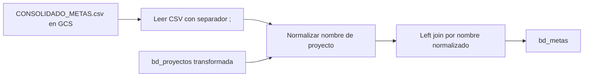

# `bd_metas` — Evolta

## ¿Qué representa?

Las **metas mensuales por proyecto y empresa**: cuánto se espera vender, cuántas separaciones, qué KPIs se debe alcanzar. Sirve para los dashboards de seguimiento (real vs meta).

A diferencia de la mayoría de tablas `bd_*`, esta NO se construye desde el CRM — se carga desde un **CSV externo** que mantiene el área comercial.

## ¿De dónde vienen los datos?

| Fuente | Aporta |
|---|---|
| `CONSOLIDADO_METAS.csv` (GCS, separador `;`) | Metas por mes, proyecto, empresa |
| `bd_proyectos` (ya transformada) | Para vincular el proyecto por nombre |

## Reglas aplicadas

1. **Lectura del CSV** desde el bucket `bucket_metas` con header y separador `;`.
2. **Normalización del nombre del proyecto** para hacer match con `bd_proyectos`:
   ```python
   normalizar_columna(col("PROYECTO"))
   ```
3. **Left join** con `bd_proyectos` por nombre normalizado.
4. **Casteos** según el tipo de KPI (montos a `double`, conteos a `integer`).
5. Auditoría con timestamps.

## Diagrama del flujo



## Resultado

| Categoría | Columnas |
|---|---|
| **Identificación** | `id_proyecto`, `mes`, `anio` |
| **KPIs** | metas por canal (visitas, citas, separaciones, ventas) y montos |

## Cosas a tener en cuenta

- **Si el CSV no está en el bucket o tiene formato roto, esta tabla queda vacía** y los dashboards de "real vs meta" no funcionan.
- **El separador es `;`** (Excel en español lo guarda así por defecto). Si alguien guarda con `,`, se rompe.
- **El match por nombre normalizado** depende de que el CSV use el mismo nombre del proyecto que tiene Evolta. Ante renombres hay que actualizar el CSV.
- Sin metas cargadas, los KPIs igual se calculan pero no muestran "% logrado".

## Referencia al código

- `run_evolta_transform.py` → `run_bd_metas(...)`.
- Lectura del CSV en función auxiliar dentro del mismo archivo.
