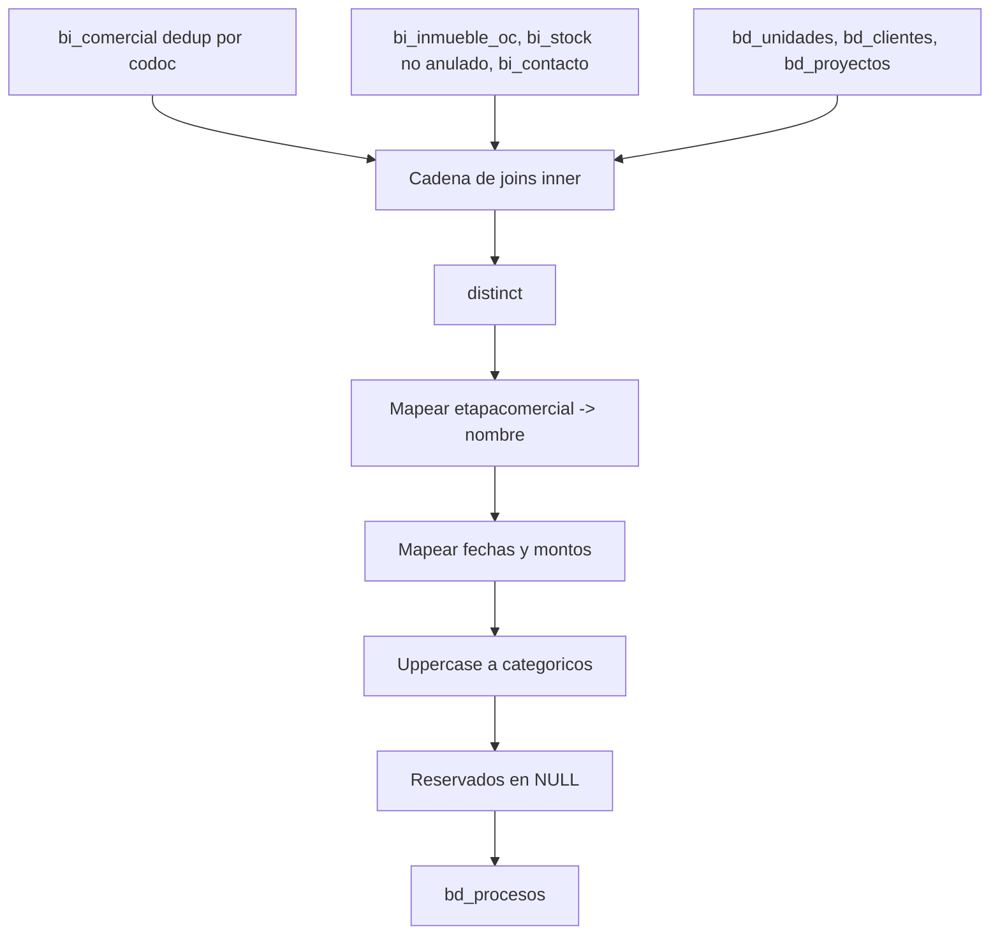

# `bd_procesos` — Evolta

## ¿Qué representa?

Los **procesos comerciales** que ocurren después de una proforma: separación, venta, anulación, devolución, minuta. Cada fila es un proceso aplicado a una unidad puntual.

Ejemplos de procesos:
- "SEPARACION" — el cliente reservó la unidad.
- "VENTA" — la operación se cerró.
- "ANULACION" — se canceló.

## ¿De dónde vienen los datos?

Mismas tablas que `bd_proformas` (ya que ambas se generan en el mismo bloque del pipeline):

| Fuente | Aporta |
|---|---|
| `bi_comercial` (raw) | Datos del proceso: etapa, fechas, montos, motivo de devolución |
| `bi_inmueble_oc` (raw) | Vínculo |
| `bi_stock` (raw, filtrado por `anulado = "No"`) | Unidad |
| `bi_contacto` (raw) | Cliente |
| `bd_unidades`, `bd_clientes`, `bd_proyectos` | Mapeos finales de IDs |

## Reglas aplicadas

1. **Dedup en `bi_comercial`** por `codoc`.
2. **Filtro `bi_stock.anulado = "No"`.**
3. **Inner joins** en cadena (igual que `bd_proformas`).
4. **`distinct`.**

### Mapeo de procesos
5. **`nombre`** = `etapacomercial` en mayúsculas (es el "tipo" de proceso: SEPARACION, VENTA, etc.). En Evolta este es el campo que el dashboard usa para filtrar `nombre = 'SEPARACION'`.

### Fechas y montos
6. **Fechas:**
   - `fecha_proforma` ← `fechaproforma`.
   - `fecha_inicio` ← `fechaseparacion`.
   - `fecha_fin` ← `fechaventa`.
   - `fecha_contrato` ← `fechaventa`.
7. **Montos:**
   - `precio_base_proforma` ← `montototal`.
   - `descuento_venta` ← `montodescuento`.
   - `precio_venta` ← `montoventa`.
8. **`tipo_cambio`** se castea a `double`.

### Mayúsculas
9. En: `origen_proforma`, `modalidad_contrato`, `tipo_financiamiento`, `banco`, `nombre`, `premios`.

### Reservados
10. **NULL:** `completado`, `total_pendiente`, `fecha_nif`, `estado_nif`, `flujo_anulacion`, `fecha_anulacion`, `codigo_externo_venta`, `tipo`, `fecha_actualizacion`, `tipo_cronograma`, `estado_contrato`, `devolucion`, `excedente`, `motivo_caida`, `paso_actual`, etc.

11. `numero_contrato` se construye casteando `codoc` a integer.

12. `aprobador_descuento` ← `nombreresponsable`.

13. Auditoría con timestamps.

## Diagrama del flujo

## Resultado: columnas destacadas

| Categoría | Columnas |
|---|---|
| **IDs** | `id_proceso`, `id_proforma`, `id_unidad`, `id_proyecto`, `id_cliente`, `*_evolta` |
| **Tipo** | `nombre` (= etapa comercial: SEPARACION, VENTA), `origen_proforma`, `modalidad_contrato` |
| **Fechas** | `fecha_proforma`, `fecha_inicio` (separación), `fecha_fin` (venta), `fecha_contrato` |
| **Montos** | `precio_base_proforma`, `descuento_venta`, `precio_venta`, `tipo_cambio`, `moneda` |
| **Comercial** | `aprobador_descuento`, `tipo_financiamiento`, `banco`, `premios` |
| **Reservados (NULL)** | `completado`, `total_pendiente`, `fecha_nif`, `estado_nif`, etc. |

## Cosas a tener en cuenta

- **`nombre` es lo que define el tipo de proceso** y los dashboards filtran por valores como `'SEPARACION'`. Si Evolta cambia el nombre (`'Separación'` con tilde, por ejemplo), el filtro se rompe.
- **`numero_contrato` se construye desde `codoc`** porque Evolta no tiene un número de contrato real. Es solo una representación.
- Muchos campos quedan NULL porque Sperant tiene metadata de proceso mucho más rica que Evolta.

## Referencia al código

- `transformations2_operations.py` → `transform_bd_procesos(...)`.
- Orquestador: `run_evolta_transform.py` → `run_bd_proformas_y_procesos(...)`.
