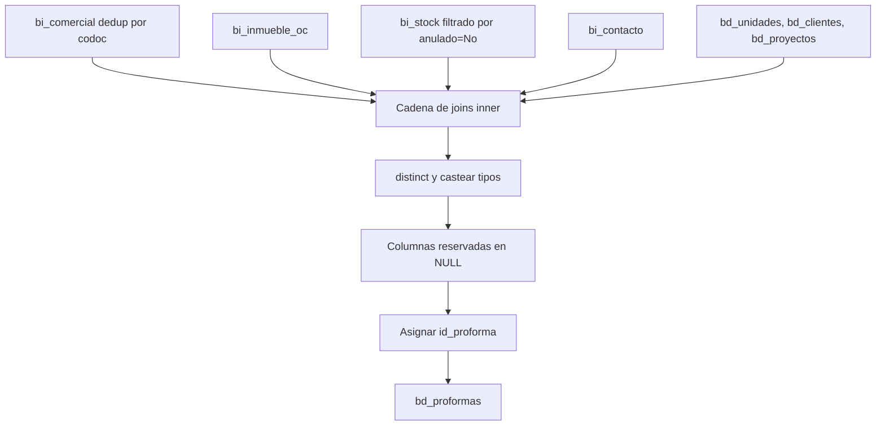

# `bd_proformas` — Evolta

## ¿Qué representa?

Cada **proforma** (cotización formal) emitida a un cliente sobre una unidad inmobiliaria.

Una proforma es el paso intermedio entre interés y separación: el cliente pide un detalle de precio, condiciones, financiamiento. Si lo acepta, suele convertirse en una separación (proceso comercial).

## ¿De dónde vienen los datos?

| Fuente | Aporta |
|---|---|
| `bi_comercial` (raw) | Datos de la operación comercial: tipo cotización, precio, fecha proforma, vendedor |
| `bi_inmueble_oc` (raw) | Vínculo unidad-OC |
| `bi_stock` (raw, filtrado por `anulado = "No"`) | Unidad: precio, modelo, estado |
| `bi_contacto` (raw) | Documento del cliente |
| `bd_unidades` (ya transformada) | Mapea `codinmueble` a `id_unidad` |
| `bd_clientes` (ya transformada) | Mapea `codcontacto` a `id_cliente` |
| `bd_proyectos` (ya transformada) | Mapea `codproyecto` a `id_proyecto` |

## Reglas aplicadas

1. **Dedup en `bi_comercial`** por `codoc` antes de los joins (una operación = una proforma).

2. **Filtro de stock anulado:** solo se consideran unidades con `bi_stock.anulado = "No"`. Las unidades canceladas no aparecen en proformas.

3. **Joins inner** en cadena:
   ```
   bi_comercial -> bi_inmueble_oc (codoc)
                -> bi_stock (codinmueble, no anulado)
                -> bi_contacto (codcontacto)
                -> bd_unidades (codinmueble)
                -> bd_clientes (codcontacto)
                -> bd_proyectos (codproyecto = id_proyecto)
   ```

4. **`distinct`** sobre el resultado.

5. **Casteos:** `precio_venta` a `double`, `fecha_actualizacion` y `fecha_proforma` a `date`/`timestamp` según corresponda.

6. **Mayúsculas** en `tipo_unidad` y `estado`, `tipo_financiamiento`.

7. **Columnas reservadas en NULL:** `asignacion`, `afecto_igv`, `lista_metraje`, `fecha_expiracion`, IDs Sperant, etc.

8. **`id_proforma` con `monotonically_increasing_id`.**

9. Auditoría: `fecha_hora_creacion`, `fecha_hora_modificacion`.

## Diagrama del flujo



## Resultado: columnas destacadas

| Categoría | Columnas |
|---|---|
| **IDs** | `id_proforma`, `id_unidad`, `id_proyecto`, `id_cliente`, `*_evolta` |
| **Operación** | `codigo_proforma`, `origen_proforma` |
| **Unidad** | `tipo_unidad`, `precio_venta`, `estado` |
| **Cliente** | `documento_cliente` |
| **Comercial** | `usuario_creador`, `username_creador`, `tipo_financiamiento` |
| **Fechas** | `fecha_creacion` (= fecha proforma), `fecha_actualizacion`, `fecha_expiracion` (NULL) |
| **Notas** | `nota_proforma` |

## Cosas a tener en cuenta

- **Solo proformas con stock no anulado y con cliente identificable.** Inner joins agresivos.
- **`asignacion`, `afecto_igv`, `lista_metraje`, `fecha_expiracion`** quedan NULL — Evolta no los expone.
- **`precio_venta` viene de `bi_stock.precioventa`**, no de `bi_comercial`. Es el precio listado en el inventario al momento de la proforma.
- Si una operación tiene varias proformas históricas, solo queda la última (por dedup en `codoc`).

## Referencia al código

- `transformations2_operations.py` → `transform_bd_proformas(...)`.
- Orquestador: `run_evolta_transform.py` → dentro de `run_bd_proformas_y_procesos(...)`.
