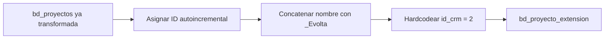

# `bd_proyecto_extension` — Evolta

## ¿Qué representa?

Una tabla auxiliar que asocia cada proyecto con un identificador único, su nombre y el CRM al que pertenece (Evolta o Sperant).

Sirve como "extensión" de `bd_proyectos` para llevar metadata adicional sin engordar la tabla principal.

## ¿De dónde vienen los datos?

| Tabla previa | Aporta |
|---|---|
| `bd_proyectos` (ya transformada) | `id_proyecto`, `nombre` |

No usa tablas raw — se construye **a partir de la `bd_proyectos` ya generada** en el mismo pipeline.

## Reglas aplicadas

1. Se asigna un ID interno autoincremental (`monotonically_increasing_id`).
2. Se concatena el nombre del proyecto con el sufijo `_Evolta` para construir un identificador legible:
   ```
   nombre = "Torre Sol_Evolta"
   codigo = "Torre Sol_Evolta"
   ```
3. Se hardcodea `id_crm = 2` (convención: `1` = Sperant, `2` = Evolta).
4. Auditoría con timestamps.

## Diagrama del flujo



## Resultado

| Columna | Qué guarda |
|---|---|
| `id` | ID autoincremental |
| `id_proyecto` | Referencia al proyecto |
| `nombre` | `\<nombre\>_Evolta` |
| `codigo` | Igual al nombre |
| `id_crm` | 2 (Evolta) |
| `fecha_hora_creacion_aud`, `fecha_hora_modificacion_aud` | Auditoría |

## Cosas a tener en cuenta

- El sufijo `_Evolta` es importante para distinguir filas de Evolta vs Sperant cuando se consulta esta tabla en un esquema joined.
- El `id_crm = 2` es una convención global del ETL (no buscar en una tabla maestra; está hardcoded).

## Referencia al código

- `transformations2_operations.py` → `transform_bd_proyecto_extension(bd_proyecto)`.
- Orquestador: `run_evolta_transform.py` → `run_bd_proyecto_extension(...)`.
