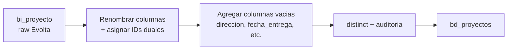

# `bd_proyectos` — Evolta

## ¿Qué representa?

La lista maestra de **proyectos inmobiliarios** que la inmobiliaria está vendiendo o ya entregó (ej. "Torre Sol", "Edificio Mar", "Condominio Las Flores").

Cada fila es un proyecto distinto. Esta tabla se usa como referencia en casi todos los dashboards: para filtrar por proyecto, mostrar el nombre, agrupar ventas, etc.

---

## ¿De dónde vienen los datos?

Una sola tabla cruda de Evolta:

| Tabla raw | Qué aporta |
|---|---|
| `bi_proyecto` | El nombre del proyecto, código, empresa dueña, si está activo o no |

Se leen estos campos: `codempresa`, `empresa`, `codproyecto`, `proyecto`, `activo`.

---

## Reglas aplicadas

La transformación es **muy simple** porque Evolta ya entrega los datos limpios:

1. **Renombrado de columnas** al estándar `bd_*`:
   - `codproyecto` → `id_proyecto` (y también se copia a `id_proyecto_evolta`).
   - `codempresa` → `id_empresa` (y también a `id_empresa_evolta`).
   - `proyecto` → `nombre`.
   - `empresa` → `empresa` (sin cambio).
   - `activo` → se mantiene tal cual.

2. **IDs de Sperant en `NULL`.** Como esta es la versión Evolta-pura, no hay equivalente en Sperant: `id_proyecto_sperant` y `id_empresa_sperant` quedan vacíos.

3. **Columnas extra reservadas en `NULL`.** Para mantener el mismo esquema que las versiones Sperant y Joined, se agregan placeholders vacíos (`direccion`, `fecha_entrega`, `latitud`, `longitud`, `pais`, `departamento`, `distrito`, `tipo_proyecto`, `estado_construccion`, `total_unidades`, `unidades_vendidas`, `moneda`, `banco_sponsor`, `fecha_inicio_venta`, `razon_social`, etc.).

   La razón: si los dashboards consultan estas columnas, deben existir aunque estén vacías. Se llenan en la versión Joined con datos de un CSV maestro.

4. **`distinct()` al final** — evita filas duplicadas por si `bi_proyecto` tuviera repetidos.

5. **Auditoría:** se agregan `fecha_hora_creacion_aud` y `fecha_hora_modificacion_aud` con el timestamp actual.

---

## Diagrama del flujo

---

## Resultado: columnas principales

| Columna | Qué guarda | Origen |
|---|---|---|
| `id_proyecto` | ID único del proyecto | `bi_proyecto.codproyecto` |
| `id_empresa` | A qué empresa pertenece | `bi_proyecto.codempresa` |
| `id_proyecto_evolta` | Mismo ID (rastreabilidad) | `bi_proyecto.codproyecto` |
| `id_empresa_evolta` | Mismo ID empresa | `bi_proyecto.codempresa` |
| `id_proyecto_sperant` | NULL en versión Evolta | — |
| `id_empresa_sperant` | NULL en versión Evolta | — |
| `nombre` | Nombre del proyecto | `bi_proyecto.proyecto` |
| `empresa` | Nombre de la empresa | `bi_proyecto.empresa` |
| `activo` | Si el proyecto está activo | `bi_proyecto.activo` |
| `direccion`, `fecha_entrega`, `latitud`, `longitud`, etc. | Reservados (NULL) | Se llenan en versión Joined |

---

## ¿Quiénes la usan?

- **Casi todos los dashboards** filtran o muestran por proyecto.
- `bd_unidades`, `bd_clientes`, `bd_interacciones` la referencian vía `id_proyecto`.
- `bd_proyecto_extension` la complementa con datos extra.

---

## Cosas a tener en cuenta

- **Sin filtros de "activo".** Esta tabla incluye proyectos activos e inactivos. El filtrado por `activo` se hace en los dashboards si se necesita.
- **No hay datos geográficos en Evolta.** Los campos `latitud`, `longitud`, `direccion`, `distrito` quedan vacíos en esta versión. La versión Joined los llena leyendo `CONSOLIDADO_DATA_PROYECTOS_EVOLTA.csv` desde GCS.
- **Empresas duplicadas son posibles.** Si dos proyectos tienen el mismo `codempresa` y `empresa`, ambos sobreviven (lo que se hace `distinct` es la fila completa, no solo la empresa).
- **Sin transformación de `nombre`.** El nombre del proyecto se guarda tal cual viene de Evolta (no se pasa a mayúsculas, no se normaliza). Esto difiere de la versión Sperant y Joined.

---

## Referencia rápida al código

- Orquestador: `run_evolta_transform.py` → `run_bd_proyectos(...)`.
- Lógica: `transformations2_operations.py` → `transform_bd_proyectos(bi_proyecto)`.
