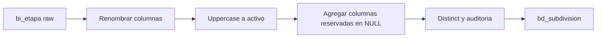

# `bd_subdivision` — Evolta

## ¿Qué representa?

Las **subdivisiones** dentro de un proyecto: torres, etapas, sectores, fases, módulos. Un proyecto tipo "Condominio Las Flores" puede tener Torre A, Torre B, Etapa 1, Etapa 2, etc.

## ¿De dónde vienen los datos?

| Tabla raw | Aporta |
|---|---|
| `bi_etapa` | Código de etapa, código de proyecto al que pertenece, nombre, si está activa |

## Reglas aplicadas

1. Renombrado:
   - `codetapa` → `id_subdivision` (también copiado a `id_subdivision_evolta`).
   - `codproyecto` → `id_proyecto` (y `id_proyecto_evolta`).
   - `etapa` → `nombre`.
2. IDs de Sperant en NULL.
3. **`activo` se pasa a mayúsculas.** Por consistencia con el resto del ETL.
4. Columnas reservadas en NULL para que el esquema coincida con las versiones Sperant y Joined: `fecha_actualizacion`, `tipo`, `fecha_inicio_venta`, `fecha_entrega`, `nropisos`, `observacion`.
5. `distinct` al final.
6. Auditoría con timestamps.

## Diagrama del flujo

## Resultado

| Columna | Qué guarda |
|---|---|
| `id_subdivision` | ID etapa | 
| `id_proyecto` | Proyecto al que pertenece |
| `nombre` | Nombre de la etapa o torre |
| `activo` | "S" / "N" / equivalente |
| `tipo`, `fecha_inicio_venta`, `fecha_entrega`, `nropisos`, `observacion` | NULL |
| Auditoría | Timestamps |

## Cosas a tener en cuenta

- Evolta llama "etapa" a lo que el ETL llama "subdivisión". Es solo un cambio de nombre.
- El `activo` puede venir con valores variados (`S`, `N`, `True`, `1`, `Activo`). Solo se hace uppercase, no se normaliza el valor — los dashboards deben tener en cuenta esto.

## Referencia al código

- `transformations2_operations.py` → `transform_bd_subdivision(bi_etapa)`.
- Orquestador: `run_evolta_transform.py`.
