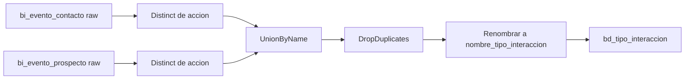

# `bd_tipo_interaccion` — Evolta

## ¿Qué representa?

El catálogo de **tipos de interacción** entre cliente y asesor: llamada, visita, cita, mail, mensaje, etc. Es una tabla maestra que se va construyendo a partir de los valores que aparecen en los eventos.

## ¿De dónde vienen los datos?

| Tabla raw | Aporta |
|---|---|
| `bi_evento_contacto` | Columna `accion` |
| `bi_evento_prospecto` | Columna `accion` |

## Reglas aplicadas

1. Se sacan los valores **distintos** de `accion` en cada tabla.
2. Se hace `unionByName` de ambos.
3. Se hace `dropDuplicates` por `accion` (el `unionByName` puede traer repetidos si la misma acción existe en ambas tablas).
4. Se renombra `accion` → `nombre_tipo_interaccion`.
5. Se asigna `id_tipo_interaccion` con `monotonically_increasing_id`.
6. Auditoría con timestamps.

## Diagrama del flujo

## Resultado

| Columna | Qué guarda |
|---|---|
| `id_tipo_interaccion` | ID generado |
| `nombre_tipo_interaccion` | Nombre del tipo (ej. "LLAMADA", "VISITA") |
| Auditoría | Timestamps |

## Cosas a tener en cuenta

- **No hay traducción ni normalización** del nombre. Si Evolta tiene "Llamada", "llamada" y "LLAMADA", aparecerán como tres tipos distintos. Idealmente deberían normalizarse (lowercase + trim) antes del distinct.
- **El ID no es estable** entre corridas. `monotonically_increasing_id` puede asignar valores distintos cada vez. Si un dashboard guarda un ID puntual, va a romperse.
- Esta tabla se usa para joinear contra `bd_interacciones`.

## Referencia al código

- `transformations2_operations.py` → `transform_tipo_interacciones(bi_evento_contacto, bi_evento_prospecto)`.
- Orquestador: `run_evolta_transform.py`.
