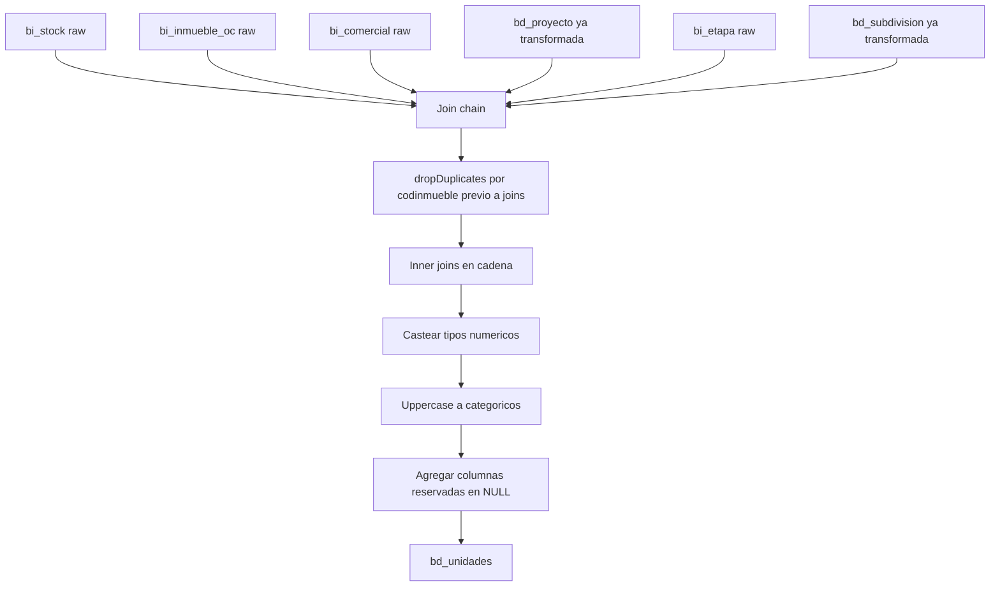

# `bd_unidades` — Evolta

## ¿Qué representa?

Cada **unidad inmobiliaria** que se vende: departamento, casa, lote, oficina, local. Es una de las tablas centrales del ETL — alimenta el dashboard de stock comercial y se referencia desde proformas, procesos e interacciones.

## ¿De dónde vienen los datos?

Cinco tablas crudas + dos `bd_*` previas:

| Fuente | Aporta |
|---|---|
| `bi_stock` | Información del inmueble: precios, áreas, tipología, dormitorios, baños, estado |
| `bi_inmueble_oc` | Vínculo entre el inmueble y la operación comercial (`codoc`) |
| `bi_comercial` | Datos comerciales: tipo de financiamiento, etapa comercial |
| `bi_etapa` | Nombre de la etapa a la que pertenece la unidad |
| `bi_proyecto` (vía `bd_proyecto` ya transformada) | Proyecto y empresa |
| `bd_subdivision` | ID de subdivisión ya generado |

## Reglas aplicadas

### Limpieza previa
1. Se hace `dropDuplicates(["codinmueble"])` sobre `bi_stock` y `bi_inmueble_oc` antes de los joins. Razón: si una misma unidad aparece varias veces, los joins explotan.

### Joins en cadena
2. Joins **inner** todos:
   ```
   bi_stock <-> bi_inmueble_oc        (codinmueble)
   bi_inmueble_oc <-> bi_comercial    (codoc)
   bi_stock <-> bd_proyecto           (codproyecto = id_proyecto)
   bi_stock <-> bi_etapa              (codetapa)
   bi_stock <-> bd_subdivision        (codetapa = id_subdivision)
   ```

3. Como son `inner`, **una unidad sin operación comercial NO aparece** en `bd_unidades`. Esto es intencional — solo se guardan unidades que ya están en el flujo comercial.

### Transformaciones de columnas
4. **ID secuencial:** se asigna `id_unidad` con `monotonically_increasing_id()`.
5. **Mayúsculas en categóricos:** `tipo_unidad`, `estado_construccion`, `tipologia`, `vista`, `estado`, `modalidad_contrato`.
6. **Casteos numéricos:**
   - Áreas → `double`.
   - Dormitorios → `integer`.
   - Baños → `double` (sí, double — porque puede haber medio baño: 1.5).
   - Precios → `double`.
7. **Duplicación de campos:**
   - `area_total` viene de `areaventa`.
   - `precio_proforma` y `precio_venta` ambos vienen de `precioventa` (no se distinguen en Evolta).
   - `moneda_precio_lista` y `moneda_venta` ambos vienen de `moneda` (igual).
8. **Columnas reservadas en NULL** (no existen en Evolta): `motivo_bloqueo`, `fecha_fin_independizacion`, `codigo_externo`, `fecha_precio_actualizado`, `fecha_vcto_garantia_*`, `partida_independizacion`.
9. Auditoría con timestamps.

## Diagrama del flujo



## Resultado: columnas destacadas

| Categoría | Columnas |
|---|---|
| **IDs** | `id_unidad`, `codinmueble`, `id_subdivision`, `id_unidad_evolta`, `id_subdivision_evolta` |
| **Datos del proyecto** | `proyecto`, `empresa` |
| **Tipo y ubicación** | `tipo_unidad`, `piso`, `estado_construccion`, `tipologia`, `vista` |
| **Areas** | `area_libre`, `area_techada`, `area_total`, `area_construida`, `area_jardin`, `area_terraza`, `area_terreno` |
| **Dormitorios y baños** | `total_dormitorios`, `total_banos`, `num_estudios` |
| **Precios** | `precio_base`, `precio_lista`, `precio_proforma`, `precio_venta`, `descuento`, `preciometro2` |
| **Estado comercial** | `estado`, `moneda_precio_lista`, `moneda_venta`, `modalidad_contrato` |
| **Observaciones** | `observaciones` |

## Cosas a tener en cuenta

- **Inner joins eliminan unidades sin operación comercial.** Si negocio quiere ver unidades disponibles que aún no tienen `codoc`, hay que ajustar a left join.
- **Anulados no se filtran.** A diferencia de las versiones de proformas/procesos, aquí no se aplica filtro `anulado = "No"`. Las unidades canceladas pueden aparecer.
- **`num_estudios` es igual a `total_dormitorios`.** Es un alias, no un cálculo distinto. Si en algún momento negocio define "estudio" como caso especial (0 dormitorios, por ejemplo), hay que ajustar.
- **`precio_proforma == precio_venta`.** Ambos vienen del mismo campo. Es un placeholder hasta que Evolta distinga ambos.

## Referencia al código

- `transformations2_operations.py` → `transform_bd_unidades(bi_stock, bi_inmueble_oc, bi_comercial, bd_proyecto, bi_etapa, bd_subdivision)`.
- Orquestador: `run_evolta_transform.py` → `run_bd_unidades(...)`.
