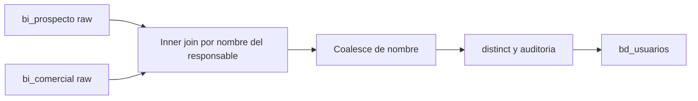

# `bd_usuarios` — Evolta

## ¿Qué representa?

Los **asesores comerciales** que atienden clientes y operaciones. Sirve para reportar performance, asignar leads, identificar al vendedor responsable de una venta.

## ¿De dónde vienen los datos?

| Fuente | Aporta |
|---|---|
| `bi_prospecto` | `idresponsable`, `responsable` (nombre) |
| `bi_comercial` | `nombreresponsable` |

Evolta no tiene una tabla maestra de usuarios — los asesores se infieren de las tablas donde aparecen como responsables.

## Reglas aplicadas

1. **Inner join** entre `bi_prospecto` y `bi_comercial` por nombre del responsable:
   ```
   bi_prospecto.responsable == bi_comercial.nombreresponsable
   ```
   Solo quedan asesores que aparecen en ambas tablas.

2. **Coalesce del nombre:** se prefiere el nombre que viene de `bi_comercial` y, si no hay, el de `bi_prospecto`.

3. **`id_usuario`** = `idresponsable` de Evolta. También se duplica como `id_usuario_original` y `id_usuario_evolta`.

4. Columnas Sperant en NULL: `id_usuario_sperant`, `username`, `username_asignador`, `tipo_asesor`, `id_crm`.

5. `distinct` al final.
6. Auditoría con timestamps.

## Diagrama del flujo



## Resultado

| Columna | Origen |
|---|---|
| `id_usuario` | `bi_prospecto.idresponsable` |
| `id_usuario_evolta` | Mismo valor |
| `id_usuario_original` | Mismo valor |
| `id_usuario_sperant` | NULL |
| `nombre` | `bi_comercial.nombreresponsable` o `bi_prospecto.responsable` |
| `username`, `username_asignador`, `tipo_asesor`, `id_crm` | NULL |
| Auditoría | Timestamps |

## Cosas a tener en cuenta

- **Inner join descarta asesores que solo trabajan prospectos** (sin operaciones cerradas) o solo comerciales (sin prospectos). Si negocio quiere ver todos los asesores, cambiar a left join o full outer.
- **Coincidencia por nombre** es frágil. Si hay tipeo distinto entre tablas (espacios, mayúsculas, tildes), el match falla. Idealmente debería ser por ID.
- No hay `username` en Evolta — solo nombre. La columna `username` queda en NULL siempre (a diferencia de Sperant donde `username` es la clave).

## Referencia al código

- `transformations2_operations.py` → `transform_bd_usuarios(bi_prospecto, bi_comercial)`.
- Orquestador: `run_evolta_transform.py`.
