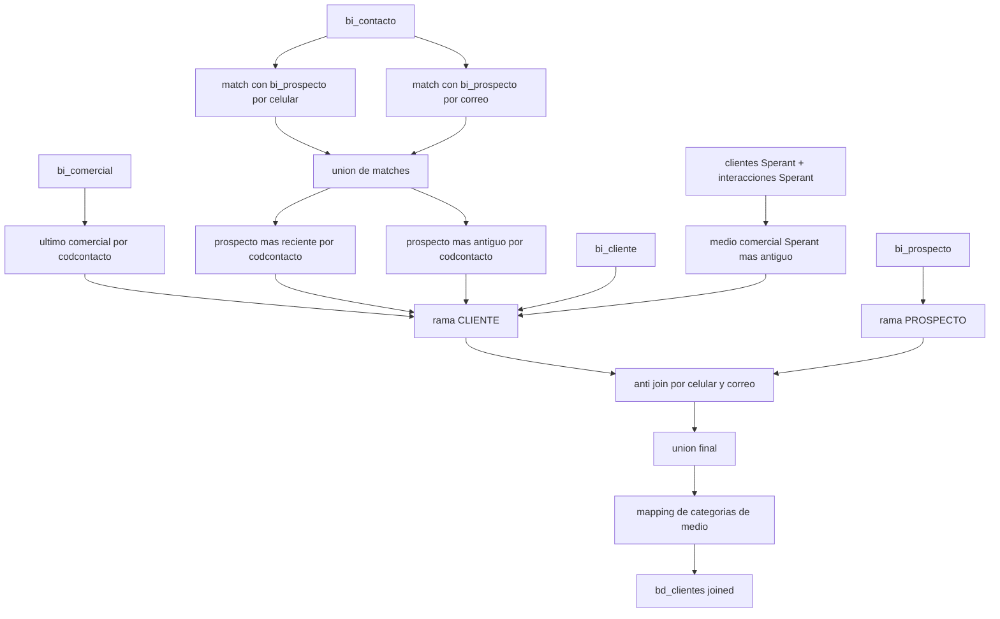

# `bd_clientes` - Joined

## Que representa?

La tabla maestra de clientes para esquemas joined (`sev_9`, `sev_121`).

No es una union simple de "clientes Evolta" + "clientes Sperant".
La rama principal sigue saliendo de Evolta, pero el flujo usa Sperant para enriquecer algunos campos comerciales y para categorizar mejor el medio.

## De donde vienen los datos?

| Fuente | Que aporta |
|---|---|
| `bi_contacto` | Base de contactos Evolta |
| `bi_prospecto` | Prospectos, fechas, UTM, nivel de interes, responsable |
| `bi_comercial` | Ultimo proyecto comercial, estado del cliente, responsable comercial |
| `bi_cliente` | Datos personales adicionales del cliente ya convertido |
| `interacciones` (Sperant) | Medio de captacion comercial mas antiguo por cliente Sperant |
| `clientes` (Sperant) | Email y celular para enlazar esas interacciones |
| `CONSOLIDADO_MEDIOS_CAPTACION.csv` | Categoria de medio |
| `RELACION_ASESORES.csv` | Responsable consolidado |

## Como se arma realmente

### 1. Se construye primero la vista "contacto + prospecto" desde Evolta

El codigo cruza `bi_contacto` con `bi_prospecto` por dos caminos:

1. `celular_clean`
2. `correo`

Luego hace `unionAll` de ambos matches. Sobre esa union:

- saca el prospecto mas reciente por `codcontacto`
- saca el prospecto mas antiguo por `codcontacto`
- arma la lista de proyectos relacionados

Eso sirve para separar:

- el estado mas actual del cliente
- la primera captacion y sus UTM

### 2. La rama `CLIENTE` sale de Evolta, no de Sperant

Para que una fila quede como `tipo_origen = CLIENTE`, el flujo exige:

- contacto en `bi_contacto`
- match con su prospecto
- match con `ultimo_comercial`
- match con `bi_cliente`

Por eso esta rama es agresiva:

- usa `inner join` con `ultimo_comercial`
- usa `inner join` con `bi_cliente`

Si un contacto existe pero no llega a convertirse en cliente comercial dentro de ese camino, no entra a esta rama.

### 3. Sperant no crea clientes nuevos; solo enriquece el medio comercial

El joined lee:

- `clientes` de Sperant
- `interacciones` de Sperant filtradas solo a tipos:
  - `FACEBOOK`
  - `API`
  - `PORTAL INMOBILIARIO`
  - `CREACION DE CLIENTE`

Con eso hace dos enlaces:

1. contacto Evolta -> celular Sperant
2. contacto Evolta -> email Sperant

Despues busca la interaccion Sperant mas antigua por `codcontacto` y la usa para poblar:

- `medio_captacion_comercial`

Eso es lo mas importante del joined en esta tabla: no agrega clientes Sperant puros, pero si usa Sperant para mejorar el origen comercial del cliente ya conocido en Evolta.

### 4. La rama `PROSPECTO` si sale directamente de `bi_prospecto`

Se arma otra tabla solo con prospectos Evolta.

Antes de anexarla al resultado final, se le aplica un anti-join para no duplicar registros que ya existen como `CLIENTE`:

- anti-join por `celular`
- anti-join por `correo`

Solo los prospectos que no colisionan con un cliente existente sobreviven.

### 5. Al final se mapean categorias de medio

Se normalizan y mapean dos campos distintos:

- `medio_captacion_prospectos`
- `medio_captacion_comercial`

De ahi salen:

- `medio_captacion_categoria_prospecto`
- `medio_captacion_categoria_comercial`

## Diagrama del flujo

## Cosas a tener en cuenta

- **No es una union total de ambos CRMs.** La identidad del cliente sigue gobernada por Evolta.
- **Sperant no aporta clientes nuevos** en esta tabla. Solo aporta contexto de medio comercial cuando se logra enlazar por email o celular.
- **Los joins a cliente convertido son agresivos.** Si falta `ultimo_comercial` o `bi_cliente`, la rama `CLIENTE` se cae.
- **El anti-join de prospectos puede ocultar casos ambiguos.** Si dos personas comparten celular o correo, el prospecto puede quedar fuera aunque negocio lo considere distinto.
- **`id_cliente_sperant` queda en NULL.** Aunque se use Sperant para enriquecer, el modelo final no conserva una llave Sperant del cliente.
- **El comportamiento joined depende de CSVs externos.** Medio y responsable consolidado vienen de archivos con separador `;`.

## Referencia al codigo

- `infra/src/etl/run_evolta_sperant_transform.py` -> `run_bd_clientes(...)`
- `infra/src/etl/run_evolta_sperant_transform.py` -> `run_bd_clientes_transform(...)`
