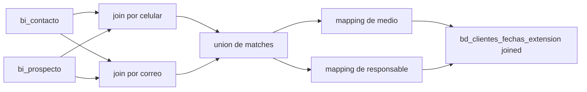

# `bd_clientes_fechas_extension` - Joined

## Que representa?

Una tabla liviana de linea de tiempo para cliente/prospecto.

Guarda la primera fecha de registro conocida junto con el medio, subestado, responsable consolidado y UTM asociados a ese registro.

## De donde vienen los datos?

| Fuente | Que aporta |
|---|---|
| `bi_contacto` | Contacto base Evolta |
| `bi_prospecto` | Fecha de registro, medio, proyecto, responsable, subestado, UTM |
| `CONSOLIDADO_MEDIOS_CAPTACION.csv` | Categoria de medio |
| `RELACION_ASESORES.csv` | Responsable consolidado |

## Como se arma

1. Limpia celular en `bi_contacto` y `bi_prospecto`.
2. Hace dos `inner join` entre contacto y prospecto:
   - por `celular_clean`
   - por `correo`
3. Une ambos caminos con `unionAll`.
4. Normaliza `pros_comoseentero` para buscar su categoria.
5. Normaliza `responsable` para enlazar con el CSV de usuarios.
6. Proyecta el resultado final con:
   - `id_cliente_evolta = codcontacto`
   - `id_proyecto = pros_codproyecto`
   - `fecha_registro = pros_fecharegistro`
   - UTM y responsable consolidado

No usa raw de Sperant.

## Diagrama del flujo

## Cosas a tener en cuenta

- **Solo usa Evolta.** No incorpora interacciones o clientes Sperant.
- **Puede duplicar el mismo contacto por dos caminos de match** y luego confiar en `distinct()` al final.
- **`id_cliente_evolta` aqui es `codcontacto`, no `codprospecto`.** Eso es importante para reconciliar contra `bd_clientes`.
- **Si cambia el primer medio en Evolta, esta tabla no hace una logica de "mas antiguo vs mas reciente".** Guarda cada match que sobrevive al `distinct`.

## Referencia al codigo

- `infra/src/etl/run_evolta_sperant_transform.py` -> `run_bd_clientes_fechas_extension(...)`
- `infra/src/etl/run_evolta_sperant_transform.py` -> `run_bd_clientes_extension_transform(...)`
