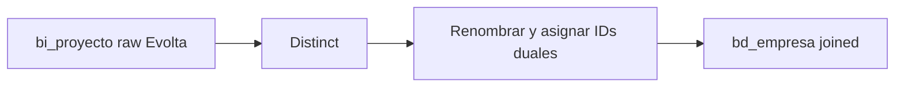

# `bd_empresa` — Joined

## ¿Qué representa?

La empresa unificada para esquemas que tienen **ambos CRMs** activos.

## ¿De dónde vienen los datos?

Igual que la versión Evolta: se infiere de `bi_proyecto`. La versión joined **solo enriquece la lógica de Evolta**, no une con Sperant para esta tabla puntual.

## Reglas aplicadas

1. Distinct por `codempresa` + `empresa`.
2. Renombrar `empresa` → `nombre`.
3. Hardcodear `id_team_performance = 1`.
4. Auditoría con timestamps + `fecha_creacion_aud` adicional.

## Diagrama del flujo

## Resultado

Mismas columnas que la versión Evolta más `fecha_creacion_aud` (date, no timestamp) que solo aparece en versiones joined.

## Cosas a tener en cuenta

- **Esta versión NO mezcla empresas de Sperant.** Si el esquema joined tiene proyectos solo en Sperant, esas empresas no aparecerán aquí. Se asume que Evolta es la fuente de verdad para empresa.

## Referencia al código

- `run_evolta_sperant_transform.py` → `run_bd_empresa(...)` y `run_bd_empresa_transform(...)`.
