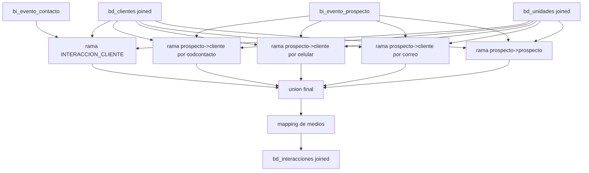

# `bd_interacciones` - Joined

## Que representa?

Las interacciones comerciales del esquema joined.

Aqui la materia prima sigue viniendo de Evolta, pero la resolucion de cliente, unidad y proyecto ya se hace contra las tablas `bd_*` joined. Por eso no es "solo Evolta" en terminos funcionales.

## De donde vienen los datos?

| Fuente | Que aporta |
|---|---|
| `bi_evento_contacto` | Eventos sobre contacto |
| `bi_evento_prospecto` | Eventos sobre prospecto |
| `bi_contacto` | Identidad base del contacto |
| `bi_prospecto` | Medio, canal, UTM, proyecto, visita |
| `bi_comercial` | Proforma, medio/canal comercial, visita unica |
| `bi_inmueble_oc` + `bi_stock` | Camino para resolver unidad Evolta |
| `bd_clientes` joined | Cliente final ya consolidado |
| `bd_unidades` joined | Unidad final ya consolidada |
| `bd_proyectos` joined | Proyecto final |
| `bd_tipo_interaccion` joined | Catalogo de accion -> tipo |
| `CONSOLIDADO_MEDIOS_CAPTACION.csv` | Categoria de medio |
| `RELACION_ASESORES.csv` | Responsable consolidado |

## Como se arma realmente

### 1. Se reconstruye otra vez el puente contacto-prospecto

El flujo repite la idea de `bd_clientes`:

- match por celular
- match por correo
- `unionAll`
- se queda con el prospecto mas reciente por `codcontacto`

Eso sirve para enriquecer los eventos con:

- UTM
- medio
- canal
- fechas de visita y tarea

### 2. Rama `INTERACCION_CLIENTE`

Parte de `bi_evento_contacto`.

Luego enlaza con:

- `bd_clientes` joined por `codcontacto`
- `bd_tipo_interaccion`
- `bd_proyectos`
- `bi_comercial` por `codcontacto + codproyecto`
- `bi_inmueble_oc` y `bi_stock`
- `bd_unidades` joined por nombre/codigo de unidad y proyecto

Despues filtra solo unidades tipo:

- `departamento`
- `casa`
- o `NULL`

La deduplicacion fuerte de esta rama es:

- `dropDuplicates(["codeventocontacto", "fechavisita"])`

### 3. Rama `INTERACCION_PROSPECTO` que termina siendo cliente

Parte de `bi_evento_prospecto`, pero intenta resolver si ese prospecto ya corresponde a un cliente joined.

Hace tres caminos alternativos:

1. match por `codcontacto`
2. match por `celular`
3. match por `correo`

Une los tres, filtra solo filas donde `id_cliente` no sea nulo y deduplica por:

- `id_interaccion_evolta`

### 4. Rama `INTERACCION_PROSPECTO` que sigue siendo prospecto

Tambien parte de `bi_evento_prospecto`, pero ahora enlaza contra `bd_clientes` joined filtrando:

- `tipo_origen = PROSPECTO`

en vez de intentar resolverlo como cliente.

### 5. Union final y mapeo de medios

Se unen:

- `interacciones_contacto`
- `interacciones_prospecto`

Despues se mapean dos cosas:

- `medio_captacion`
- `medio_captacion_proforma`

para producir:

- `medio_captacion_categoria`
- `medio_captacion_proforma_categoria`

## Diagrama del flujo

## Cosas a tener en cuenta

- **No consume interacciones raw de Sperant.** Todo evento nace en Evolta.
- **Si `bd_clientes` joined esta corto o sesgado, esta tabla hereda el problema.**
- **La unidad no sale directo de la tabla final de stock.** Hay un camino intermedio `bi_comercial -> bi_inmueble_oc -> bi_stock -> bd_unidades`.
- **El filtro por tipo de unidad puede esconder registros.** Todo lo que no sea `departamento`, `casa` o `NULL` se cae.
- **La rama prospecto->cliente usa tres llaves distintas.** Eso mejora cobertura, pero tambien aumenta el riesgo de falso match si hay correos o celulares compartidos.
- **Aqui `estado` no esta hardcodeado.** Sale de `bec.codestado`, no de una constante tipo `"NO HAY ESTADO"`.

## Referencia al codigo

- `infra/src/etl/run_evolta_sperant_transform.py` -> `run_bd_interacciones(...)`
- `infra/src/etl/run_evolta_sperant_transform.py` -> `run_bd_interacciones_transform(...)`
