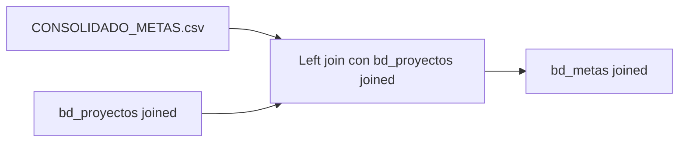

# `bd_metas` — Joined

## ¿Qué representa?

Las metas para esquemas joined. Mismo origen y lógica que las versiones Evolta y Sperant.

## ¿De dónde vienen los datos?

CSV `CONSOLIDADO_METAS.csv` + `bd_proyectos` joined.

## Reglas aplicadas

Mismas que las otras versiones. El proyecto se vincula vía nombre normalizado contra la versión joined de `bd_proyectos`.

## Diagrama del flujo

## Cosas a tener en cuenta

- El CSV debe tener filas para los proyectos del esquema joined (`sev_9`, `sev_121`).
- Si la inmobiliaria carga metas separadas para Evolta y Sperant en el mismo proyecto, se necesita criterio adicional para no duplicar.

## Referencia al código

- `run_evolta_sperant_transform.py` → `run_bd_metas(...)`.
