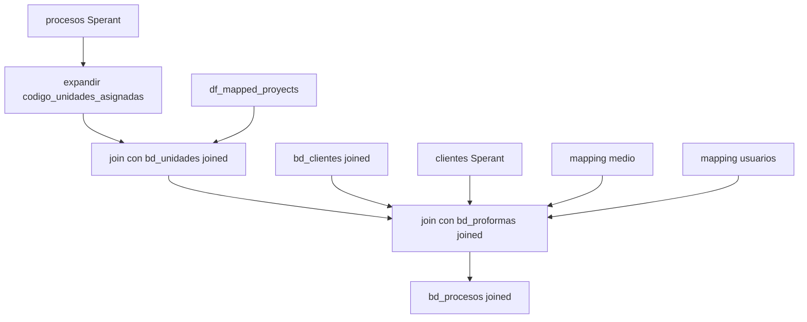

# `bd_procesos` - Joined

## Que representa?

Los procesos comerciales del esquema joined: separaciones, ventas, anulaciones, devoluciones y campos de perfil comercial asociados al proceso.

En joined, esta tabla no nace de Evolta. La base real es Sperant.

## De donde vienen los datos?

| Fuente | Que aporta |
|---|---|
| `procesos` (Sperant) | Proceso comercial base |
| `clientes` (Sperant) | Datos de perfil del cliente y medio original |
| `bd_unidades` joined | Unidad final |
| `bd_proformas` joined | Proforma final |
| `bd_clientes` joined | Cliente final |
| `df_mapped_proyects` | Traduccion `codigo_proyecto Sperant -> id_proyecto joined` |
| `CONSOLIDADO_MEDIOS_CAPTACION.csv` | Categoria del medio |
| `RELACION_ASESORES.csv` | Responsable consolidado |

## Como se arma realmente

### 1. Se expande una fila de proceso en varias unidades cuando hace falta

El campo `codigo_unidades_asignadas` puede traer varias unidades en una sola cadena.

El flujo:

- conserva la unidad original en `codigo_unidad`
- explota `codigo_unidades_asignadas` por coma
- une ambas versiones con `unionByName`

Esto significa que un mismo proceso puede terminar replicado en varias filas, una por unidad.

### 2. El proceso se vuelve "joined" cuando logra resolver tres llaves

Sobre `df_procesos_expandido`, hace `inner join` con:

1. `bd_unidades` por `codigo_unidad`
2. `df_mapped_proyects` por `codigo_proyecto`
3. `bd_proformas` por `codigo_proforma`

Si cualquiera de esos tres enlaces falla, la fila se pierde.

### 3. El cliente final es opcional, pero el cliente Sperant original no

Luego hace:

- `left join` con `bd_clientes` joined usando `documento_cliente`
- `left join` con `clientes` Sperant usando `cliente_id`

Eso genera un comportamiento mixto:

- la fila del proceso puede sobrevivir aunque no encuentre `id_cliente` en `bd_clientes`
- pero igual puede traer campos de perfil desde `clientes` Sperant

### 4. Medio y responsable se consolidan en esta capa

Dos enriquecimientos importantes:

- `responsable_consolidado` se resuelve contra el CSV de usuarios usando `aprobador_descuento`
- `medio_captacion_esp` se mapea desde el medio del cliente Sperant hacia su categoria consolidada

Ademas, esta tabla deja listos muchos campos que despues usan dashboards como:

- `perfil_cliente`
- `stock_comercial`
- `cliente_mensual_comercial`

## Diagrama del flujo

## Campos a mirar con cuidado

- `id_proceso_sperant`
  - viene del proceso Sperant real
- `id_proceso_evolta`
  - queda en `NULL`
- `id_proyecto`
  - sale del mapping joined, no del codigo raw tal cual
- `medio_captacion_esp`
  - sale del cliente Sperant y se categoriza con CSV
- `ultimoproceso`
  - queda hardcodeado en `"Si"`
- `visita_unica_mes`
  - queda en `NULL` en esta tabla

## Cosas a tener en cuenta

- **Esta tabla puede multiplicar filas** por la explosion de `codigo_unidades_asignadas`.
- **Tres `inner join` mandan la cobertura.** Si falta mapeo de proyecto, unidad o proforma, el proceso desaparece.
- **Muchos campos de perfil vienen de Sperant, no del cliente joined.**
- **Los nombres de columnas de IDs pueden confundir.** Aunque el origen es Sperant, `id_proyecto_evolta` queda poblado con el ID joined/equivalente y `id_proyecto_sperant` tambien se llena con ese mismo valor mapeado.
- **Hay dependencias fuertes de CSVs externos.** Si falla el mapping de medio o de usuarios, cambian `medio_captacion_esp` y `responsable_consolidado`.

## Referencia al codigo

- `infra/src/etl/run_evolta_sperant_transform.py` -> `run_bd_procesos(...)`
- `infra/src/etl/run_evolta_sperant_transform.py` -> `run_bd_procesos_transform(...)`
