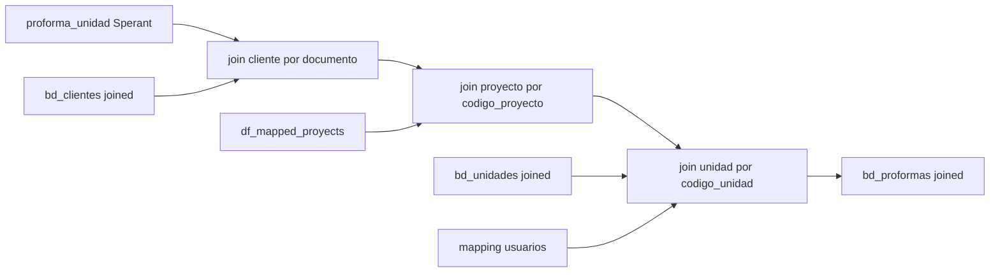

# `bd_proformas` - Joined

## Que representa?

Las proformas comerciales del esquema joined.

En legacy joined, la fuente real es Sperant. El "joined" se logra porque la proforma se amarra a los IDs finales de cliente, unidad y proyecto ya transformados.

## De donde vienen los datos?

| Fuente | Que aporta |
|---|---|
| `proforma_unidad` (Sperant) | Proforma base |
| `bd_clientes` joined | Cliente final por documento |
| `bd_unidades` joined | Unidad final por codigo |
| `df_mapped_proyects` | Traduccion `codigo_proyecto Sperant -> id_proyecto joined` |
| `RELACION_ASESORES.csv` | Responsable consolidado |

## Como se arma

1. Lee `proforma_unidad` de Sperant.
2. Busca el cliente final en `bd_clientes` joined usando:
   - `documento_cliente == nrodocumento`
   - y solo dentro de `tipo_origen = CLIENTE`
3. Busca el proyecto joined correcto en `df_mapped_proyects` usando `codigo_proyecto`.
4. Busca la unidad joined en `bd_unidades` usando `codigo_unidad`.
5. Busca responsable consolidado con `username_creador`.

Los joins clave son:

- cliente: `left`
- proyecto: `inner`
- unidad: `inner`

Eso significa:

- una proforma puede sobrevivir sin cliente enlazado
- pero no sobrevive sin proyecto mapeado ni sin unidad mapeada

## Diagrama del flujo

## Cosas a tener en cuenta

- **No usa proformas raw de Evolta.** Todo nace en Sperant.
- **El match del cliente depende del documento.** Si el documento esta distinto entre Sperant y `bd_clientes`, la proforma queda sin `id_cliente`.
- **Proyecto y unidad si son obligatorios.** Sin mapping, la fila se pierde.
- **`id_proforma_evolta` queda en NULL.** No existe una proforma Evolta equivalente en esta tabla.
- **Las columnas `id_proyecto_evolta` e `id_proyecto_sperant` son enganosas.** Ambas se llenan con el mismo ID joined mapeado, no con dos llaves crudas independientes.
- **No hay deduplicacion semantica por `codigo_proforma`.** Se asume que la fuente Sperant ya viene en un nivel suficientemente limpio.

## Referencia al codigo

- `infra/src/etl/run_evolta_sperant_transform.py` -> `run_bd_proformas(...)`
- `infra/src/etl/run_evolta_sperant_transform.py` -> `run_bd_proformas_transform(...)`
