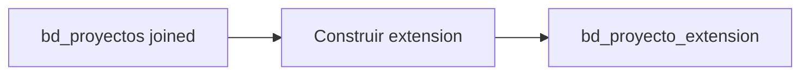

# `bd_proyecto_extension` — Joined

## ¿Qué representa?

Tabla auxiliar de proyectos para esquemas joined.

## ¿De dónde vienen los datos?

Reutiliza la lógica de Evolta — se construye desde `bd_proyectos` joined.

## Reglas aplicadas

Mismas que Evolta:
1. ID autoincremental.
2. Sufijo `_Evolta` en `nombre` y `codigo`.
3. `id_crm = 2`.
4. Auditoría.

## Diagrama del flujo

## Cosas a tener en cuenta

- Solo cubre proyectos de Evolta. Los proyectos solo en Sperant no tendrán fila aquí.

## Referencia al código

- `run_evolta_sperant_transform.py` → `run_bd_proyecto_extension(...)`.
