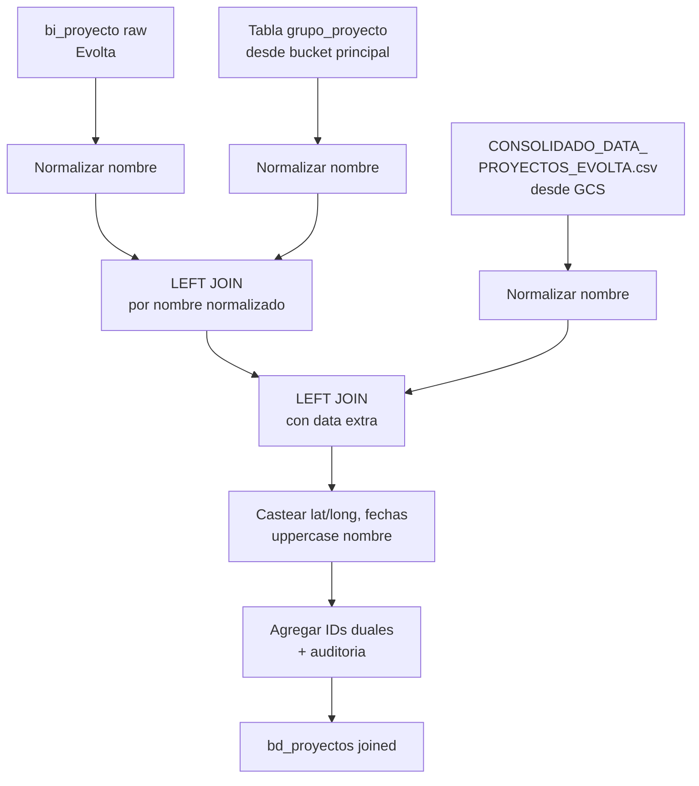

# `bd_proyectos` — Joined (Evolta + Sperant)

## ¿Qué representa?

La lista maestra de proyectos para los esquemas que tienen **ambos CRMs** activos al mismo tiempo (`sev_9`, `sev_121`).

A diferencia de las versiones Evolta-pura y Sperant-pura, esta versión:
- Toma los proyectos de **Evolta** como base.
- Les **enriquece** con datos extra que no están en el CRM (dirección, latitud, longitud, etapa) leídos desde un archivo CSV maestro.
- Les agrega información de **agrupación inmobiliaria y team** (también desde CSV).

---

## ¿De dónde vienen los datos?

| Fuente | Qué aporta |
|---|---|
| `bi_proyecto` (Evolta raw) | Lista de proyectos: `codempresa`, `empresa`, `codproyecto`, `proyecto`, `activo` |
| `CONSOLIDADO_DATA_PROYECTOS_EVOLTA.csv` (CSV en GCS) | Datos extra: dirección, fecha de entrega, latitud, longitud, etapa, distrito, "estado_performance" |
| Tabla principal de grupo (CSV / BQ) | Grupo inmobiliario y team al que pertenece cada proyecto |

> **Importante:** esta versión **NO** usa la tabla `proyectos` de Sperant. Aunque se llame "joined", para `bd_proyectos` específicamente solo se enriquece la versión de Evolta. Las versiones unificadas que sí mezclan ambos CRMs son `bd_clientes`, `bd_interacciones`, `bd_unidades`, etc.

---

## Reglas aplicadas

1. **Normalización del nombre del proyecto.** Antes de cualquier join se aplica `normalizar_columna(...)` al nombre de Evolta. Esta función (en `general_utils.py`) saca tildes, espacios y caracteres especiales para que el join con el CSV no falle por diferencias de tipeo.

2. **Join LEFT con el CSV de grupo inmobiliario.** Se busca el grupo inmobiliario y team del proyecto comparando nombres normalizados:
   ```
   normalizar(grupo_proyecto.proyecto_normalizado) == normalizar(bi_proyecto.proyecto)
   ```
   Si el proyecto no está en el CSV, los campos `grupo_inmobiliario` y `team_performance` quedan en NULL.

3. **Join LEFT con el CSV de data extra.** Mismo criterio: nombre normalizado vs nombre normalizado. Aporta dirección, fecha de entrega, lat/long, distrito, etapa, estado.

4. **Nombre en mayúsculas.** `nombre` se pasa a uppercase. El nombre original tal cual viene queda dentro del flujo de joins pero no en el output final como columna separada.

5. **Casteos de tipos.** El CSV trae todo como string, así que se castea:
   - `latitud`, `longitud` → `double`.
   - `fecha_entrega` → `date` (con `to_date`).
   - `distrito`, `etapa`, `direccion` → `string`.

6. **Misma estructura de IDs duales que Evolta.** `id_proyecto` = `codproyecto`, `id_proyecto_evolta` = mismo, `id_proyecto_sperant` = NULL.

7. **Auditoría triple:** se agregan `fecha_hora_creacion_aud`, `fecha_hora_modificacion_aud` y `fecha_creacion_aud` (esta última solo aparece en la versión Joined, no en las otras dos).

---

## Diagrama del flujo



---

## Resultado: columnas principales

| Columna | Qué guarda | Origen |
|---|---|---|
| `id_proyecto` | ID del proyecto | `bi_proyecto.codproyecto` |
| `id_empresa` | ID empresa Evolta | `bi_proyecto.codempresa` |
| `id_proyecto_evolta` | Mismo ID | `bi_proyecto.codproyecto` |
| `id_empresa_evolta` | Mismo ID empresa | `bi_proyecto.codempresa` |
| `id_proyecto_sperant` | NULL (no se usa) | — |
| `id_empresa_sperant` | NULL | — |
| `nombre` | Nombre en mayúsculas | `bi_proyecto.proyecto` |
| `empresa` | Nombre empresa | `bi_proyecto.empresa` |
| `grupo_inmobiliario` | Grupo al que pertenece | CSV grupo |
| `team_performance` | Team comercial asignado | CSV grupo |
| `activo` | Tal cual viene | `bi_proyecto.activo` |
| `direccion` | Dirección del proyecto | CSV data extra |
| `fecha_entrega` | Fecha de entrega | CSV data extra |
| `latitud`, `longitud` | Coordenadas | CSV data extra |
| `distrito` | Distrito | CSV data extra |
| `estado_construccion` | Etapa (en obra, terminado) | CSV data extra (`etapa`) |
| `estado_performance` | Marca interna de seguimiento | CSV data extra |
| Resto (`pais`, `departamento`, `total_unidades`, etc.) | NULL | Reservados |

---

## ¿Quiénes la usan?

- Todos los dashboards de los esquemas mixtos (`sev_9`, `sev_121`).
- Las versiones joined de `bd_unidades`, `bd_subdivision`, `bd_clientes` se cruzan con esta tabla por `id_proyecto` para enriquecer los datos comerciales con el contexto del proyecto.

---

## Cosas a tener en cuenta

- **Si un proyecto no está en el CSV, los datos extra quedan en NULL.** No es un error, es por diseño (el CSV es la única fuente de verdad para esos campos). Si un dashboard reporta valores vacíos en `latitud`, revisar primero si el proyecto está en `CONSOLIDADO_DATA_PROYECTOS_EVOLTA.csv`.
- **El CSV se lee de GCS en cada corrida.** Si alguien sube una versión nueva del CSV, basta con re-ejecutar el ETL del esquema joined para que tome los cambios.
- **El separador del CSV es `;` (punto y coma), no coma.** Si se edita el CSV en Excel, asegurarse de exportar con ese separador.
- **El "join" por nombre normalizado es frágil.** Si alguien renombra un proyecto en Evolta pero no actualiza el CSV (o viceversa), el match se rompe y los datos extra desaparecen. Idealmente debería joinearse por código, no por nombre — mejora pendiente.
- **`activo` no se transforma.** Llega tal cual de Evolta — puede ser `'S'`, `'N'`, `True`, `False` según cómo lo guarde Evolta. Los dashboards deben tener en cuenta esto al filtrar.
- **Esta versión solo enriquece Evolta.** No mezcla proyectos de Sperant. Si un esquema joined tiene proyectos solo en Sperant, no aparecerán en esta tabla — habría que actualizar la lógica.

---

## Referencia rápida al código

- Orquestador: `run_evolta_sperant_transform.py` → `run_bd_proyectos(...)`.
- Lógica: `run_evolta_sperant_transform.py` → `run_bd_proyectos_transform(bi_proyecto, df_grupo_proyecto, df_extra_data)`.
- Lectura del CSV de data extra: `read_evolta_proyect_extra_data(spark, config)` en el mismo archivo.
- Lectura del CSV de grupo: `read_bucket_principal_data(spark, bq_client, config)`.
- Función de normalización: `general_utils.py` → `normalizar_columna(col)`.
