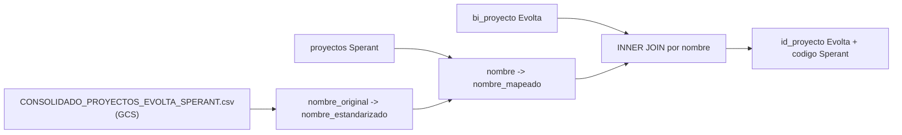
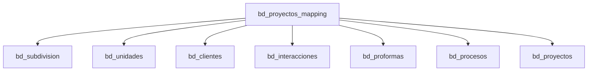

# `bd_proyectos_mapping` — Mapeo de proyectos Evolta-Sperant (Joined)

## Proposito de negocio

Traduce codigos de proyecto entre Evolta (`codproyecto`) y Sperant (`codigo`) para los esquemas joined (`sev_9`, `sev_121`). Sin este mapeo, no se pueden cruzar datos de ambos CRMs.

---

## Tabla fuente



### Paso a paso

1. Leer proyectos de Evolta: `codproyecto` + `proyecto`.
2. Leer proyectos de Sperant: `id` + `codigo` + `nombre`.
3. Leer CSV de mapeo con columnas `nombre_original` y `nombre_estandarizado`.
4. Mapear nombres Sperant: si el CSV tiene traduccion, se usa; si no, se usa el nombre original.
5. INNER JOIN entre Sperant mapeado y Evolta por nombre.

---

## Output schema

| Columna | Tipo | Descripcion |
|---|---|---|
| `id_proyecto` | INTEGER | `codproyecto` de Evolta, usado como ID consolidado |
| `nombre` | STRING | Nombre del proyecto (version Evolta) |
| `codigo` | STRING | `codigo` de Sperant para cruzar con tablas Sperant |

---

## Consumidores downstream



Patron tipico en tablas joined:
```python
df.join(df_mapped_proyects.alias("pry"),
    F.col("pry.codigo") == F.col("tabla.proyecto_codigo"), "inner")
```

---

## Notas / gotchas

1. **INNER JOIN agresivo.** Si un proyecto Sperant no matchea con Evolta, se pierden todas sus unidades, clientes y procesos.
2. **Sin normalizacion en el join final.** Diferencias de mayusculas/tildes/espacios rompen el match.
3. **No persiste en BigQuery.** Es un DataFrame intermedio (`df_mapped_proyects`) que se pasa como parametro.
4. **CSV mantenido manualmente** por negocio en GCS.
5. **Dependencia critica:** si el CSV falta, todo el pipeline joined falla.

---

## Referencia al codigo

- `run_evolta_sperant_transform.py` -> `read_project_mapping_csv()` y `obtain_mapping_proyect()`.
- CSV: `gs://carga_archivos_maestros_etl_prod/CONSOLIDADO_PROYECTOS_EVOLTA_SPERANT.csv`.
