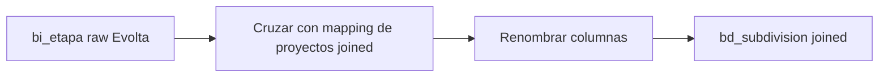

# `bd_subdivision` — Joined

## ¿Qué representa?

Las subdivisiones unificadas para esquemas joined.

## ¿De dónde vienen los datos?

| Fuente | Aporta |
|---|---|
| `bi_etapa` (Evolta raw) | Etapas de proyectos Evolta |
| `df_mapped_proyects` | Mapping de proyectos joined que cruza Evolta + Sperant |

## Reglas aplicadas

Es esencialmente la lógica de Evolta enriquecida con el mapping joined de proyectos. La idea es que las subdivisiones queden vinculadas al `id_proyecto` consolidado del esquema joined.

1. Lee `bi_etapa` de Evolta.
2. Cruza con el `df_mapped_proyects` para obtener el `id_proyecto` joined correcto.
3. Renombra columnas como en la versión Evolta.
4. Pasa `activo` a mayúsculas.

## Diagrama del flujo

## Cosas a tener en cuenta

- **Solo cubre subdivisiones de Evolta.** Las etapas que existen solo en Sperant no aparecen aquí. Esto es intencional o pendiente de revisar.
- El `df_mapped_proyects` se construye en otro paso (ver `read_project_mapping_csv` y derivados).

## Referencia al código

- `run_evolta_sperant_transform.py` → `run_bd_subdivision(...)` y `run_bd_subdivision_transform(...)`.
