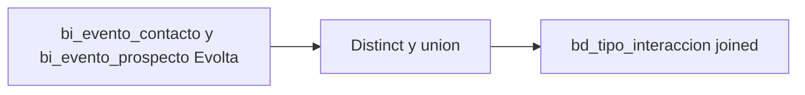

# `bd_tipo_interaccion` — Joined

## ¿Qué representa?

Catálogo unificado de tipos de interacción para esquemas joined.

## ¿De dónde vienen los datos?

Reutiliza la lógica de Evolta. Toma `accion` de `bi_evento_contacto` y `bi_evento_prospecto`.

## Reglas aplicadas

Idénticas a Evolta:
1. Distinct + unionByName + dropDuplicates.
2. ID con `monotonically_increasing_id`.
3. Auditoría.

## Diagrama del flujo

## Cosas a tener en cuenta

- Solo cubre tipos que aparecen en eventos de Evolta.
- Si en un esquema joined Sperant tiene tipos que Evolta no tiene, no se incluyen aquí — habría que ampliar la lógica.

## Referencia al código

- `run_evolta_sperant_transform.py` → `run_bd_tipo_interaccion(...)` y `run_bd_tipo_interaccion_transform(...)`.
