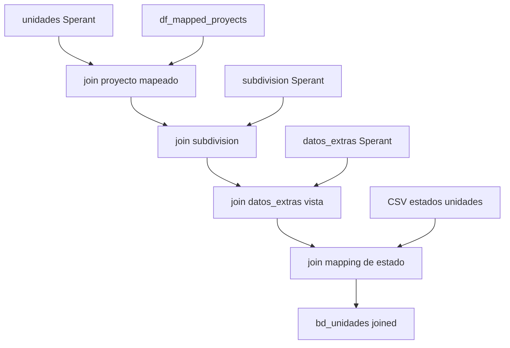

# `bd_unidades` - Joined

## Que representa?

Las unidades inmobiliarias del esquema joined.

Aqui el origen real es Sperant. El "joined" aparece porque la unidad se pega al proyecto consolidado del esquema mixto y mantiene una estructura de columnas compatible con el resto del modelo.

## De donde vienen los datos?

| Fuente | Que aporta |
|---|---|
| `unidades` (Sperant) | Unidad base |
| `subdivision` (Sperant) | Subdivision por codigo |
| `datos_extras` (Sperant) | Valor de `vista` |
| `df_mapped_proyects` | Traduccion `codigo_proyecto Sperant -> id_proyecto joined` |
| `CONSOLIDADO_ESTADOS_UNIDADES.csv` | Estado comercial consolidado |

## Como se arma realmente

1. Lee `unidades` de Sperant.
2. Normaliza `estado_comercial`.
3. Hace `inner join` con `df_mapped_proyects` por `codigo_proyecto`.
4. Hace `left join` con `subdivision` por `codigo_subdivision`.
5. Hace `left join` con `datos_extras` para tomar solo `nombre = "vista"`.
6. Hace `left join` con el CSV de estados para traducir el estado comercial.

El resultado final conserva:

- la llave Sperant real de la unidad
- el proyecto final del esquema joined
- una estructura compatible con dashboards y con procesos/proformas joined

## Diagrama del flujo

## Cosas a tener en cuenta

- **No mezcla stock Evolta y stock Sperant.** La unidad final viene de Sperant.
- **Si el proyecto no esta en `df_mapped_proyects`, la unidad desaparece.** El join al mapping es `inner`.
- **`empresa` queda hardcodeada como `VyV`.** No sale de una tabla maestra.
- **`id_unidad_evolta` queda en NULL.** La llave fisica real es Sperant.
- **`id_proyecto_evolta` se llena con el ID mapeado del proyecto joined.** El nombre de la columna puede inducir a pensar que vino raw de Evolta, pero aqui no es asi.
- **`vista` depende de un `datos_extras` generico.** Si Sperant cambia el nombre de ese atributo, se pierde.
- **Muchos campos quedan reservados en NULL.** Jardin, terraza, area_terreno, motivo_bloqueo, observaciones, etc.

## Referencia al codigo

- `infra/src/etl/run_evolta_sperant_transform.py` -> `run_bd_unidades(...)`
- `infra/src/etl/run_evolta_sperant_transform.py` -> `run_bd_unidades_transform(...)`
