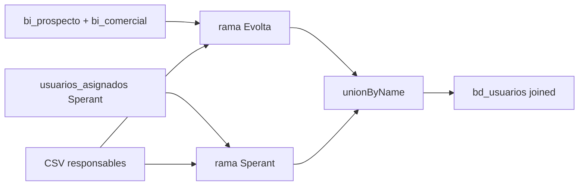

# `bd_usuarios` - Joined

## Que representa?

El catalogo de usuarios/asesores para esquemas joined.

Esta tabla si mezcla dos ramas:

- usuarios inferidos desde Evolta
- usuarios leidos desde Sperant

Luego las une en una sola salida.

## De donde vienen los datos?

| Fuente | Que aporta |
|---|---|
| `bi_prospecto` | Responsable e `idresponsable` de Evolta |
| `bi_comercial` | Nombre comercial del responsable |
| `usuarios_asignados` (Sperant) | Lista de usernames Sperant |
| `RELACION_ASESORES.csv` | Responsable consolidado |

## Como se arma

### Rama Evolta

1. Lee responsables desde `bi_prospecto`.
2. Intenta enriquecer el nombre con `bi_comercial`.
3. Busca `responsable_consolidado` en el CSV.
4. Marca `id_crm = "2"`.
5. Deduplica por `nombre`.

### Rama Sperant

1. Lee `usuarios_asignados`.
2. Deduplica por `username`.
3. Busca `responsable_consolidado` en el mismo CSV.
4. Genera `id_usuario` con `monotonically_increasing_id`.
5. Marca `id_crm = "1"`.

### Union final

Hace `unionByName` entre ambas ramas.

No hay una fase final de consolidacion dura entre un usuario Evolta y uno Sperant que representen a la misma persona. Por eso la tabla puede tener dos filas conceptualmente equivalentes si cada CRM usa un nombre distinto.

## Diagrama del flujo

## Cosas a tener en cuenta

- **La doc anterior que decia "solo Evolta" estaba incompleta.** Esta tabla si mete usuarios de Sperant.
- **No existe una llave maestra cross-CRM.** La union final no intenta colapsar definitivamente un asesor de Evolta con uno de Sperant.
- **La rama Evolta deduplica por `nombre`, no por ID.** Si el mismo nombre aparece con distintos IDs, se aplana.
- **La rama Sperant usa `username` como identificador.**
- **`responsable_consolidado` depende totalmente del CSV.** Si no hay match, se conserva el nombre original.

## Referencia al codigo

- `infra/src/etl/run_evolta_sperant_transform.py` -> `run_bd_usuarios(...)`
- `infra/src/etl/run_evolta_sperant_transform.py` -> `run_bd_usuarios_transform(...)`
