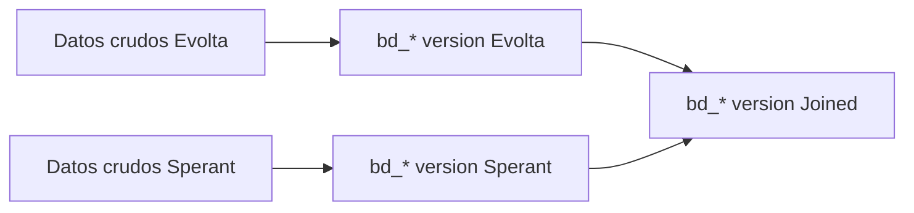

# Capa 2 - Transformacion a tablas `bd_*`

## Que hace esta capa?

Toma datos crudos de los CRMs y los convierte en tablas de negocio relativamente estables:

- `bd_clientes`
- `bd_proyectos`
- `bd_unidades`
- `bd_interacciones`
- `bd_proformas`
- `bd_procesos`
- etc.

La idea es que dashboard y capas posteriores lean un vocabulario comun, sin tener que saber si el origen real fue Evolta, Sperant o una mezcla.

---

## Por que existe?

Sin esta capa, cada dashboard tendria que conocer diferencias como:

- el cliente en Evolta se arma desde `bi_contacto`, `bi_prospecto`, `bi_cliente`, `bi_comercial`
- en Sperant muchas cosas salen de tablas mas directas, pero con otras llaves
- las fechas, estados y medios no usan el mismo formato
- varios campos dependen de CSVs externos y no de tablas del CRM

Esta capa encapsula esa complejidad.

---

## Tres versiones de cada tabla

| Version | Cuando se usa |
|---|---|
| **Evolta** | esquemas `sev_*` que solo viven en Evolta |
| **Sperant** | esquemas como `checor`, donde la verdad operativa esta en Sperant |
| **Joined** | esquemas mixtos como `sev_9` y `sev_121`, donde negocio quiere una lectura unificada |

---

## Como pensar la version Joined de verdad

La palabra "joined" no significa siempre lo mismo.

Hay tres patrones distintos:

| Patron | Ejemplos | Que pasa realmente |
|---|---|---|
| **Evolta con contexto joined** | `bd_proyectos`, `bd_subdivision`, `bd_tipo_interaccion`, parte de `bd_interacciones`, `bd_clientes_fechas_extension` | La materia prima sigue saliendo de Evolta, pero se reusa el ecosistema joined para IDs o cruces finales |
| **Sperant con IDs joined** | `bd_unidades`, `bd_proformas`, `bd_procesos` | La fila base nace en Sperant y luego se traduce al proyecto consolidado |
| **Hibrido real** | `bd_clientes`, `bd_usuarios` | Evolta y Sperant se combinan o uno de los dos enriquece campos clave del otro |

La pieza central de joined es:

- `CONSOLIDADO_PROYECTOS_EVOLTA_SPERANT.csv`

De ahi sale `df_mapped_proyects`, que traduce:

- `codigo` de proyecto en Sperant
- al `id_proyecto` que el esquema joined termina usando

Si ese mapping falla, varias tablas joined se quedan sin cobertura porque usan `inner join`.

---

## Archivos principales del codigo

```mermaid
graph TD
    subgraph EV["Pipeline Evolta"]
        E1["run_evolta_transform.py"]
        E2["transformations2.py"]
        E3["transformations2_operations.py"]
        E1 --> E2
        E2 --> E3
    end

    subgraph SP["Pipeline Sperant"]
        S1["run_sperant_transform.py"]
        S2["transformation_sperant.py"]
        S3["transformation_sperant_operations.py"]
        S1 --> S2
        S2 --> S3
    end

    subgraph JN["Pipeline Joined"]
        J1["run_evolta_sperant_transform.py"]
        J2["combina logica Evolta y Sperant"]
        J1 --> J2
    end
```

Convencion general:

- `run_bd_\<tabla\>`: orquesta lectura, transformacion y carga
- `run_bd_\<tabla\>_transform`: contiene la logica principal de armado

---

## Reglas generales que se repiten

1. **Auditoria.**
   - casi todas las tablas agregan timestamp y fecha de corrida

2. **Strings categoricos en upper.**
   - estado, tipo, genero, medio, etc.

3. **Muchos CSVs externos.**
   - medios
   - responsables
   - estados de unidades
   - mapeo de proyectos

4. **Muchos `distinct()` o `dropDuplicates()`.**
   - el modelo se apoya mucho en deduplicar despues de joins amplios

5. **Sin filtros temporales fuertes.**
   - la capa `bd_*` suele cargar historico completo

---

## Gotchas especificos de Joined

1. **Joined no es una union perfecta entre CRMs.**
   - hay tablas donde Sperant solo enriquece un campo
   - hay tablas donde Evolta casi no participa en la fila final

2. **Los nombres de IDs pueden confundir.**
   - en algunas tablas joined, la fila nace en Sperant
   - pero columnas como `id_proyecto_evolta` quedan pobladas con el ID consolidado
   - por eso hay que leer el significado real en cada doc

3. **Los joins agresivos de joined son los que mas explican faltantes.**
   - `bd_clientes` depende de cadenas largas de match
   - `bd_proformas` y `bd_procesos` dependen de mapping de proyecto y unidad
   - `bd_interacciones` hereda lo bueno y lo malo de `bd_clientes` y `bd_unidades`

4. **Si el CSV de mapping falla, el problema no es pequeno.**
   - no suele quedar un campo en null
   - suele caerse la fila entera

---

## Orden sugerido de lectura

Si quieres entender joined en serio:

1. `joined/bd_proyectos.md`
2. `joined/bd_unidades.md`
3. `joined/bd_clientes.md`
4. `joined/bd_proformas.md`
5. `joined/bd_procesos.md`
6. `joined/bd_interacciones.md`

Con eso ya se entiende casi todo el comportamiento del esquema mixto.
