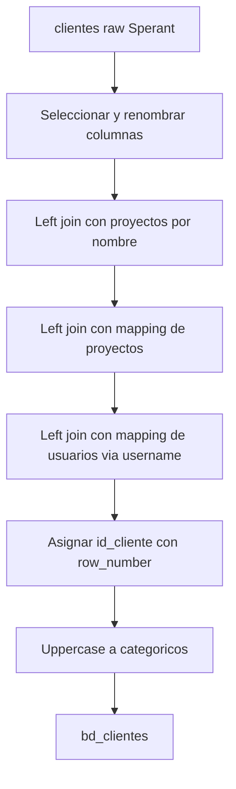

# `bd_clientes` — Sperant

## ¿Qué representa?

Los clientes registrados en el CRM Sperant. Mucho más simple que la versión Evolta porque Sperant tiene una sola tabla `clientes` con todos los datos juntos.

## ¿De dónde vienen los datos?

| Fuente | Aporta |
|---|---|
| `clientes` (raw Sperant) | Datos personales, contacto, demográficos, estado, captación |
| `proyectos` (raw Sperant) | Para vincular con el último proyecto |
| `idproyecto_bd_proyecto_mapping` | ID final de proyecto |
| `idusuario_bd_usuario_mapping` | ID final de asesor |

## Reglas aplicadas

### Selección y renombrado
1. Se seleccionan ~40 columnas con renombres clave:
   - `id` → `id_cliente_original`.
   - `email` → `correo`.
   - `celulares` → `celular`.
   - `documento` → `nrodocumento`.
   - `ocupacion` → ambos `puesto` y `profesion` (alias).
   - `estado` → `estado_cliente` y también `estado_proceso`.
   - `fecha_creacion` → `fecha_registro`.
   - `pais` → `pais_residencia`.
   - `desistido` → `ha_desistido`.

### Joins
2. **Left join con proyectos** por nombre del último proyecto:
   ```
   proyectos.nombre == clientes.ultimo_proyecto
   ```
3. **Left join con mapping de proyectos** para obtener el `id_proyecto` final:
   ```
   p_map.nombre_proyecto == clientes.ultimo_proyecto
   ```
4. **Left join con mapping de usuarios** vía `username`:
   ```
   usuario_mapping.username == clientes.username
   ```

### ID y mayúsculas
5. **`id_cliente`** se asigna con `row_number` ordenando por `id_cliente_original`.
6. **Mayúsculas** en muchos campos: `nombres`, `apellidos`, `correo`, `tipo_documento`, `departamento`, `provincia`, `estado_civil`, `distrito`, `genero`, `puesto`, `profesion`, `estado_cliente`, `agrupacion_medio_captacion`, `medio_captacion`, `canal_entrada`, `nivel_interes`, `pais_residencia`, `apto`, `origen`, `ultimo_tipo_interaccion`, `agrupacion_canal_entrada`, `tipo_financiamiento`, `razon_desistimiento`.

### Apellidos
7. **Sperant guarda los apellidos en una sola columna `apellidos`.** En la transformación se duplica esa columna a `apellido_paterno` y `apellido_materno` (ambos con el mismo valor). No se separan.

### Reservados
8. **`medio_captacion_prospectos`, `medio_captacion_comercial`, `cliente_unico_mes`** quedan en NULL (Sperant no expone estos campos).

### Tipo de origen
9. **`tipo_origen` se hardcodea a `"CLIENTE"`.** A diferencia de Evolta, no hay distinción entre clientes y prospectos en Sperant — todos son clientes.

10. Auditoría con timestamps.

## Diagrama del flujo



## Resultado

Misma estructura general que Evolta. Diferencias clave:

| Columna | Evolta | Sperant |
|---|---|---|
| `apellido_paterno` y `apellido_materno` | Separados | Ambos = `apellidos` |
| `tipo_origen` | "CLIENTE" o "PROSPECTO" | Siempre "CLIENTE" |
| `id_usuario_sperant` | NULL | El `username` (string) |
| `medio_captacion_prospectos`, `medio_captacion_comercial` | Distintos | NULL |
| `proxima_tarea` | Real | NULL hardcoded |

## Cosas a tener en cuenta

- **Apellido paterno y materno son iguales.** Si negocio quiere apellidos separados, hay que cambiar la fuente o aplicar lógica de split.
- **`medio_captacion`** y `agrupacion_medio_captacion` son los únicos campos de captación con valor real. En el dashboard se usa `agrupacion_medio_captacion` como `medio_captacion_categoria` (ver `bd_clientes_fechas_extension`).
- **Join por nombre del proyecto** es frágil — si el nombre tiene tildes diferentes o espacios extra, no matchea.
- **`fecha_captacion` (referenciada por dashboards) = `fecha_creacion`** según mapping de query_builder.
- **`responsable_consolidado`** referenciado por dashboards = `username` (a través de mapping de asesores).

## Referencia al código

- `transformation_sperant_operations.py` → `transform_bd_clientes(df_bi_cliente, df_proyectos, idusuario_bd_usuario_mapping, idproyecto_bd_proyecto_mapping, optimal_partitions)`.
- Orquestador: `run_sperant_transform.py`.
