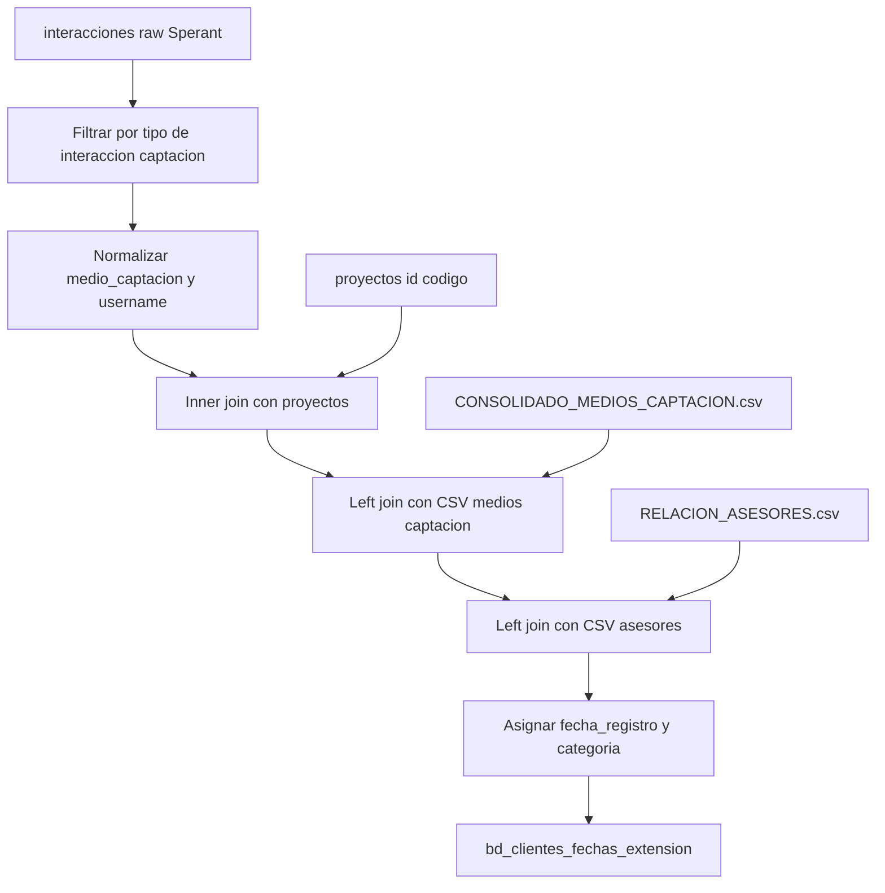

# `bd_clientes_fechas_extension` — Sperant

## ¿Qué representa?

Igual concepto que la versión Evolta: tabla de eventos clave en la línea de tiempo del cliente. Una fila por evento de captación.

## ¿De dónde vienen los datos?

| Fuente | Aporta |
|---|---|
| `interacciones` (raw Sperant, filtrado) | Solo interacciones de tipo captación |
| `proyectos` (raw, columnas `id, codigo`) | Para vincular el proyecto |
| `RELACION_ASESORES.csv` (GCS) | Mapping de username a `responsable_consolidado` |
| `CONSOLIDADO_MEDIOS_CAPTACION.csv` (GCS) | Mapping de medio captación a categoría |

## Reglas aplicadas

### Filtro de tipo de interacción
1. Solo se consideran interacciones cuyo `tipo_interaccion` (en mayúsculas) sea uno de:
   - `FACEBOOK`
   - `API`
   - `PORTAL INMOBILIARIO`
   - `CREACIÓN DE CLIENTE`

   Estas son las interacciones que cuentan como **eventos de captación** según negocio.

### Normalización
2. **`medio_captacion_normalizado`** = `normalizar_columna(medio_captacion)` — saca tildes, espacios, caracteres raros.
3. **`responsable_normalizado`** = `normalizar_columna(username)` — para hacer match con el CSV de asesores.

### Joins
4. **Inner join** con `proyectos` por `codigo_proyecto = codigo`.
5. **Left join** con el CSV de medios de captación para obtener `categoria_medio`.
6. **Left join** con el CSV de asesores para obtener `responsable_consolidado` (nombre real).

### Resolución de campos
7. **`responsable_consolidado`** = coalesce entre el del CSV y el `username` original (si no hay match en CSV, queda el username).
8. **`fecha_registro`** = `fecha_creacion` de la interacción.

### Reservados
9. **`sub_estado`** queda NULL (Sperant no lo expone como tal).
10. **`id_cliente_evolta`, `id_proyecto_evolta`** quedan NULL (versión Sperant).

## Diagrama del flujo

## Resultado

| Columna | Origen |
|---|---|
| `id_cliente_evolta` | NULL |
| `id_cliente_sperant` | `interacciones.cliente_id` |
| `id_proyecto`, `id_proyecto_sperant` | Mapping de proyectos |
| `id_proyecto_evolta` | NULL |
| `fecha_registro` | `interacciones.fecha_creacion` |
| `medio_captacion` | Tal cual viene |
| `medio_captacion_categoria` | Del CSV (`categoria_medio`) |
| `sub_estado` | NULL |
| `responsable_consolidado` | CSV asesores o `username` |
| UTMs | De la interacción |
| Auditoría | Timestamp |

## Cosas a tener en cuenta

- **El filtro por `tipo_interaccion` es crítico.** Si negocio agrega un nuevo canal de captación (TikTok, WhatsApp), hay que sumar el valor a la lista de filtro o no aparecerá aquí.
- **CSVs externos.** Si los CSVs no se cargaron al bucket o están con formato roto, los campos `categoria_medio` y `responsable_consolidado` quedan NULL.
- **El join por nombre de proyecto** (vía código) es estable en Sperant porque el código no cambia.
- **La normalización es importante** — sin ella, "Facebook Ads" y "facebook ads" se ven distintos al CSV.

## Referencia al código

- `run_sperant_transform.py` → `run_bd_clientes_extension_transform(spark, esquema, config, project_id)`.
- Funciones auxiliares: `read_bucket_user_data(...)`, `read_bucket_mapping_medio_captacion(...)`.
- Función `normalizar_columna` en `general_utils.py`.
