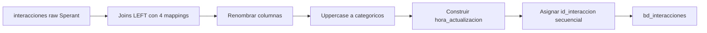

# `bd_interacciones` — Sperant

## ¿Qué representa?

Las interacciones cliente-asesor en Sperant. Mucho más sencilla que la versión Evolta porque Sperant ya tiene una tabla `interacciones` directa.

## ¿De dónde vienen los datos?

| Fuente | Aporta |
|---|---|
| `interacciones` (raw Sperant) | Tabla principal de interacciones |
| `idcliente_bd_cliente_mapping` | ID de cliente final |
| `idtipo_interaccion_mapping` | ID de tipo de interacción |
| `idunidad_bd_unidad_mapping` | ID de unidad |
| `idproyecto_bd_cod_mapping` | ID de proyecto |

## Reglas aplicadas

1. **Joins LEFT** con cada mapping para resolver IDs finales:
   - `interacciones.cliente_id` ↔ `cliente_mapping.id_cliente_original`.
   - `interacciones.tipo_interaccion` ↔ `tipo_interaccion_mapping.nombre_tipo_interaccion` (uppercase).
   - `interacciones.codigo_unidad` ↔ `unidad_mapping.codigo_unidad`.
   - `interacciones.codigo_proyecto` ↔ `proyecto_mapping.proyecto_codigo`.

2. **ID secuencial generado** con `row_number` ordenando por `id_cliente`.

3. **Mayúsculas** a campos categóricos: `canal_entrada`, `medio_captacion`, `nombre_interaccion`, `estado`, `utm_*`, `origen`, `tipo_interaccion`, `satisfactorio`, `tipo_evento`, `nivel_interes`, `razon_desistimiento`.

4. **`hora_actualizacion`** se construye concatenando `fecha_actualizacion` + `' '` + `hora_actualizacion` y casteando a timestamp.

5. **Renombrado:**
   - `nombres_usuario` → `nombre_responsable`.
   - `nombre` → `nombre_interaccion`.
   - `fecha_creacion` → `fecha_interaccion`.
   - `fecha_programada` → `fecha_tarea`.
   - `razon_desistimiento` → `razon_devolucion`.

6. Auditoría con timestamps.

## Diagrama del flujo

## Resultado

Misma estructura que la versión Evolta. Diferencias clave:

| Columna | Evolta | Sperant |
|---|---|---|
| `estado` | "NO HAY ESTADO" hardcoded | Estado real de la interacción |
| `id_cliente_sperant` | NULL | `interacciones.cliente_id` |
| `id_tipo_interaccion_sperant` | NULL | El ID Sperant |
| `id_tipo_interaccion_evolta` | NULL | NULL |

## Cosas a tener en cuenta

- **Mucho más simple que Evolta.** Sperant ya tiene una tabla unificada de interacciones — no hay que mezclar eventos de contacto y prospecto.
- **Joins LEFT permiten interacciones huérfanas.** A diferencia de Evolta (donde interacciones sin cliente se descartan), aquí pueden quedar con `id_cliente = NULL`. Los dashboards deben filtrar.
- **El campo `estado` sí trae valor real** (a diferencia de Evolta).

## Referencia al código

- `transformation_sperant_operations.py` → `transform_bd_interacciones(...)`.
