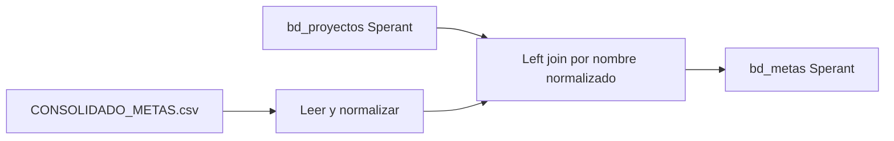

# `bd_metas` — Sperant

## ¿Qué representa?

Las metas mensuales por proyecto en el lado Sperant. Misma lógica que la versión Evolta — se carga desde el CSV externo `CONSOLIDADO_METAS.csv`.

## ¿De dónde vienen los datos?

| Fuente | Aporta |
|---|---|
| `CONSOLIDADO_METAS.csv` (GCS) | Metas por proyecto, mes |
| `bd_proyectos` Sperant (ya transformada) | Para vincular el proyecto |

## Reglas aplicadas

Idénticas a la versión Evolta:
1. Lectura del CSV con separador `;`.
2. Normalización del nombre del proyecto.
3. Left join con `bd_proyectos`.
4. Casteos.

## Diagrama del flujo

## Cosas a tener en cuenta

- Mismas observaciones que en Evolta (CSV separador `;`, frágil ante renombres).
- El CSV es el mismo para ambos pipelines — no hay un CSV separado para Sperant.

## Referencia al código

- `run_sperant_transform.py` → `run_bd_metas(...)`.
