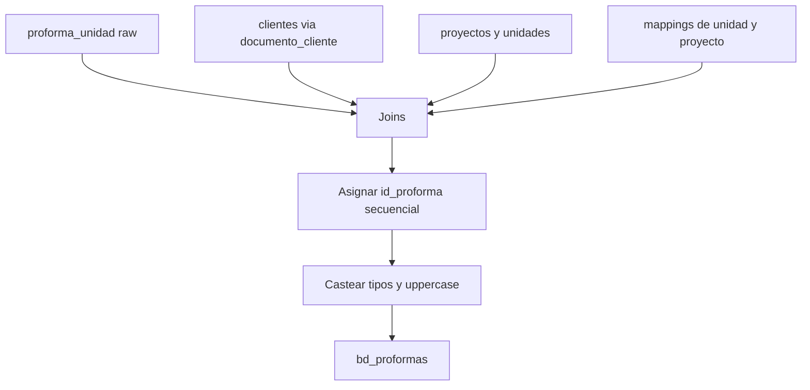

# `bd_proformas` — Sperant

## ¿Qué representa?

Las proformas en Sperant. Cada fila es una cotización emitida sobre una unidad.

## ¿De dónde vienen los datos?

| Fuente | Aporta |
|---|---|
| `proforma_unidad` (raw Sperant) | Tabla principal de proformas |
| `unidades` (raw Sperant) | Datos de la unidad |
| `proyectos` (raw Sperant) | Datos del proyecto |
| `clientes` (raw Sperant) | Para vincular con el cliente vía `documento` |
| `idunidad_bd_unidad_mapping` | ID de unidad final |
| `idproyecto_bd_cod_mapping` | ID de proyecto final |

## Reglas aplicadas

1. **`id_proforma` secuencial** asignado con `row_number` ordenando por `proforma_unidad.id`.

2. **Joins:**
   - `proforma_unidad.documento_cliente` ↔ `clientes.documento` (inner — solo proformas con cliente identificable).
   - `proforma_unidad.codigo_proyecto` ↔ `proyectos.codigo` (left).
   - `proforma_unidad.codigo_unidad` ↔ `unidades.codigo` (left).
   - Joins con mappings para resolver IDs finales.

3. **Casteos:**
   - `precio_venta` → `double`.
   - `fecha_creacion` → `date`.
   - `fecha_expiracion` → `timestamp`.

4. **Mayúsculas** en: `asignacion`, `estado`, `tipo_financiamiento`.

5. Auditoría: `fecha_hora_creacion`, `fecha_hora_modificacion`.

## Diagrama del flujo

## Resultado

Mismas columnas que la versión Evolta, con estas particularidades:
- `id_proforma_sperant`, `id_unidad_sperant`, `id_proyecto_sperant` con valores reales.
- `asignacion`, `afecto_igv`, `lista_metraje`, `fecha_expiracion` con valores reales (Sperant los expone, a diferencia de Evolta).

## Cosas a tener en cuenta

- **El join con `clientes` es por `documento`** (no por ID). Si un cliente tiene su documento mal cargado, la proforma no se vincula.
- En el código aparece **dos veces `id_cliente_sperant`** en el `select` (una con valor real desde `cliente_id`, otra hardcoded a NULL). El segundo prevalece — bug a confirmar con negocio.

## Referencia al código

- `transformation_sperant_operations.py` → `transform_bd_proformas(...)`.
