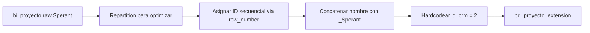

# `bd_proyecto_extension` — Sperant

## ¿Qué representa?

Igual que la versión Evolta: tabla auxiliar que liga cada proyecto con un identificador único y el CRM origen.

## ¿De dónde vienen los datos?

Se construye desde `bi_proyecto` ya transformada en este pipeline (`bd_proyectos` Sperant).

## Reglas aplicadas

1. Asigna ID con `monotonically_increasing_id` y luego `row_number` para tener ID secuencial estable.
2. Concatena el nombre con sufijo `_Sperant`:
   ```
   nombre = "TS001_Sperant"
   codigo = "TS001_Sperant"
   ```
3. Hardcodea `id_crm = 2`.
4. Auditoría con timestamps.

## Diagrama del flujo



## Resultado

Mismas columnas que la versión Evolta, pero con `nombre` terminado en `_Sperant`.

## Cosas a tener en cuenta

- En el código aparece `id_crm = 2` para Sperant también. Esto **contradice la convención** mencionada en la doc Evolta (donde se decía 1 = Sperant, 2 = Evolta). En la práctica ambas versiones usan `id_crm = 2`. Si negocio espera distinguir CRM por este campo, hay un bug.
- El sufijo `_Sperant` es la forma confiable de distinguir el origen.

## Referencia al código

- `transformation_sperant_operations.py` → `transform_bd_proyecto_extension(df, optimal_partitions)`.
- Orquestador: `run_sperant_transform.py`.
