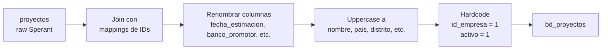

# `bd_proyectos` — Sperant

## ¿Qué representa?

La lista maestra de proyectos inmobiliarios tal como está en el CRM **Sperant** (esquema `checor`).

Mismo concepto que la versión Evolta, pero con datos provenientes de otra fuente con otra estructura.

---

## ¿De dónde vienen los datos?

Una sola tabla cruda de Sperant:

| Tabla raw | Qué aporta |
|---|---|
| `proyectos` | Proyecto, código, fechas, dirección, banco promotor, datos de la razón social, etc. |

Sperant es más rico que Evolta en este punto: la tabla `proyectos` ya trae dirección, fechas y datos legales del proyecto.

Adicionalmente se usan dos mappings auxiliares (calculados antes en el pipeline):
- `idproyecto_bd_proyecto_mapping` — para asignar el ID interno del nuevo `bd_proyectos`.
- `idempresa_bd_empresa_mapping` — para vincular cada proyecto con su empresa.

---

## Reglas aplicadas

1. **ID nuevo asignado por mapping.** Sperant no usa el `id` original como `id_proyecto` — se asigna uno nuevo a través de un mapping previo. El `id` original de Sperant queda en `id_proyecto_sperant` para trazabilidad.

2. **`id_proyecto_evolta` queda en NULL.** Esta es la versión Sperant-pura, no hay equivalente Evolta.

3. **`id_empresa` siempre es `1`.** En Sperant solo hay una empresa por esquema (CHECOR), así que se hardcodea a 1.

4. **Nombre del proyecto en mayúsculas.** `nombre` se transforma con `F.upper(...)` para evitar inconsistencias de capitalización. El nombre original sin transformar queda como `nombre_proyecto`.

5. **`activo` siempre es `1`.** No se considera el campo de activo de la tabla origen — se asume que todos los proyectos cargados están activos.

6. **Renombre de columnas con cambios semánticos:**
   - `fecha_estimacion` (Sperant) → `fecha_entrega` (estándar `bd_*`).
   - `banco_promotor` (Sperant) → `banco_sponsor` (estándar `bd_*`).
   - `codigo` → `proyecto_codigo`.

7. **Geografía pasada a mayúsculas:** `pais`, `departamento`, `distrito`, `provincia`, `tipo_proyecto`, `estado_construccion` se uppercase si vienen con valor.

8. **`id_crm` construido como texto.** Se concatena `\<codigo\>_Sperant` (ej. "TS001_Sperant") para identificar fácilmente que viene de Sperant.

9. **Auditoría:** dos timestamps al momento de la corrida.

---

## Diagrama del flujo

---

## Resultado: columnas principales

| Columna | Qué guarda | Origen |
|---|---|---|
| `id_proyecto` | ID asignado por el mapping interno | mapping |
| `id_proyecto_sperant` | ID original de Sperant | `proyectos.id` |
| `id_proyecto_evolta` | NULL en versión Sperant | — |
| `id_empresa` | Siempre `1` (CHECOR) | hardcoded |
| `nombre` | Nombre en mayúsculas | `proyectos.codigo` o nombre |
| `nombre_proyecto` | Nombre tal cual viene | `proyectos.nombre` |
| `activo` | Siempre `1` | hardcoded |
| `direccion` | Dirección física | `proyectos.direccion` |
| `fecha_entrega` | Fecha estimada de entrega | `proyectos.fecha_estimacion` |
| `latitud`, `longitud` | Coordenadas | `proyectos.latitud/longitud` |
| `pais`, `departamento`, `distrito`, `provincia` | Ubicación (en mayúsculas) | `proyectos.*` |
| `tipo_proyecto`, `estado_construccion` | Categorización | `proyectos.*` |
| `total_unidades`, `unidades_vendidas` | Conteos | `proyectos.*` |
| `moneda`, `banco_sponsor` | Datos comerciales | `proyectos.moneda`, `proyectos.banco_promotor` |
| `fecha_inicio_venta` | Cuándo empezó la venta | `proyectos.fecha_inicio_venta` |
| `razon_social`, `direccion_razon_social`, `ruc_razon_social` | Datos legales | `proyectos.*` |
| `proyecto_codigo` | Código del proyecto | `proyectos.codigo` |
| `id_crm` | "\<codigo\>_Sperant" | construido |

---

## ¿Quiénes la usan?

- Dashboards filtrados sobre el esquema `checor`.
- `bd_unidades` (Sperant) usa `proyecto_codigo` para joins (no `id`).
- `bd_subdivision` (Sperant) usa `proyecto_codigo` también.

---

## Cosas a tener en cuenta

- **Sperant usa `proyecto_codigo` para joins, no `id`.** A diferencia de Evolta, las tablas hijas (subdivisiones, unidades, etc.) se vinculan por el código del proyecto. Esto es una particularidad importante al armar joins.
- **`fecha_estimacion` no es lo mismo que `fecha_entrega`.** Se renombra pero el valor original es estimación, no la fecha real de entrega.
- **`banco_promotor` se renombra a `banco_sponsor`.** Es solo un cambio de nombre — semánticamente es lo mismo.
- **No tiene columna `empresa` en Sperant.** Se asume "CHECOR" porque ese es el único cliente que usa Sperant en este ETL. Si se agrega otro cliente Sperant, hay que ajustar la lógica.
- **`activo` se hardcodea a 1.** Si la tabla origen marca un proyecto como inactivo, igual aparecerá como activo aquí. Esto puede ser un bug pendiente o una decisión deliberada — verificar con negocio antes de cambiar.

---

## Referencia rápida al código

- Orquestador: `run_sperant_transform.py` → `run_bd_proyectos(...)`.
- Lógica: `transformation_sperant_operations.py` → `transform_bd_proyectos(df, mapping1, mapping2, optimal_partitions)`.
