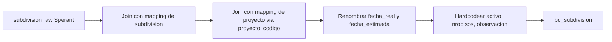

# `bd_subdivision` — Sperant

## ¿Qué representa?

Las subdivisiones de cada proyecto en Sperant (torres, etapas, sectores).

## ¿De dónde vienen los datos?

| Tabla raw | Aporta |
|---|---|
| `subdivision` | `id`, `proyecto_codigo`, `nombre`, `tipo`, `fecha_real`, `fecha_estimada`, `fecha_actualizacion` |

Se requieren además dos mappings auxiliares para asignar IDs únicos:
- `idsubdivision_bd_subdivision_mapping` — asigna `id_subdivision` final.
- `idproyecto_bd_proyecto_mapping` — asigna el `id_proyecto` ya transformado.

## Reglas aplicadas

1. **Join con mappings.** Sperant usa `proyecto_codigo` (no `proyecto_id`) para vincularse con la tabla de proyectos. Esta es una diferencia clave vs Evolta.
2. Renombrado de fechas:
   - `fecha_real` → `fecha_inicio_venta`.
   - `fecha_estimada` → `fecha_entrega`.
3. **Hardcodea `activo = "ACTIVO"`** (en mayúsculas). Sperant no expone un campo activo confiable, así que se asume que toda subdivisión cargada está activa.
4. Hardcodea `nropisos = 0` y `observacion = "obs"`. Valores placeholder porque Sperant no los expone.
5. `tipo` se pasa a mayúsculas.
6. Auditoría con timestamps.

## Diagrama del flujo

## Resultado

| Columna | Origen |
|---|---|
| `id_subdivision` | Mapping interno |
| `id_subdivision_sperant` | `subdivision.id` original |
| `id_proyecto` | Mapping interno (vía `proyecto_codigo`) |
| `id_proyecto_sperant` | ID original de proyecto |
| `nombre` | `subdivision.nombre` |
| `tipo` | `subdivision.tipo` en mayúsculas |
| `fecha_inicio_venta` | `subdivision.fecha_real` |
| `fecha_entrega` | `subdivision.fecha_estimada` |
| `activo` | Hardcoded "ACTIVO" |
| `nropisos` | Hardcoded 0 |
| `observacion` | Hardcoded "obs" |

## Cosas a tener en cuenta

- **El join se hace por `proyecto_codigo`**, no por ID. Si dos proyectos tienen el mismo código (raro pero posible), va a haber conflicto.
- **`activo` siempre es "ACTIVO".** Si negocio quiere desactivar una subdivisión, no se reflejará aquí.
- Los hardcoded `nropisos = 0` y `observacion = "obs"` son placeholders feos — pendiente verificar si negocio realmente quiere esos valores o si convendría dejarlos NULL.

## Referencia al código

- `transformation_sperant_operations.py` → `transform_bd_subdivision(...)`.
