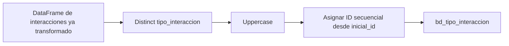

# `bd_tipo_interaccion` — Sperant

## ¿Qué representa?

Catálogo de tipos de interacción para Sperant. Mismo concepto que la versión Evolta.

## ¿De dónde vienen los datos?

Se calcula a partir del DataFrame **ya transformado** de interacciones (no directamente de la tabla raw). Toma la columna `tipo_interaccion`.

## Reglas aplicadas

1. **Distinct** de `tipo_interaccion`.
2. **Uppercase** al nombre — Sperant no tiene capitalización consistente.
3. Asigna ID secuencial con `row_number()` arrancando desde un `inicial_id` configurable (permite que los IDs Sperant no choquen con los de Evolta si se decidiera unirlos).
4. Auditoría con timestamps.

## Diagrama del flujo

## Resultado

Misma estructura que la versión Evolta:
- `id_tipo_interaccion` (numérico secuencial)
- `nombre_tipo_interaccion` (en mayúsculas)
- Auditoría

## Cosas a tener en cuenta

- **El uppercase normaliza diferencias menores.** Si Sperant guarda "Llamada" y "llamada" se consolidan.
- **El `inicial_id` arranca en 1 por defecto.** Si en el futuro se mezclan IDs de tipo_interaccion entre Evolta y Sperant, hay que configurar este parámetro para evitar choques.

## Referencia al código

- `transformation_sperant_operations.py` → `transform_tipo_interacciones(df_interacciones, inicial_id, optimal_partitions)`.
