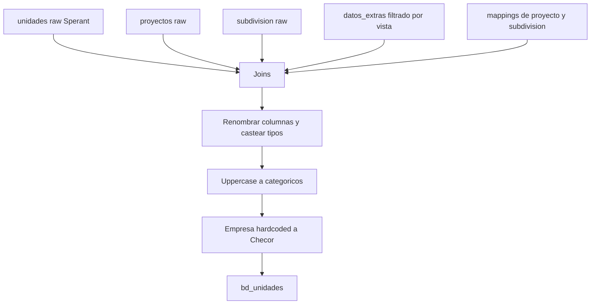

# `bd_unidades` — Sperant

## ¿Qué representa?

Las unidades inmobiliarias en Sperant. Mismo concepto que la versión Evolta.

## ¿De dónde vienen los datos?

| Fuente | Aporta |
|---|---|
| `unidades` (raw Sperant) | Datos principales: tipología, dormitorios, áreas, precios, estado |
| `proyectos` (raw Sperant) | Nombre del proyecto |
| `subdivision` (raw Sperant) | Nombre de la subdivisión |
| `datos_extras` (raw Sperant, filtrado por `nombre = 'vista'`) | Vista de la unidad |
| `idproyecto_bd_proyecto_mapping` | Asignación del `id_proyecto` final |
| `idsubdivision_bd_subdivision_mapping` | Asignación del `id_subdivision` final |

## Reglas aplicadas

1. **Joins:**
   - `unidades.codigo_proyecto` ↔ `proyectos.codigo` (left).
   - `unidades.codigo_subdivision` ↔ `subdivision.codigo` (left).
   - Joins con mappings para resolver IDs finales.
   - `datos_extras` filtrado a `nombre = 'vista'` para extraer solo el campo de vista.

2. **ID secuencial** generado con `row_number()` ordenando por `unidades.id`.

3. **Renombrado de columnas (cambios de nombre vs Sperant):**
   - `total_habitaciones` → `total_dormitorios`.
   - `nombre_tipologia` → `tipologia`.
   - `precio_base_proforma` → `precio_base` (también copiado a `precio_proforma`).
   - `descuento_venta` → `descuento`.
   - `estado_comercial` → `estado`.
   - `precio_m2` → `preciometro2`.
   - `vcto_garantia_*` → `fecha_vcto_garantia_*`.

4. **Empresa hardcoded a "Checor"** (en lugar de inferirla del proyecto).

5. **Mayúsculas a:** `tipo_unidad`, `estado_construccion`, `tipologia`, `vista`, `estado`.

6. **Casteos numéricos:** áreas → `double`, dormitorios → `integer`, precios → `double`.

7. **Columnas Evolta en NULL** (`id_unidad_evolta`, `id_proyecto_evolta`, etc.).

8. **Algunas áreas en NULL** porque Sperant no las expone: `area_construida`, `area_jardin`, `area_terraza`, `area_terreno`.

## Diagrama del flujo

## Resultado

Mismas columnas que la versión Evolta, con estas particularidades:
- `empresa` siempre dice `Checor`.
- `area_construida`, `area_jardin`, `area_terraza`, `area_terreno` quedan NULL.
- `precio_proforma == precio_base` (ambos vienen de `precio_base_proforma`).
- `num_estudios == total_dormitorios` (alias).

## Cosas a tener en cuenta

- **Empresa "Checor" en minúsculas iniciales.** Está literal en el código como `"Checor"` (no `"CHECOR"`). Si negocio quiere unificar con la versión hardcoded de `bd_empresa` (`"CHECOR"`), hay diferencia de capitalización a resolver.
- **Vista se obtiene de `datos_extras`** filtrando por nombre `'vista'`. Si en el futuro hay otros datos extras (orientación, certificación, etc.) habría que sumarlos con la misma técnica.
- **Joins LEFT** (no inner como Evolta). Una unidad sin proyecto cargado igual aparece, con `id_proyecto = NULL`.

## Referencia al código

- `transformation_sperant_operations.py` → `transform_bd_unidades(...)`.
- Orquestador: `run_sperant_transform.py`.
