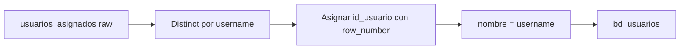

# `bd_usuarios` — Sperant

## ¿Qué representa?

Los asesores comerciales en Sperant.

## ¿De dónde vienen los datos?

| Tabla raw | Aporta |
|---|---|
| `usuarios_asignados` | `username` (no hay columna `id` confiable) |

## Reglas aplicadas

1. Se toman los `username` distintos. En Sperant **no hay un `id` numérico** confiable — el username es la clave.
2. Se asigna un ID secuencial por `username` usando `row_number()`:
   ```
   id_usuario = row_number() over (order by internal_id)
   ```
3. **`id_usuario_sperant` se setea con el `username` (no con un número).** Esto es atípico — el ID Sperant es texto.
4. `nombre` = `username` (no hay otro nombre disponible).
5. Columnas Evolta en NULL.
6. Auditoría con timestamps.

## Diagrama del flujo



## Resultado

| Columna | Origen / valor |
|---|---|
| `id_usuario` | Secuencial generado |
| `id_usuario_evolta` | NULL |
| `id_usuario_sperant` | El `username` (string, no numérico) |
| `nombre` | `username` |
| `username` | El mismo |
| Auditoría | Timestamps |

## Cosas a tener en cuenta

- **El ID Sperant es texto, no número.** Esto rompe el patrón del resto de tablas donde los IDs son enteros. Si un dashboard hace cast a integer, va a fallar. Documentado en `MEMORY.md` como gotcha conocido.
- **`nombre == username`.** No hay nombre real de la persona — solo el alias del CRM.
- Para mostrar nombres legibles en dashboards hay que cruzar con la tabla maestra externa (`RELACION_ASESORES.csv`) que sí mapea username a nombre real.

## Referencia al código

- `transformation_sperant_operations.py` → `transform_bd_usuarios(...)`.
