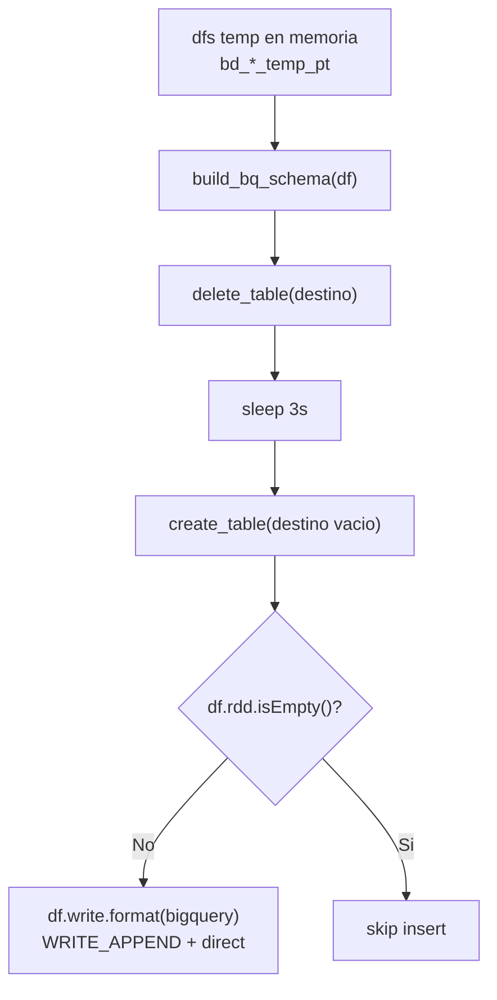

# Capa 3 - Load `bd_*` a BigQuery

## Que hace esta capa?

Toma los DataFrames Spark ya transformados y los materializa como tablas fisicas en BigQuery dentro del esquema del cliente (`checor`, `sev_*`, `sev_9`, `sev_121`, etc.).

En el codigo legacy, esto vive en:

- [load2.py](/C:/Users/Usuario/etl_pyspark/infra/src/etl/load2.py)

---

## Responsabilidad real de `load2.py`

`load2.py` hace tres cosas:

1. traduce el schema Spark a schema BigQuery
2. borra y recrea cada tabla `bd_*`
3. inserta las filas con el conector BigQuery para Spark

No calcula reglas de negocio.
No transforma columnas.
No hace merge incremental.

Es solo capa de materializacion.

---

## Flujo real



---

## Funciones principales

### `spark_type_to_bq_type(dtype)`

Convierte tipos Spark a tipos BigQuery.

Reglas clave:

- enteros Spark -> `INTEGER`
- `FloatType` / `DoubleType` -> `FLOAT`
- `StringType` -> `STRING`
- `TimestampType` -> `TIMESTAMP`
- `DateType` -> `DATE`
- `BooleanType` -> `BOOLEAN`
- `DecimalType`
  - precision `<= 38` -> `NUMERIC`
  - precision `> 38` -> `STRING`
- `ArrayType` y `MapType` -> `STRING`

Eso ultimo importa: estructuras complejas no se cargan como arrays/records de BigQuery; se degradan a string.

### `build_bq_schema(df)`

Recorre `df.schema.fields` y arma una lista de `bigquery.SchemaField`.

Tambien traduce nullabilidad:

- `nullable = True` -> `NULLABLE`
- `nullable = False` -> `REQUIRED`

### `create_empty_table(...)`

Hace esto en orden:

1. construye `table_id`
2. borra la tabla destino con `client.delete_table(..., not_found_ok=True)`
3. espera `3` segundos
4. crea una tabla nueva vacia con el schema actual del DataFrame

Este paso corre antes de mirar si el DataFrame tiene filas o no.

### `insert_df(...)`

Usa el writer Spark BigQuery:

- `.format("bigquery")`
- `writeMethod = "direct"`
- `writeDisposition = "WRITE_APPEND"`
- `.mode("append")`
- `maxRetries = 3`

No usa `MERGE`.
No usa staging manual.
No usa `truncate` por SQL.

---

## Orquestacion de `load_tables_to_bigquery(...)`

La funcion espera un diccionario `dfs` con claves temporales como:

- `bd_empresa_temp_pt`
- `bd_clientes_temp_pt`
- `bd_procesos_temp_pt`

Luego usa un mapeo fijo origen -> destino.

Orden actual:

1. `bd_grupo_inmobiliario`
2. `bd_team_performance`
3. `bd_empresa`
4. `bd_proyectos`
5. `bd_subdivision`
6. `bd_proyecto_extension`
7. `bd_unidades`
8. `bd_usuarios`
9. `bd_clientes`
10. `bd_tipo_interaccion`
11. `bd_interacciones`
12. `bd_proformas`
13. `bd_procesos`

Primero recrea todas las tablas vacias.
Despues hace una segunda pasada para insertar.

Eso significa que la ventana "tabla vacia" existe aunque el insert todavia no haya empezado.

---

## La famosa "proteccion 0 rows": que hace y que NO hace

El codigo tiene esta validacion:

```python
if not df.rdd.isEmpty():
    insert_df(...)
else:
    print("Tabla vacia. No se inserta.")
```

Eso solo protege contra el `INSERT` de un DataFrame vacio.

No protege contra esto:

1. la tabla anterior ya fue borrada
2. la tabla nueva ya fue creada vacia
3. si `df` esta vacio, simplemente se queda vacia

Entonces la frase correcta no es:

- "si hay 0 rows no borra"

La frase correcta es:

- "si hay 0 rows no inserta, pero la tabla ya fue recreada"

Ese matiz es critico.

---

## Riesgos operativos reales

### 1. DataFrame vacio = tabla final vacia

Si por un bug upstream un `df` viene vacio:

- `create_empty_table` ya destruyo el contenido anterior
- el `INSERT` se salta
- BigQuery queda con tabla vacia y schema nuevo

### 2. No hay rollback

No existe transaccion global entre tablas.

Si una falla:

- las anteriores ya quedaron recreadas/inseridas
- la fallida puede quedar vacia
- las siguientes siguen intentando cargar

### 3. El `try/except` esta solo en la fase de insercion

En `load_tables_to_bigquery`:

- la recreacion de tablas no esta protegida por try por tabla
- la insercion si

Eso vuelve mas delicado cualquier problema antes del `INSERT`.

### 4. El schema siempre lo manda el DataFrame del run actual

Si cambia el schema Spark:

- la tabla se vuelve a crear con el schema nuevo
- no hay `ALTER TABLE` incremental en esta capa

---

## Por que el orden importa?

Aunque BigQuery no impone foreign keys operativas en este flujo, el orden intenta respetar dependencias logicas:

- primero proyecto y subdivision
- luego unidades y usuarios
- luego clientes
- luego interacciones, proformas y procesos

Eso reduce el riesgo de que una tabla downstream se construya contra una upstream todavia no materializada.

---

## Cosas a tener en cuenta

- **No es carga incremental.** Cada corrida reemplaza las `bd_*`.
- **La tabla puede quedar vacia aunque exista "proteccion 0 rows".**
- **`quantity_df` hoy se pasa como `"desconocido"`.** El loader no calcula conteo real para logging.
- **Hay sleeps fijos (`3s`, `10s`, `1s`) para consistencia/orden, no por logica de negocio.**
- **`ArrayType` y `MapType` se fuerzan a `STRING`.** Si algun transform empieza a producir estructuras mas complejas, esta capa las aplana.

## Referencia al codigo

- [load2.py](/C:/Users/Usuario/etl_pyspark/infra/src/etl/load2.py)
  - `spark_type_to_bq_type(...)`
  - `build_bq_schema(...)`
  - `create_empty_table(...)`
  - `insert_df(...)`
  - `load_tables_to_bigquery(...)`
