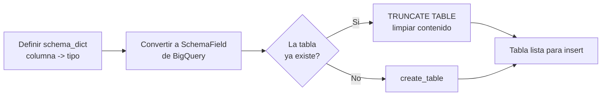
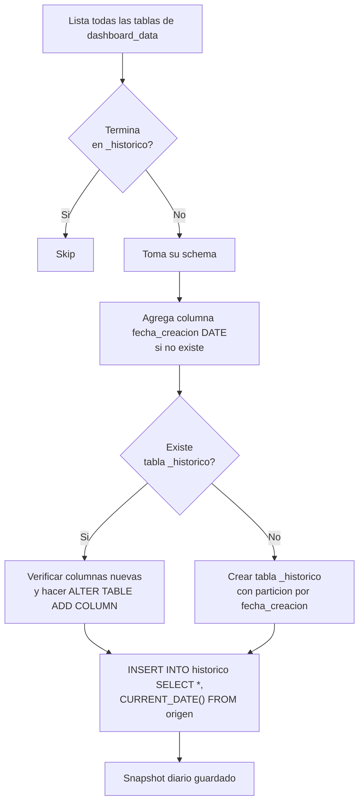

# Capa 4 — DDL de tablas de dashboard

## ¿Qué hace esta capa?

Crear (o limpiar) en BigQuery todas las tablas del esquema `dashboard_data` que después la capa 6 va a poblar con cálculos. También se encarga de la **historización**: copiar el contenido actual a tablas `*_historico` con un snapshot diario.

Es la capa que define la **forma** (columnas, tipos) de las tablas que finalmente verán los dashboards.

---

## Archivo principal

`infra/src/etl/dashboard_tables_helper.py`

Tiene un grupo grande de funciones `create_*` (una por tabla del dashboard) y una función `crear_tablas_historico_*` para los snapshots.

---

## Patrón común de cada función `create_*`

Todas siguen exactamente la misma estructura:



**Detalles importantes:**

1. **Si la tabla ya existe → TRUNCATE.** Se borra todo el contenido pero se mantiene el schema. Sirve para que cada corrida del ETL parta limpio.
2. **Si la tabla no existe → CREATE TABLE** con el schema definido.
3. **No hay merge ni upsert.** El modelo es "borra y vuelve a poblar".
4. **El esquema destino siempre es `dashboard_data`.**

> **Nota práctica:** este patrón significa que durante una corrida hay un periodo donde la tabla está vacía. Si un dashboard consulta justo en ese momento, va a mostrar 0 datos. Por eso el ETL se corre fuera de horario comercial.

---

## Catálogo de tablas creadas

Cada función `create_*` corresponde a una tabla en `dashboard_data`. Resumen:

### KPIs principales

| Función | Tabla | Qué guarda |
|---|---|---|
| `create_kpis_comercial_table` | `kpis_embudo_comercial` | KPIs del embudo: captaciones, separaciones, ventas, visitas, leads, citas — por mes y proyecto |
| `create_kpis_comercial_funnel_table` | `kpis_comercial_funnel` | Vista funnel del embudo |
| `create_kpis_medio_comercial_table` | `kpis_medio_comercial` | KPIs por medio de captación |
| `create_kpis_medio_comercial_detalle_table` | `kpis_medio_comercial_detalle` | Detalle por canal/campaña |
| `create_kpis_medio_proforma_comercial_table` | `kpis_medio_proforma_comercial` | KPIs de proformas por medio |
| `create_kpis_bigdata_table` | `kpis_bigdata` | Métricas BigData |
| `create_canal_digital_table` | `canal_digital` | Performance por canal digital |

### Agregaciones de cliente

| Función | Tabla | Qué guarda |
|---|---|---|
| `create_client_daily_comercial_table` | `cliente_diario_comercial` | Agregado diario por cliente |
| `create_client_mensual_comercial_table` | `cliente_mensual_comercial` | Agregado mensual |
| `create_client_mensual_comercial_table_prueba` | `cliente_mensual_comercial_prueba` | Versión de prueba (paralela) |
| `create_acciones_cliente_table` | `acciones_cliente` | Eventos por cliente |

### Inventario

| Función | Tabla | Qué guarda |
|---|---|---|
| `crear_tabla_stock_comercial` | `stock_comercial` | Unidades disponibles (excluye blacklist) |
| `create_proyecto_data_table` | `proyecto_data` | Data agregada por proyecto |

### Vistas operativas

| Función | Tabla | Qué guarda |
|---|---|---|
| `create_perfil_cliente_table` | `perfil_cliente` | Perfil consolidado del cliente |
| `create_clientes_vencidos_table` | `clientes_vencidos` | Clientes sin actividad reciente |
| `create_visitas_data_table` | `visitas_data` | Datos agregados de visitas |
| `create_prospectos_data_table` | `prospectos_data` | Datos agregados de prospectos |

### Detalles operativos

| Función | Tabla | Qué guarda |
|---|---|---|
| `create_prospectos_detalle_table` | `prospectos_detalle` | Detalle fila por fila de prospectos |
| `create_visitas_detalle_table` | `visitas_detalle` | Detalle de visitas |
| `create_citas_generadas_detalle_table` | `citas_generadas_detalle` | Detalle de citas agendadas |
| `create_citas_concretadas_detalle_table` | `citas_concretadas_detalle` | Detalle de citas que sí se hicieron |
| `create_separaciones_detalle_table` | `separaciones_detalle` | Detalle de separaciones |
| `create_ventas_detalle_table` | `ventas_detalle` | Detalle de ventas cerradas |

---

## Columnas comunes en los KPIs

La mayoría de tablas KPI repiten las mismas columnas de identificación al inicio:

| Columna | Qué guarda |
|---|---|
| `grupo_inmobiliario` | Grupo dueño |
| `nombre_empresa` | Empresa |
| `team_performance` | Equipo comercial |
| `id_empresa_evolta` | ID empresa Evolta |
| `id_proyecto_sperant`, `id_proyecto_evolta` | IDs duales |
| `nombre_proyecto` | Nombre del proyecto |
| `is_visible` | Si la fila debe mostrarse en dashboard |
| `mes_anio` | "MM-YYYY" |
| `fecha` | Fecha real (si aplica) |

Después vienen las métricas específicas (CAPTACIONES, SEPARACIONES, VENTAS, etc.) en `INT64`.

> **Decisión de diseño:** todos los KPIs son `INT64`. Los dashboards no usan agregaciones decimales (no hay "1.5 ventas").

---

## Caso especial: `crear_tabla_stock_comercial`

Esta función es más larga que las otras porque la tabla `stock_comercial` tiene muchas columnas (~60+): información de la unidad, precios, áreas, modalidad, fechas, descuentos.

Patrón es el mismo (define schema, crea o trunca), pero el schema es enorme. Si negocio agrega un atributo nuevo de unidad para mostrar en el dashboard, se edita acá.

---

## Historización: `crear_tablas_historico_dashboard_comercial`

Esta función no crea tablas "vacías" — toma una tabla existente del `dashboard_data` y crea (o actualiza) su versión `*_historico` con snapshots diarios.

### Qué hace exactamente



### Detalles de la historización

1. **Itera todas las tablas** de `dashboard_data` y excluye las que terminan en `_historico` (no se historiza el histórico).

2. **Para cada tabla:**
   - Lee el schema de la tabla origen.
   - Le agrega una columna virtual `fecha_creacion` (date) que va a marcar el día del snapshot.

3. **Si la tabla histórica no existe:**
   - Se crea **particionada por día** sobre `fecha_creacion`. Esto hace que las consultas por rango de fecha sean rápidas.

4. **Si la tabla histórica ya existe:**
   - Se compara el schema actual vs el del histórico.
   - Si hay columnas nuevas, se hace `ALTER TABLE ADD COLUMN` por cada una. Así la historización no se rompe cuando se agrega un campo nuevo a la tabla origen.
   - Si la columna ya existía o hay error de sintaxis, se loguea pero **no se aborta** la corrida.

5. **INSERT del snapshot:**
   ```sql
   INSERT INTO `proyecto.dashboard_data.kpis_embudo_comercial_historico`
     (col1, col2, ..., fecha_creacion)
   SELECT col1, col2, ..., CURRENT_DATE() AS fecha_creacion
   FROM `proyecto.dashboard_data.kpis_embudo_comercial`
   ```

### Particionado

Las tablas `*_historico` están particionadas por día sobre `fecha_creacion`. Beneficios:
- Consultas tipo `WHERE fecha_creacion BETWEEN ... AND ...` solo escanean particiones relevantes.
- Permite borrar particiones antiguas (>1 año) si se quiere ahorrar storage.

---

## Reglas y decisiones de negocio importantes

1. **Todas las tablas se borran y recrean en cada corrida.** No hay incremental load. Esto simplifica la lógica pero significa que un fallo a mitad del ETL deja tablas a medio poblar.

2. **`is_visible` es un booleano global por fila** — los dashboards lo usan para ocultar proyectos sin mostrar a la empresa pero que siguen siendo procesados.

3. **El histórico crece sin límite.** Cada corrida agrega una partición nueva. Hay que planear retención (no implementada hoy).

4. **El schema es la fuente de verdad para los nombres de columnas.** Si la SQL de la capa 6 (cálculos) usa una columna que no está en este schema, va a fallar el insert. Por eso ambos archivos deben mantenerse alineados.

5. **No hay foreign keys.** BigQuery no las soporta — toda la integridad la garantiza la lógica de las queries.

---

## ¿Cuándo editar este archivo?

| Caso | Qué hacer |
|---|---|
| Agregar una columna nueva a un dashboard | Sumar la columna al `schema_dict` correspondiente. La capa de cálculo (capa 6) debe poblarla. |
| Crear un dashboard nuevo | Agregar una nueva función `create_\<nombre\>_table(...)` y registrarla en `dashboard_runner.py`. |
| Cambiar tipo de una columna | Editar el `schema_dict`. Cuidado: la próxima corrida hará TRUNCATE primero, así que no hay migración. Para tablas históricas hay que decidir si dropear o no. |
| Renombrar una columna | Cambiar nombre en `schema_dict` + en la SQL de la capa 6. La historización va a ALTER ADD COLUMN nueva (no renombra). Idealmente borrar la histórica vieja antes. |

---

## Cosas a tener en cuenta

- **Las funciones `create_*` no validan que el schema coincida.** Si una corrida cambia el schema y la siguiente intenta TRUNCATE + INSERT con columnas distintas, va a fallar. La forma "correcta" sería dropear la tabla antes — pero el código solo hace TRUNCATE.
- **El bloque `try/except` para `get_table` captura cualquier error** (no solo `NotFound`). Si BigQuery está caído, va a interpretar que la tabla no existe e intentar crearla. Manejo de errores demasiado amplio.
- **`crear_tablas_historico_*` no tiene control de transacción.** Si falla un `INSERT INTO _historico`, las tablas que ya se procesaron antes quedan con snapshot, las posteriores no.
- **Tablas con sufijo `_prueba`** (`cliente_mensual_comercial_prueba`) son experimentos vivos. Verificar con negocio antes de eliminarlas.

---

## Referencia rápida al código

- `dashboard_tables_helper.py` — todas las funciones `create_*` y la historización.
- `dashboard_runner.py` — orquesta cuándo se llama cada `create_*` (capa 7).
- Archivo paralelo `dashboard_tables_helper_prueba2.py` — versiones experimentales. Confirmar si están vivas antes de tocar.
