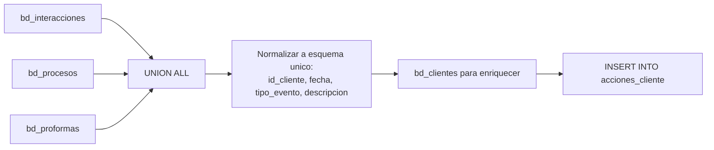

# `acciones_cliente`

## ¿Qué representa?

El **timeline de eventos** de cada cliente: una fila por cada evento que el cliente generó (visita, llamada, cita, separación, venta, devolución).

Sirve para mostrar la "historia" de un cliente en orden cronológico cuando un asesor lo consulta.

---

## Granularidad

```
Una fila = un evento (interacción, proceso, proforma) de un cliente
```

Un mismo cliente puede tener decenas o cientos de filas a lo largo de su ciclo.

---

## ¿De dónde vienen los datos?

| Tabla | Aporta |
|---|---|
| `bd_interacciones` | Visitas, llamadas, citas, mensajes |
| `bd_procesos` | Separaciones, ventas, anulaciones |
| `bd_proformas` | Emisión de proformas |
| `bd_clientes` | Datos del cliente para enriquecer |

---

## Lógica



### Pasos
1. **UNION ALL** entre las tres tablas (`bd_interacciones`, `bd_procesos`, `bd_proformas`).
2. **Normalización**: cada evento se mapea a un esquema común con campos `tipo_evento`, `descripcion`, `fecha`, `responsable`.
3. **Join** con `bd_clientes` para sumar datos del cliente.
4. **Order by fecha** dentro del cliente para que la consulta sea fácil.

---

## Esquema común de evento

| Columna | Qué guarda |
|---|---|
| `id_cliente` | A quién pertenece |
| `fecha_evento` | Cuándo ocurrió |
| `tipo_evento` | INTERACCION, PROFORMA, SEPARACION, VENTA, DEVOLUCION |
| `subtipo` | Detalle (ej. para INTERACCION: VISITA, LLAMADA) |
| `descripcion` | Texto libre del evento |
| `responsable` | Asesor que lo registró |
| `id_unidad` | Unidad asociada (si aplica) |
| `id_proyecto` | Proyecto |
| `monto` | Si aplica (proforma, venta) |

---

## Reglas de negocio

### 1. Eventos en orden cronológico
La tabla puede tener miles de filas; los dashboards deben siempre `ORDER BY fecha_evento DESC` al consultar.

### 2. Devoluciones como evento separado
Una venta devuelta genera **dos filas**:
- Una de tipo VENTA (cuando se vendió).
- Otra de tipo DEVOLUCION (cuando se devolvió).

### 3. No incluye eventos del cliente fuera del CRM
Si el cliente envió un email no registrado en Sperant/Evolta, no aparece. Solo se muestran eventos del CRM.

### 4. Filtros para reducir ruido
Algunos tipos de interacción menores (ej. "AUTO-LOG") pueden excluirse para no saturar la timeline.

---

## Cosas a tener en cuenta

- **Tabla muy grande.** Multiplicar el número de clientes por su cantidad promedio de eventos.
- **Ordenamiento crítico.** Si un dashboard no ordena por fecha, la timeline va a verse desordenada.
- **Algunos eventos pueden tener fecha NULL** (ej. proceso sin fecha_inicio). Se filtran o se les asigna fecha del registro de auditoría.

---

## Referencia al código

- Evolta: `calculate_acciones_data_evolta(...)`.
- Sperant: `calculate_acciones_data_sperant(...)`.
- Joined: `calculate_acciones_data_sperant_evolta(...)`.
- Schema: `dashboard_tables_helper.py` → `create_acciones_cliente_table(...)`.
