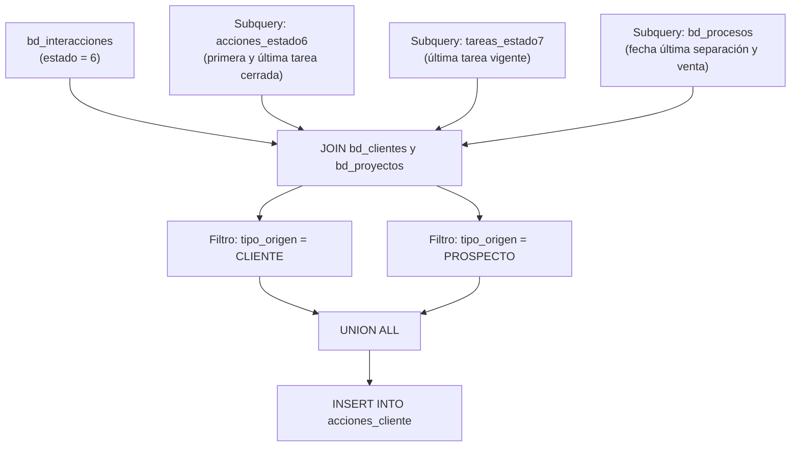

# `acciones_cliente` — registro de interacciones cerradas

## ¿Qué representa?

A diferencia de lo que podría sugerir su nombre, esta tabla **no** es un timeline general de todos los eventos del cliente. En realidad, representa un registro de las **interacciones (tareas) cerradas o completadas** (`estado = '6'`) que tuvieron los clientes o prospectos con los asesores.

Esta tabla enriquece cada tarea completada con los datos del perfil del cliente (tipo de persona, nombres, nivel de interés, origen, fechas clave de su ciclo de vida como cuándo se separó o vendió). Sirve para auditar la gestión de tareas de los vendedores y analizar respuestas/satisfacción de los contactos.

---

## Granularidad

**Una fila = Una interacción/tarea en estado '6' (Cerrada) de un cliente o prospecto.**

Si un cliente tuvo 5 tareas completadas en su historial, aparecerá 5 veces en esta tabla.

---

## ¿De dónde vienen los datos?

| Tabla | Aporta |
|---|---|
| `bd_interacciones` | Es la tabla principal (filtro `estado = '6'`). Aporta la fecha de la acción, el tipo, la respuesta y las descripciones. |
| `bd_clientes` | Datos demográficos y de contacto del cliente/prospecto. |
| `bd_proyectos` | Identificación del proyecto y distrito. |
| Subqueries varias sobre `bd_interacciones` | Cálculos de `Fecha_PrimeraAccion`, `Fecha_UltimaAccion`, y la última tarea vigente (`estado = '7'`). |
| Subqueries sobre `bd_procesos` | Búsqueda de `FechaSeparacion`, `FechaVenta` y quién fue el `ReferidoPorUltimoProceso` para ese cliente. |

---

## Lógica

### Diagrama de flujo

---

## Columnas destacadas

| Categoría | Columnas principales |
|---|---|
| **Estructura** | `Codigo` (id_cliente), `Proyecto`, `TipoPersona` (CLIENTE o PROSPECTO) |
| **Cliente** | `Nombres`, `Apellidos`, `TipoDocumento`, `Celular`, `Correo`, `ComoSeEntero` |
| **La Tarea Actual** | `Tipo_Accion` (nombre de la interacción), `Fecha_Accion`, `Tipo_Respuesta` (satisfactorio), `Descrip_Respuesta` |
| **Historial Tareas** | `Fecha_PrimeraAccion`, `Fecha_UltimaAccion`, `Fecha_TareaNueva`, `EstadoTareaNueva` (Vigente o Cerrado) |
| **Hitos de Venta** | `FechaSeparacion`, `FechaVenta` |

---

## Reglas de negocio importantes

### 1. Solo tareas cerradas (`estado = '6'`)
La base central de esta tabla solo extrae interacciones históricas. Tareas vigentes o pendientes (`estado = '7'`) no generan filas propias aquí, solo se usan en las subqueries para indicar si el cliente tiene una "Tarea Nueva Vigente".

### 2. Separación de Clientes y Prospectos
La query utiliza un `UNION ALL` para calcular los datos de los clientes que nacieron como `CLIENTE` separados de los que nacieron como `PROSPECTO`, asegurando que el cruce de orígenes no rompa el performance o los JOINs a `bd_clientes`.

### 3. Sub-estados de la "Tarea Nueva"
Si un cliente tiene al menos una tarea en estado `7` (`tareas_estado7`) cuya fecha es mayor al día de hoy, el campo `EstadoTareaNueva` dirá `VIGENTE`. En caso contrario, dirá `CERRADO`.

### 4. Fechas de Separación y Venta
A cada tarea cerrada del cliente se le pega, a modo referencial, la fecha máxima de su última separación o venta extraída desde `bd_procesos`. Esto permite saber si esta interacción ocurrió antes o después de la conversión real.

---

## Referencia al código

- Origen Evolta: `infra/src/etl/dashboard_operations_evolta.py` → `calculate_acciones_data_evolta(...)`
- Origen Sperant: `infra/src/etl/dashboard_operations_sperant.py` → `calculate_acciones_data_sperant(...)`
- Origen Joined: `infra/src/etl/dashboard_operations_sperant_evolta_prueba2.py` → `calculate_acciones_data_evolta_sperant(...)`
- Definición de Schema: `infra/src/etl/dashboard_tables_helper.py` → `create_acciones_cliente_table(...)`
