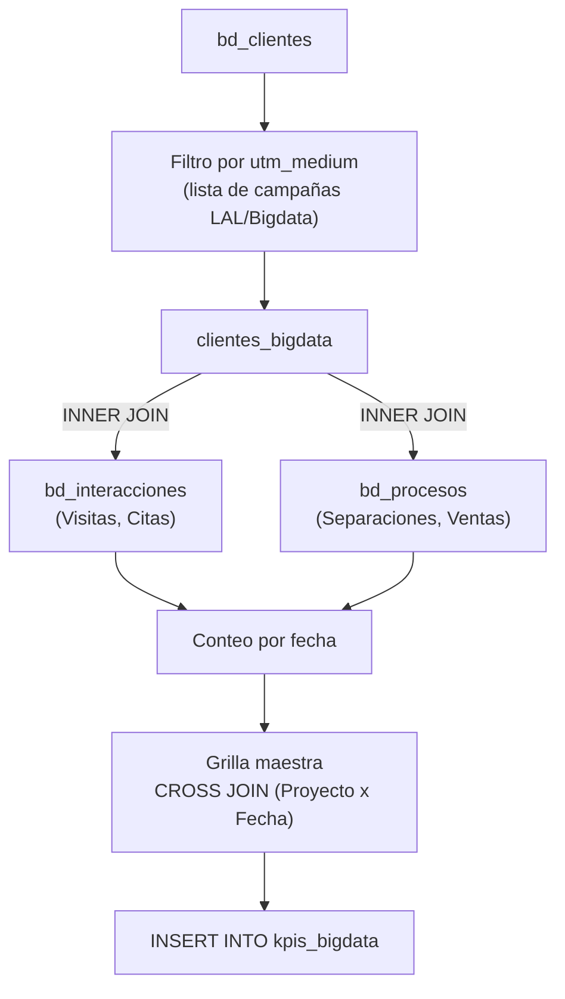

# `kpis_bigdata`

## ¿Qué representa?

A pesar de su nombre, esta tabla **no calcula métricas analíticas avanzadas**, sino que calcula **el mismo embudo comercial diario** (`kpis_embudo_comercial`) pero **exclusivamente para leads generados por campañas de Big Data / Inteligencia Artificial (Lookalikes)**.

Permite evaluar si las audiencias generadas algorítmicamente (ej. perfiles "lookalike" o "similares" construidos a partir de data histórica) rinden mejor que las audiencias tradicionales a lo largo del embudo (Visitas, Citas, Separaciones, Ventas).

---

## Granularidad

```
Una fila = (proyecto, fecha)
```

Igual que `kpis_embudo_comercial`, contiene registros diarios desde enero de 2017 hasta hoy.

---

## Métricas que calcula

Son las mismas métricas básicas del embudo, pero el valor reflejado proviene **solo de clientes BigData**:

- `CAPTACIONES`
- `VISITAS`
- `CITAS_GENERADAS`
- `CITAS_CONCRETADAS`
- `SEPARACIONES`
- `VENTAS`

---

## ¿De dónde vienen los datos?

Los datos vienen de las mismas tablas del embudo (`bd_clientes`, `bd_interacciones`, `bd_procesos`), con un filtro inicial estricto sobre los clientes.

### La clave: `clientes_bigdata`

Antes de calcular cualquier métrica, se crea un universo cerrado de clientes. Solo califican aquellos cuyo campo `utm_medium` (en `bd_clientes` o `bd_clientes_fechas_extension`) coincida con una **lista de campañas hardcoded**:

```sql
utm_medium IN (
    'ATRIA - [LAL] - 031025',
    'ATRIA LAL 2% 031125',
    'ATRIA - [LAL 4%] - 051125',
    'ATRIA - [LAL] - 030925',
    'SUCRE - [LAL - 3%] - 281025',
    'ROOSEVELT - [LAL] - 131025',
    'Bigdata LAL 3 Dorms',
    'Conj. Similar 1%',
    'Conj. Similar 3%',
    'LAL-Bigdata',
    'Conj. Similar',
    'LAL 5% -  ChatBot 30 a 60',
    'LAL 5% -  Bigdata',
    'Conj. Similar 2%',
    'Conj. Similar 4%',
    'Mirahome-LAL-Bigdata 2%'
)
```

**Cualquier cliente que no esté en este listado queda excluido**. Luego, todas las visitas, separaciones y ventas se calculan haciendo un `INNER JOIN` contra esta lista de clientes aprobados.

---

## Lógica



---

## Cosas a tener en cuenta

- **Lista de campañas hardcoded.** Este es el mayor riesgo técnico. Si marketing lanza una nueva campaña Lookalike (ej. `LAL 6% - Noviembre`), **NO aparecerá en los dashboards** hasta que un ingeniero modifique el SQL manualmente para agregarla al `IN (...)`.
- **INNER JOIN en procesos.** Si un proceso de separación existe pero el cliente no proviene de estas campañas, la separación no se cuenta. Esto es correcto para evaluar el canal, pero significa que los totales de esta tabla serán muy inferiores a los del embudo general.
- **`correo != 'TEST@FB.COM'`**: Se excluyen los leads de prueba de Facebook.

---

## Referencia al código

- Evolta: `dashboard_operations_evolta.py` → `calculate_kpis_bigdata_evolta(...)`
- Sperant: `dashboard_operations_sperant.py` → `calculate_kpis_bigdata_sperant(...)`
- Joined: `dashboard_operations_sperant_evolta.py` → `calculate_kpis_bigdata_evolta_sperant(...)`
- Schema destino: `dashboard_data.kpis_bigdata`
