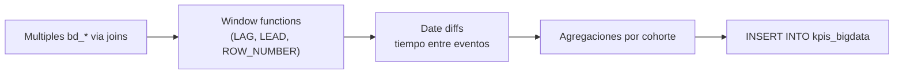

# `kpis_bigdata`

## ¿Qué representa?

Métricas analíticas avanzadas — el "BigData layer" del dashboard. Son KPIs derivados que cruzan múltiples tablas y períodos para responder preguntas más complejas que las del embudo simple.

Ejemplos de preguntas que responde:
- ¿Cuál es el tiempo promedio entre captación y separación?
- ¿Cuántos clientes vuelven a interactuar después de 30 días?
- ¿Cuál es la tasa de cierre por asesor en el último trimestre?

---

## Granularidad

Variable según la métrica. Puede ser por proyecto-mes, por asesor-mes, o totales por período.

---

## Métricas típicas

(Las exactas dependen de cómo esté definido el SQL — consultar el código por la lista actual.)

| Categoría | Ejemplos |
|---|---|
| **Tiempo entre eventos** | Días promedio entre captación y primera visita, entre separación y venta |
| **Recurrencia** | % de clientes que regresan, ratio de re-engagement |
| **Conversion ratio avanzado** | Conversión multi-touch attribution, rate por cohorte |
| **Velocidad** | Velocidad de cierre por asesor, por proyecto |

---

## ¿De dónde vienen los datos?

Todas las `bd_*` que ya están en BigQuery. No se generan datos nuevos — solo se cruzan los existentes.

---

## Lógica

A diferencia de los KPIs del embudo (que son `COUNT(*)` simples), aquí se usan operaciones más sofisticadas:
- `LAG()` y `LEAD()` para comparar entre filas.
- `DATE_DIFF` para tiempos entre eventos.
- `PERCENTILE_CONT` para medianas y percentiles.

---

## Cosas a tener en cuenta

- **Performance variable.** Algunas queries pueden ser lentas porque hacen window functions sobre datasets grandes.
- **Sensible a outliers.** Un cliente con fechas muy extrañas (ej. fecha 1900) puede sesgar promedios. Conviene aplicar filtros en las queries.
- **Si negocio cambia la definición de una métrica BigData, hay que ajustar el SQL en los 3 archivos.**
- **Muchas métricas dependen de que las fechas estén bien cargadas en `bd_*`.** Si Sperant trae fechas como string en formato dudoso, puede haber métricas inconsistentes.

---

## Referencia al código

- Evolta: `calculate_kpis_bigdata_evolta(...)`.
- Sperant: `calculate_kpis_bigdata_sperant(...)`.
- Joined: `calculate_kpis_bigdata_sperant_evolta(...)`.
- Schema: `dashboard_tables_helper.py` → `create_kpis_bigdata_table(...)`.
