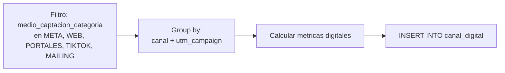

# `canal_digital`

## ¿Qué representa?

KPIs específicos del **canal digital** (META, WEB, PORTALES, TIKTOK, MAILING). Mide leads, costos, conversiones y eficiencia por canal y campaña.

Es el dashboard usado por marketing para evaluar performance de campañas digitales.

---

## Granularidad

```
(proyecto, fecha o mes, canal_digital, campaña)
```

---

## Métricas que calcula

- `LEADS` — cantidad de leads únicos.
- `LEADS_CALIFICADOS` — leads que pasaron filtros mínimos (con datos de contacto válidos).
- `VISITAS_LEAD` — visitas atribuidas a leads digitales.
- `CITAS_LEAD` — citas atribuidas a leads digitales.
- `SEPARACIONES_LEAD` — separaciones cuyo origen es lead digital.
- `VENTAS_LEAD` — ventas cuyo origen es lead digital.
- Tasas de conversión derivadas (lead → visita, visita → separación, etc.).

---

## ¿De dónde vienen los datos?

| Tabla | Aporta |
|---|---|
| `bd_clientes` + `bd_clientes_fechas_extension` | Para identificar el canal y campaña |
| `bd_interacciones` | Visitas y citas |
| `bd_procesos` | Separaciones y ventas |
| `bd_proformas` | Proformas |

---

## Lógica



### Reglas clave
1. Solo se incluyen clientes cuyo `medio_captacion_categoria` esté en la lista de canales digitales.
2. La campaña se obtiene de `utm_campaign` (o "SIN CAMPAÑA" si no hay).
3. Las conversiones se atribuyen al canal del cliente que originó el evento.

---

## Cosas a tener en cuenta

- **No incluye costos de pauta.** Esta tabla solo tiene leads y conversiones. Para ROI hay que cruzar con otra fuente externa.
- **Categorías digitales hardcoded.** Si negocio agrega WhatsApp Business o Twitter Ads, hay que sumar la categoría a la lista.
- **`utm_campaign` puede tener valores con tildes, espacios, mayúsculas inconsistentes.** Antes de hacer reportes, conviene normalizar.

---

## Referencia al código

- Evolta: `calculate_canal_digital_evolta(...)`.
- Sperant: `calculate_canal_digital_sperant(...)`.
- Joined: `calculate_canal_digital_sperant_evolta(...)`.
- Schema: `dashboard_tables_helper.py` → `create_canal_digital_table(...)`.
