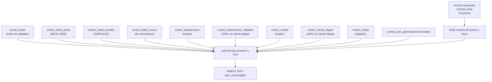

# `kpis_canal_digital`

## ¿Qué representa?

Una tabla agregada de KPIs comerciales, enfocada en comparar el **rendimiento total vs el rendimiento atribuido a canales digitales** (META, WEB, PORTALES, TIKTOK, MAILING).

A diferencia de otras tablas que agrupan por canal específico, esta tabla consolida métricas pre-calculadas en columnas separadas (ej. `VENTAS_TOTALES` vs `VENTAS_DIGITALES`, `LEADS_PAUTA` vs `LEADS_PORTALES`), facilitando el análisis rápido de aportación digital a nivel macro.

---

## Granularidad

**Una fila = Un Proyecto + Un Mes (`mes_anio`)**

---

## Métricas que calcula

Esta tabla enfrenta métricas globales con métricas estrictamente digitales:

| Categoría | Columnas |
|---|---|
| **Separaciones** | `SEPARACIONES_TOTALES`, `SEPARACIONES_DIGITALES` |
| **Ventas** | `VENTAS_TOTALES`, `VENTAS_DIGITALES` |
| **Visitas** | `VISITAS_DIGITALES` |
| **Leads** | `LEADS_TOTALES`, `LEADS_PAUTA` (solo META/WEB), `LEADS_PORTALES` (solo PORTALES), `LEADS_UNICOS` (excluye recontactos y duplicados) |
| **Citas** | `CITAS_GENERADAS`, `CITAS_CONCRETADAS` (asociadas a leads digitales) |

---

## ¿De dónde vienen los datos?

| Tabla | Aporta |
|---|---|
| `bd_clientes` + `bd_clientes_fechas_extension` | Para contar leads y segmentarlos según su categoría de captación |
| `bd_interacciones` | Visitas (digitales) y Citas |
| `bd_procesos` | Separaciones y ventas (totales y digitales cruzando con clientes) |

---

## Lógica

### Diagrama de flujo

### Reglas de Negocio Clave

1. **Atribución de ventas/separaciones a digital**:
   Se cruza `bd_procesos` con `bd_clientes`. Si el cliente original fue captado por un medio categorizado como META, WEB, PORTALES, TIKTOK o MAILING, ese proceso suma a la columna `_DIGITALES`.

2. **Tipos de Leads**:
   - `LEADS_TOTALES`: Todo lo categorizado como digital.
   - `LEADS_PAUTA`: Solo `META` y `WEB`.
   - `LEADS_PORTALES`: Solo `PORTALES`.
   - `LEADS_UNICOS`: Excluye leads cuyo subestado es `RECONTACTO` o `DUPLICADO`.

3. **Restricciones de Procesos (Separaciones y Ventas)**:
   - Solo tipo de unidad DEPARTAMENTO o CASA.
   - Excluye caídas por `ERROR DATA` o `ERROR EN REFINANCIAMIENTO`.
   - Excluye ventas/separaciones generadas por usuarios de prueba (ej. `nreyes`, `VITO HUILLCA`).

4. **Visitas Digitales**:
   Interacciones donde el cliente sea digital, con origen distinto a 'SOLO PROFORMA' y que sea una "visita única del mes".

---

## Referencia al código

- Origen Evolta: `dashboard_operations_evolta.py` → `calculate_canal_digital_evolta(...)`
- Origen Sperant: `dashboard_operations_sperant.py` → `calculate_canal_digital_sperant(...)`
- Origen Joined: `dashboard_operations_sperant_evolta_prueba2.py` → `calculate_canal_digital_sperant_evolta(...)`
- Inserción en: `dashboard_data.kpis_canal_digital`
