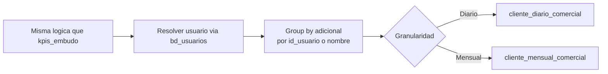

# `cliente_diario_comercial` y `cliente_mensual_comercial`

## ¿Qué representan?

Agregaciones de la actividad por **asesor** (no por proyecto):
- `cliente_diario_comercial` — granularidad **día x asesor x proyecto**.
- `cliente_mensual_comercial` — granularidad **mes x asesor x proyecto**.

Sirven para reportes de productividad: cuántos clientes atendió cada asesor, cuántas separaciones cerró, cuántas visitas concretó.

---

## Granularidad

| Tabla | Granularidad |
|---|---|
| `cliente_diario_comercial` | (proyecto, fecha, usuario) |
| `cliente_mensual_comercial` | (proyecto, mes_anio, usuario) |

---

## Métricas que calculan

| Columna | Qué cuenta |
|---|---|
| `SEPARACIONES`, `VENTAS` | Cierres del asesor |
| `VISITAS`, `CITAS_CONCRETADAS`, `CITAS_GENERADAS` | Actividad presencial |
| `CONTACTOS_EFECTIVOS` | Interacciones con cliente que llegaron a algo (definición exacta en cada query) |
| `CONTACTOS_TOTAL` | Todas las interacciones |
| `CAPTACIONES_TOTAL` | Captaciones atribuidas al asesor |
| `LEADS_UNICOS` (solo mensual) | Leads únicos atribuidos |
| `VENTAS_ACTIVAS`, `SEPARACIONES_ACTIVAS` (solo mensual) | Sin devolución |

---

## ¿De dónde vienen los datos?

Mismas tablas que `kpis_embudo_comercial`. La diferencia clave es:
- **Group by por usuario** además de proyecto.
- **`bd_usuarios`** se cruza para resolver el nombre del asesor.

---

## Lógica

---

## Reglas de negocio

### 1. Atribución del asesor
- En **separaciones y ventas**, el asesor es el responsable del proceso (`bd_procesos.aprobador_descuento` o el responsable comercial).
- En **visitas y citas**, es el responsable de la interacción (`bd_interacciones.nombre_responsable`).
- En **captaciones**, el responsable inicial del prospecto.

### 2. Asesores sin nombre
Si el responsable está vacío o no matchea con `bd_usuarios`, queda como `NULL` o `'SIN ASESOR'`. Los dashboards filtran esto.

### 3. Sperant usa username, Evolta usa id
- Lado Evolta: `id_usuario_evolta`.
- Lado Sperant: `username` directamente.
- Lado Joined: el "consolidado" del CSV de asesores.

### 4. Mes_anio sin fecha
La versión mensual NO tiene columna `fecha` (a diferencia de la diaria). Solo `mes_anio`.

---

## Variantes `_prueba`

Existen también:
- `cliente_mensual_comercial_prueba`
- `calculate_cliente_mensual_*_prueba`

Son **versiones experimentales** con lógicas alternativas (por ejemplo, distinta forma de definir "contacto efectivo"). Se generan en paralelo a las normales para que negocio compare.

> Confirmar con negocio antes de eliminar — pueden estar referenciadas por dashboards en uso.

---

## Cosas a tener en cuenta

- **Volumen muy alto en la versión diaria.** Multiplicar el embudo por la cantidad de asesores activos por proyecto. Puede tener millones de filas.
- **Atribución doble.** Un asesor que asistió en una venta junto con otro asesor solo aparecerá una vez (el "responsable" titular). Si negocio quiere ver co-atribuciones, hay que ajustar la lógica.
- **`is_visible` se hereda del proyecto** (no es por asesor).
- **El cálculo de "contactos efectivos" varía entre Evolta y Sperant** porque los campos en `bd_interacciones` no son idénticos. Verificar consistencia entre las 3 fuentes.

---

## Referencia al código

- Evolta diario: `calculate_cliente_diario_evolta(...)`.
- Evolta mensual: `calculate_cliente_mensual_evolta(...)` y `calculate_cliente_mensual_evolta_prueba(...)`.
- Sperant: `calculate_cliente_diario_sperant(...)`, `calculate_cliente_mensual_sperant(...)`, `calculate_cliente_mensual_sperant_prueba(...)`.
- Joined: `calculate_cliente_diario_sperant_evolta(...)`, `calculate_cliente_mensual_sperant_evolta(...)`, `calculate_cliente_mensual_sperant_evolta_prueba(...)`.
